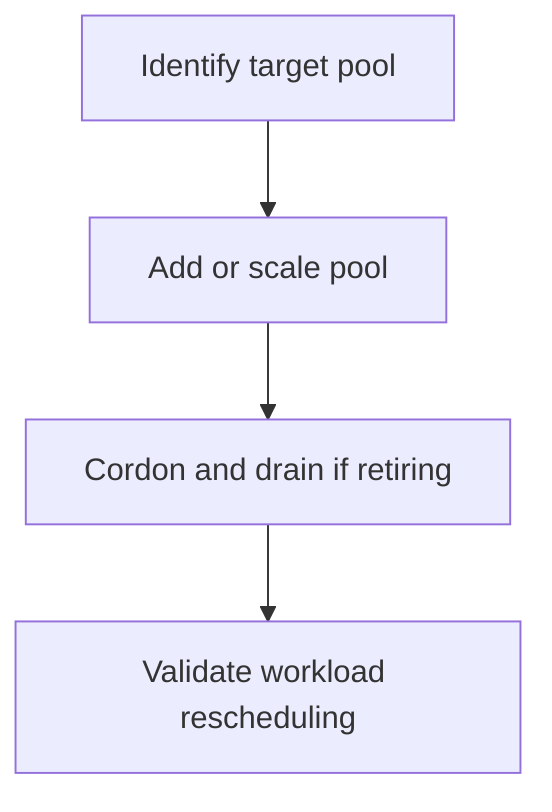

---
content_sources:
  diagrams:
  - id: operations-node-pool-operations
    type: flowchart
    source: mslearn-adapted
    mslearn_url: https://learn.microsoft.com/en-us/azure/aks/learn/quick-kubernetes-deploy-cli
    based_on:
    - https://learn.microsoft.com/en-us/azure/aks/learn/quick-kubernetes-deploy-cli
    - https://learn.microsoft.com/en-us/azure/aks/upgrade-cluster
    - https://learn.microsoft.com/en-us/azure/azure-monitor/containers/container-insights-overview
    - https://learn.microsoft.com/en-us/azure/aks/concepts-clusters-workloads
    - https://learn.microsoft.com/en-us/azure/architecture/reference-architectures/containers/aks/secure-baseline-aks
content_validation:
  status: verified
  last_reviewed: 2026-07-18
  reviewer: agent
  core_claims:
    - claim: "AKS supports separate CRUD operations on individual node pools through the az aks nodepool command set."
      source: https://learn.microsoft.com/en-us/azure/aks/create-node-pools
      verified: true
    - claim: "System node pools in AKS must contain at least two nodes, while user node pools may contain zero or more nodes."
      source: https://learn.microsoft.com/en-us/azure/aks/create-node-pools
      verified: true
    - claim: "If a cluster has both system and user node pools, applications should run on user mode node pools instead of the default system mode node pool."
      source: https://learn.microsoft.com/en-us/azure/aks/learn/quick-kubernetes-deploy-cli
      verified: true
    - claim: "All AKS node pools in a cluster must reside in the same virtual network."
      source: https://learn.microsoft.com/en-us/azure/aks/create-node-pools
      verified: true
---


# Node Pool Operations

Use node pool changes to adjust cluster capacity and isolate workloads without rebuilding the cluster. Safe node pool operations depend on drain behavior, pod disruption budgets, and quota awareness.

## Prerequisites

- Cluster credentials are current.
- You understand which workloads run on the target pool.
- PodDisruptionBudgets and autoscaler settings have been reviewed.

## When to Use

- Adding a new workload class.
- Replacing VM sizes or OS images.
- Scaling specific workload pools independently.

## Procedure
<!-- diagram-id: operations-node-pool-operations -->



```bash
az aks nodepool list --resource-group $RG --cluster-name $CLUSTER_NAME --output table
az aks nodepool add     --resource-group $RG     --cluster-name $CLUSTER_NAME     --name apps01     --mode User     --node-vm-size Standard_D4ds_v5     --node-count 3
kubectl get nodes -L kubernetes.azure.com/agentpool
kubectl cordon <node-name>
kubectl drain <node-name> --ignore-daemonsets --delete-emptydir-data
```

## Verification

```bash
az aks nodepool show --resource-group $RG --cluster-name $CLUSTER_NAME --name apps01 --query "{count:count,mode:mode,vmSize:vmSize,provisioningState:provisioningState}" --output yaml
kubectl get pods -A -o wide
```

The Azure Portal **Node pools** blade shows the same state across every pool in one view.

[[[ shot("aks-operations-node-pools") ]]]

Purpose: Show where to verify AKS node pool mode, scale method, node counts, and provisioning state.

Look for:

- At least one pool is marked **System** (`systempool`) and workload pools use **User** mode (`userpool`).
- Every pool shows **Provisioning state** `Succeeded` and **Power state** `Running`.
- The **Scale method** matches intent — `Autoscale` for elastic user pools, `Manual` for fixed pools.
- **Target nodes** and **Ready nodes** counts agree, and no autoscale warnings are raised.

Expected result: The node pool table lists healthy system and user pools with the expected scale method and node counts.

Next step: Continue to the scaling, upgrade, or workload placement procedure that depends on these pools.

## Rollback / Troubleshooting

- If drain blocks, inspect PodDisruptionBudgets and unmanaged pods.
- If scale-out fails, inspect quota, subnet IPs, and autoscaler bounds.
- If workloads land on the wrong pool, inspect taints, tolerations, selectors, and affinity.

## See Also

- [Node Pools](../platform/node-pools.md)
- [Scaling](../platform/scaling.md)
- [Scaling Failure](../troubleshooting/playbooks/operations/scaling-failure.md)

## Sources

- [Create an AKS cluster](https://learn.microsoft.com/azure/aks/learn/quick-kubernetes-deploy-cli)
- [Upgrade an AKS cluster](https://learn.microsoft.com/azure/aks/upgrade-cluster)
- [Monitor AKS with Container insights](https://learn.microsoft.com/azure/azure-monitor/containers/container-insights-overview)
- [AKS core concepts for Kubernetes and workloads](https://learn.microsoft.com/azure/aks/concepts-clusters-workloads)
- [Azure Kubernetes Service (AKS) architecture](https://learn.microsoft.com/azure/architecture/reference-architectures/containers/aks/secure-baseline-aks)
