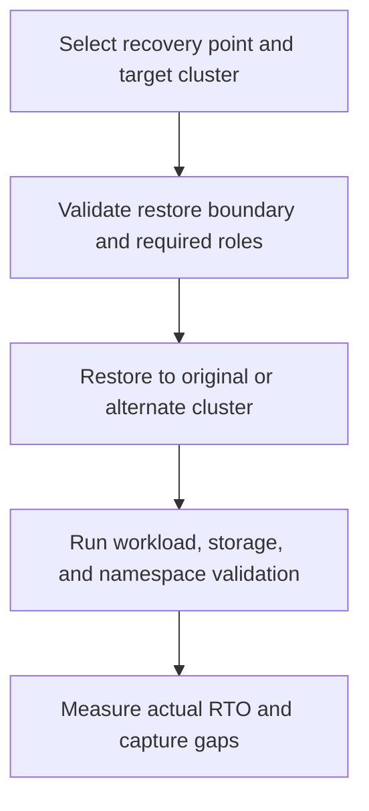

---
content_sources:
  diagrams:
    - id: operations-restore-drills-flow
      type: flowchart
      source: self-generated
      justification: AKS restore-drill flow synthesized from Microsoft Learn Azure Backup restore and backup overview guidance.
      based_on:
        - https://learn.microsoft.com/en-us/azure/backup/azure-kubernetes-service-backup-overview
        - https://learn.microsoft.com/en-us/azure/backup/azure-kubernetes-service-cluster-restore
        - https://learn.microsoft.com/en-us/azure/backup/azure-kubernetes-service-cluster-backup
content_validation:
  status: verified
  last_reviewed: 2026-07-18
  reviewer: agent
  core_claims:
    - claim: "Azure Backup for AKS can restore to the original AKS cluster or to an alternate AKS cluster."
      source: https://learn.microsoft.com/en-us/azure/backup/azure-kubernetes-service-cluster-restore
      verified: true
    - claim: "Only backups stored in Vault Tier can be restored to a different region, and that region is the Azure paired region enabled through geo-redundancy and cross-region restore."
      source: https://learn.microsoft.com/en-us/azure/backup/azure-kubernetes-service-backup-overview
      verified: true
    - claim: "Azure Files-based volumes cannot be restored across regions or across subscriptions."
      source: https://learn.microsoft.com/en-us/azure/backup/azure-kubernetes-service-cluster-restore
      verified: true
    - claim: "Azure Backup does not automatically scale out the target AKS cluster during restore; the target cluster must have sufficient resources."
      source: https://learn.microsoft.com/en-us/azure/backup/azure-kubernetes-service-cluster-restore
      verified: true
---

# Restore Drills

Backups are only credible when the team has rehearsed restore boundaries, validation steps, and timing under realistic conditions. For AKS, that means proving what a recovery point can restore, what it cannot restore, and how long the cluster actually takes to return to service.

## Prerequisites

- At least one recent, known-good AKS recovery point exists.
- The target AKS cluster has the Backup extension installed and Trusted Access enabled.
- For Vault Tier restores, a staging storage account and staging resource group are prepared.
- Validation commands, synthetic checks, and namespace-level acceptance criteria are written before the drill starts.

## When to Use

- Quarterly or release-driven disaster-recovery rehearsal.
- Pre-upgrade rollback rehearsal for stateful workloads.
- Cross-zone or cross-region recovery proof.
- Alternate-cluster restoration tests for platform migration readiness.

## Procedure

<!-- diagram-id: operations-restore-drills-flow -->

### 1) Define the restore boundary up front

For every drill, write down which of these you are proving:

- full cluster-scope restore
- selected namespaces only
- PV data plus Kubernetes objects
- original-cluster restore
- alternate-cluster restore
- paired-region restore from Vault Tier

### 2) Know what is and is not restorable

**Restorable through Azure Backup for AKS**

- selected Kubernetes resources in scope of the backup instance
- supported CSI-backed Azure Disk volumes
- supported Azure SMB Files volumes within their supported boundaries
- namespace-filtered or full-cluster backup selections

**Not a free assumption**

- unsupported PV types
- cross-region restore from Operational Tier
- Azure Files restore across subscriptions or regions
- automatic node-capacity creation by the restore workflow

### 3) Choose the target intentionally

| Target | Best use |
|---|---|
| Original cluster | Operational recovery and rollback rehearsal |
| Alternate cluster, same region | Migration, isolation, or clean-room recovery validation |
| Paired region from Vault Tier | Disaster-recovery proof for regional outage scenarios |

### 4) Run validation like an application owner, not just a platform owner

A restore drill is incomplete if it stops at `kubectl get pods`.

Validate at least:

- pods, PVCs, and PVs exist and bind correctly
- application processes can read and write restored data
- service endpoints, DNS, and ingress paths recover
- secrets required for mount/auth paths are usable
- replica counts and controller states match the intended restore result

### 5) Measure RTO as observed time

Track real timestamps:

- restore job started
- restore job completed
- first healthy pod ready
- first successful storage validation
- first successful synthetic transaction

The measured RTO should be based on when the workload becomes usable, not when the control plane says “restore completed.”

## Verification

- Restore succeeded to the intended original, alternate, or paired-region target.
- Restored namespaces and PVs match the drill scope.
- Application-level validation passes, including storage access.
- Actual RTO is recorded with evidence and compared against the objective.

## Rollback / Troubleshooting

- If a restore hits name conflicts, use the restore clash policy deliberately and document whether `Skip` or `Patch` was used.
- If restoring to an alternate cluster with different storage classes, use a resource-modifier config map to patch PVC storage class names.
- If the target cluster lacks capacity, increase capacity first; Azure Backup does not autoscale the cluster for you.
- If Azure Files volumes are involved, verify the storage-account role and secrets path before rerunning the drill.

## See Also

- [Cluster Resource and PV Backup](cluster-resource-pv-backup.md)
- [Snapshot Operations](snapshot-operations.md)
- [Tutorial 05: AKS Disaster Recovery](../tutorials/lab-guides/lab-05-aks-disaster-recovery.md)
- [Reliability](../best-practices/reliability.md)

## Sources

- [What is Azure Kubernetes Service backup?](https://learn.microsoft.com/en-us/azure/backup/azure-kubernetes-service-backup-overview)
- [Back up Azure Kubernetes Service by using Azure Backup](https://learn.microsoft.com/en-us/azure/backup/azure-kubernetes-service-cluster-backup)
- [Restore Azure Kubernetes Service using Azure Backup](https://learn.microsoft.com/en-us/azure/backup/azure-kubernetes-service-cluster-restore)
