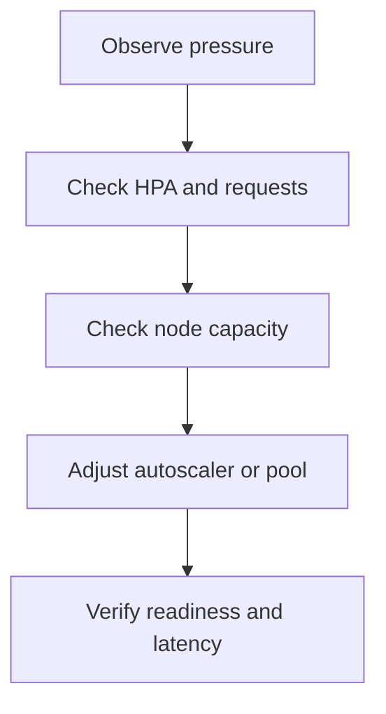

---
hide:
  - toc
content_sources:
  diagrams:
  - id: operations-scaling-operations
    type: flowchart
    source: mslearn-adapted
    mslearn_url: https://learn.microsoft.com/en-us/azure/aks/concepts-scale
    based_on:
    - https://learn.microsoft.com/en-us/azure/aks/concepts-scale
    - https://learn.microsoft.com/en-us/azure/aks/cluster-autoscaler
    - https://learn.microsoft.com/en-us/azure/aks/vertical-pod-autoscaler
---


# Scaling Operations

Scaling is operationally safe only when you understand which layer is changing: replicas, requests, or node capacity. This runbook focuses on operating those controls during normal growth and incident response.

## Prerequisites

- Metrics pipeline is available for pods and nodes.
- Workloads have requests and limits defined.
- Autoscaler min/max boundaries are documented.

## When to Use

- Traffic growth requires more replicas or nodes.
- Pending pods suggest cluster capacity constraints.
- Cost review requires tuning autoscaler boundaries.

## Procedure
<!-- diagram-id: operations-scaling-operations -->

<!-- diagram-id: operations-scaling-operations -->



```bash
kubectl get hpa -A
kubectl top nodes
kubectl top pods -A
az aks update     --resource-group $RG     --name $CLUSTER_NAME     --enable-cluster-autoscaler     --min-count 3     --max-count 10
```

## Verification

```bash
kubectl describe hpa <hpa-name> -n <namespace>
kubectl get pods -A --field-selector=status.phase=Pending
az aks show --resource-group $RG --name $CLUSTER_NAME --query "agentPoolProfiles[].{name:name,min:minCount,max:maxCount,count:count}" --output table
```

## Rollback / Troubleshooting

- Reduce aggressive HPA targets if scale churn causes instability.
- If node growth stalls, inspect quota and subnet IP capacity.
- If scaling works but latency remains high, investigate application bottlenecks rather than adding more nodes blindly.

## See Also

- [Scaling](../platform/scaling.md)
- [Cost Optimization](../best-practices/cost-optimization.md)
- [Scaling Failure](../troubleshooting/playbooks/operations/scaling-failure.md)

## Sources

- [Scale applications in AKS](https://learn.microsoft.com/azure/aks/concepts-scale)
- [Cluster autoscaler in AKS](https://learn.microsoft.com/azure/aks/cluster-autoscaler)
- [Vertical Pod Autoscaler for AKS](https://learn.microsoft.com/azure/aks/vertical-pod-autoscaler)
