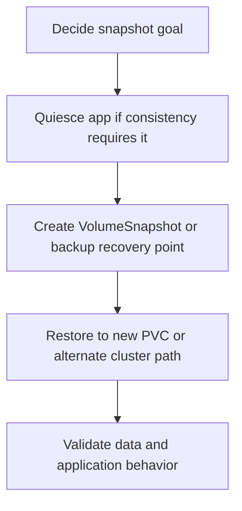

---
content_sources:
  diagrams:
    - id: operations-snapshot-operations-flow
      type: flowchart
      source: self-generated
      justification: AKS snapshot-operations workflow synthesized from Microsoft Learn Azure Disk, Azure Files, and AKS backup documentation.
      based_on:
        - https://learn.microsoft.com/en-us/azure/aks/create-volume-azure-disk
        - https://learn.microsoft.com/en-us/azure/aks/create-volume-azure-files
        - https://learn.microsoft.com/en-us/azure/backup/azure-kubernetes-service-backup-overview
        - https://learn.microsoft.com/en-us/azure/backup/azure-kubernetes-service-cluster-backup-concept
content_validation:
  status: verified
  last_reviewed: 2026-07-18
  reviewer: agent
  core_claims:
    - claim: "Azure Disk CSI supports volume snapshots and can create full or incremental snapshots based on the snapshot class configuration."
      source: https://learn.microsoft.com/en-us/azure/aks/create-volume-azure-disk
      verified: true
    - claim: "Azure Files CSI supports creating volume snapshots of persistent volumes and the underlying file shares."
      source: https://learn.microsoft.com/en-us/azure/aks/create-volume-azure-files
      verified: true
    - claim: "Azure Backup for AKS uses CSI driver snapshot capabilities to back up persistent volumes."
      source: https://learn.microsoft.com/en-us/azure/backup/azure-kubernetes-service-cluster-backup-concept
      verified: true
    - claim: "Operational Tier recovery points in Azure Backup for AKS are built from volume snapshots plus cluster state stored in a blob container."
      source: https://learn.microsoft.com/en-us/azure/backup/azure-kubernetes-service-backup-overview
      verified: true
---

# Snapshot Operations

Snapshots are the point-in-time primitive behind most AKS stateful recovery workflows. On AKS, you should treat snapshots as **fast recovery building blocks**, not as a complete recovery plan by themselves.

## Prerequisites

- The workload uses a CSI-backed storage path that supports snapshots.
- Snapshot controller support is enabled where required.
- You know whether the workload needs application quiescing before the snapshot.
- The team has decided whether the snapshot is for local rollback, clone, or a backup workflow.

## When to Use

- Point-in-time rollback before risky changes.
- Fast clone or test-environment copy from current state.
- Backup workflows that depend on CSI snapshots as the PV data source.
- Operator recovery for accidental file or block-level corruption.

## Procedure

<!-- diagram-id: operations-snapshot-operations-flow -->

### 1) Pick the right snapshot scope

| Goal | Recommended path |
|---|---|
| Quick rollback of a single PVC | CSI `VolumeSnapshot` |
| Recovery point that also includes Kubernetes objects | Azure Backup for AKS |
| Clone for test or investigation | Snapshot restore to a new PVC |

### 2) Know the storage-specific behavior

**Azure Disk**

- Best fit for block-level point-in-time recovery.
- Snapshot classes can drive full or incremental behavior.
- Restores usually land as a new PVC that you validate before cutover.

**Azure Files**

- Snapshot support exists at the CSI layer and in the underlying file share.
- Restore planning should include share-level access behavior and any secrets or storage-account roles required for the workload.

### 3) Treat snapshots as crash-consistent unless you prove otherwise

If the workload needs flush, freeze, or coordinated write pause, add that logic before the snapshot. A technically successful snapshot is not automatically an application-consistent restore point.

### 4) Point-in-time recovery workflow

Typical AKS operator flow:

1. create snapshot or backup recovery point
2. restore into a **new PVC**
3. mount into a validation pod or alternate workload
4. confirm data quality
5. cut over only after validation succeeds

### 5) Use snapshots inside broader backup design

Azure Backup for AKS composes cluster-state metadata plus CSI-backed volume snapshots into a recovery point. That is the safer choice when you need workload objects and PV data to move together.

## Verification

- Snapshot object or recovery point reaches ready state.
- Restored PVC binds successfully.
- Mounted data matches the expected point in time.
- Application-level validation confirms the data is usable, not just mountable.

## Rollback / Troubleshooting

- If the restored PVC is healthy but the application is not, suspect application consistency first.
- If the snapshot exists but restore is blocked, check target StorageClass compatibility and restore permissions.
- If Azure Backup recovery points are present but incomplete, inspect warning details for skipped resources.

## See Also

- [Cluster Resource and PV Backup](cluster-resource-pv-backup.md)
- [Restore Drills](restore-drills.md)
- [Azure Disk CSI Driver](../platform/azure-disk-csi-driver.md)
- [Volume Expansion Failure](../troubleshooting/playbooks/storage/volume-expansion-failure.md)

## Sources

- [Create and manage Azure Disk persistent volumes on AKS](https://learn.microsoft.com/en-us/azure/aks/create-volume-azure-disk)
- [Create and manage Azure Files persistent volumes on AKS](https://learn.microsoft.com/en-us/azure/aks/create-volume-azure-files)
- [What is Azure Kubernetes Service backup?](https://learn.microsoft.com/en-us/azure/backup/azure-kubernetes-service-backup-overview)
- [AKS backup prerequisites](https://learn.microsoft.com/en-us/azure/backup/azure-kubernetes-service-cluster-backup-concept)
