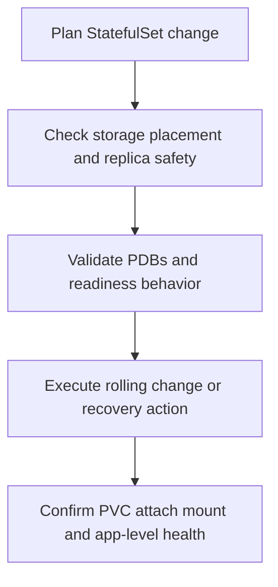

---
content_sources:
  diagrams:
    - id: operations-statefulset-day2-flow
      type: flowchart
      source: self-generated
      justification: StatefulSet day-2 operating flow synthesized from Microsoft Learn AKS upgrade behavior, stateful workload upgrade, Azure Disk, and Azure Files documentation.
      based_on:
        - https://learn.microsoft.com/en-us/azure/aks/upgrade-aks-faq
        - https://learn.microsoft.com/en-us/azure/aks/upgrade-conceptual
        - https://learn.microsoft.com/en-us/azure/aks/upgrade-aks-node-pools-rolling
        - https://learn.microsoft.com/en-us/azure/aks/create-volume-azure-disk
        - https://learn.microsoft.com/en-us/azure/aks/create-volume-azure-files
content_validation:
  status: verified
  last_reviewed: 2026-07-18
  reviewer: agent
  core_claims:
    - claim: "During an AKS cluster upgrade, StatefulSet pods are evicted and rescheduled, and the CSI driver reattaches persistent volumes to the new nodes."
      source: https://learn.microsoft.com/en-us/azure/aks/upgrade-aks-faq
      verified: true
    - claim: "AKS rolling node upgrades add surge capacity, cordon and drain nodes, reimage or replace them, and then remove surge capacity."
      source: https://learn.microsoft.com/en-us/azure/aks/upgrade-conceptual
      verified: true
    - claim: "Restrictive Pod Disruption Budgets can block evictions during AKS upgrades and leave nodes quarantined or otherwise delay completion."
      source: https://learn.microsoft.com/en-us/azure/aks/upgrade-conceptual
      verified: true
    - claim: "Azure Disk CSI supports expanding persistent volumes, and shrinking persistent volumes is not supported."
      source: https://learn.microsoft.com/en-us/azure/aks/create-volume-azure-disk
      verified: true
    - claim: "Azure Files CSI supports expanding persistent volumes."
      source: https://learn.microsoft.com/en-us/azure/aks/create-volume-azure-files
      verified: true
---

# StatefulSet Day-2 Operations

AKS does not make StatefulSets stateless; it makes their node lifecycle manageable. Day-2 ownership is about preserving ordering assumptions, keeping PDBs compatible with drain, recovering cleanly after node or zone loss, and resizing storage without creating accidental downtime.

## Prerequisites

- The StatefulSet storage path is documented: Azure Disk, Azure Files, or NFS service choice.
- PodDisruptionBudgets, readiness probes, and replica counts are reviewed before any node or cluster maintenance.
- Node-pool zone design is aligned with the StatefulSet’s storage placement model.
- StorageClass settings such as `allowVolumeExpansion` and `volumeBindingMode` are known.

## When to Use

- Rolling StatefulSet changes or Kubernetes upgrades.
- Recovery after node loss or zone loss.
- PVC expansion for growing state.
- Preflight review before draining a node pool that hosts stateful pods.

## Procedure

<!-- diagram-id: operations-statefulset-day2-flow -->

### 1) Respect StatefulSet ordering and identity

StatefulSets carry stable identities and storage attachments. Treat these as part of the workload contract.

Practical rules:

- Roll one replica boundary at a time unless the application explicitly tolerates more concurrency.
- Keep headless Service and DNS assumptions stable during rollout.
- Do not mix storage-class or zone changes with image changes unless the runbook explicitly calls for both.

### 2) Understand how AKS node operations affect stateful pods

During upgrade or repair, AKS rolls nodes by adding surge capacity, draining nodes, and reimaging or replacing them. StatefulSet pods are evicted like other pods, then rescheduled.

What determines whether that is safe:

- the CSI driver can reattach the volume where the replacement pod lands
- the PDB allows the eviction to happen
- readiness returns fast enough that the next pod can move safely

### 3) Keep PDBs compatible with real replica math

PDBs protect availability, but they can also block maintenance.

Good operator habits:

- make sure at least one disruption is allowed when drain is expected
- avoid `maxUnavailable: 0` on workloads that must survive in-place upgrades
- verify the replica count still satisfies quorum or application majority rules after one eviction

### 4) Recovery after node loss or zone loss

| Failure | What to verify first |
|---|---|
| Single node loss | Stateful pod rescheduled, PVC reattached, mount healthy, replica recovered |
| Zone loss with LRS disk | Whether the volume is zone-pinned and therefore blocks cross-zone recovery |
| Zone loss with ZRS disk | Whether scheduling, quotas, and app-level replication allow regional in-zone reattach |

The key AKS-specific question is not just “did the pod restart?” but “could the volume follow it to where the scheduler placed it?”

### 5) Expanding PVCs safely

PVC growth should be treated as a planned day-2 change:

- verify `allowVolumeExpansion: true`
- patch the PVC upward only
- watch for resize lag before declaring success
- if the app caches capacity at startup, restart or roll the pods in a controlled sequence

For StatefulSets, keep storage expansion separate from unrelated rollout changes whenever possible.

## Verification

- All StatefulSet replicas return to Ready in the expected order.
- PVCs remain bound and the expected volumes are attached and mounted.
- PDB settings allow the maintenance action that just occurred.
- Post-change application validation proves reads, writes, and quorum behavior are healthy.

## Rollback / Troubleshooting

- If a drain stalls, start with the PDB and allowed disruptions rather than the node image itself.
- If a pod reschedules but the volume does not, verify zone placement, attach limits, and StorageClass behavior.
- If expansion completes at the control plane but the filesystem view lags, recheck pod mount state before escalating.
- If a rolling update stalls on one ordinal, inspect DNS assumptions, headless Service health, and dependency on earlier pods.

## See Also

- [Azure Disk CSI Driver](../platform/azure-disk-csi-driver.md)
- [Azure Files CSI Driver](../platform/azure-files-csi-driver.md)
- [Snapshot Operations](snapshot-operations.md)
- [StatefulSet Stuck During Rolling Update](../troubleshooting/playbooks/storage/statefulset-stuck-rolling-update.md)

## Sources

- [AKS upgrades FAQ](https://learn.microsoft.com/en-us/azure/aks/upgrade-aks-faq)
- [How AKS cluster upgrades work](https://learn.microsoft.com/en-us/azure/aks/upgrade-conceptual)
- [Configure rolling node pool upgrades in AKS](https://learn.microsoft.com/en-us/azure/aks/upgrade-aks-node-pools-rolling)
- [Create and manage Azure Disk persistent volumes on AKS](https://learn.microsoft.com/en-us/azure/aks/create-volume-azure-disk)
- [Create and manage Azure Files persistent volumes on AKS](https://learn.microsoft.com/en-us/azure/aks/create-volume-azure-files)
