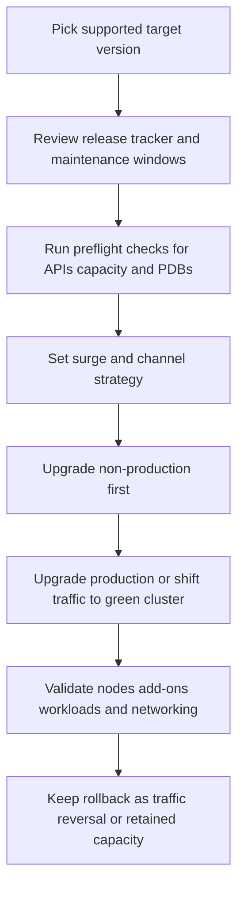

---
content_sources:
  diagrams:
    - id: operations-upgrades-safe-workflow
      type: flowchart
      source: self-generated
      justification: Safe AKS upgrade workflow synthesized from Microsoft Learn guidance for version support, upgrade validation, maintenance scheduling, node OS channels, and release tracking.
      based_on:
        - https://learn.microsoft.com/en-us/azure/aks/supported-kubernetes-versions
        - https://learn.microsoft.com/en-us/azure/aks/upgrade-options
        - https://learn.microsoft.com/en-us/azure/aks/auto-upgrade-cluster
        - https://learn.microsoft.com/en-us/azure/aks/auto-upgrade-node-os-image
        - https://learn.microsoft.com/en-us/azure/aks/planned-maintenance
        - https://learn.microsoft.com/en-us/azure/aks/release-tracker
content_validation:
  status: verified
  last_reviewed: 2026-07-18
  reviewer: agent
  core_claims:
    - claim: "AKS performs pre-upgrade validations that include deprecated API detection, valid upgrade-path checks, Pod Disruption Budget review, quota checks, subnet capacity checks, expired credential checks, and managed resource lock checks."
      source: https://learn.microsoft.com/en-us/azure/aks/upgrade-options
      verified: true
    - claim: "AKS recommends using a maintenance window of four hours or more when you use auto-upgrade or node OS auto-upgrade."
      source: https://learn.microsoft.com/en-us/azure/aks/planned-maintenance
      verified: true
    - claim: "AKS supports the latest GA Kubernetes minor version and the two previous GA minor versions, with an additional platform-support-only N-3 window."
      source: https://learn.microsoft.com/en-us/azure/aks/supported-kubernetes-versions
      verified: true
    - claim: "Node image and security-patch releases can be tracked by region in the AKS release tracker."
      source: https://learn.microsoft.com/en-us/azure/aks/release-tracker
      verified: true
---

# Upgrades

AKS upgrades are lifecycle operations, not one-click events. A safe production path combines support-window awareness, maintenance scheduling, workload disruption controls, and explicit post-upgrade validation.

## Prerequisites

- Confirm the cluster and target version are still within the AKS support model.
- Review maintenance windows, auto-upgrade channels, and node OS channel settings.
- Validate workload resilience: replicas, readiness probes, PodDisruptionBudgets, and zone design.
- Confirm the change window includes rollback-by-traffic or rollback-by-capacity options.

## When to Use

- Moving to a newer supported Kubernetes minor or patch version.
- Rolling out node image or node OS security updates.
- Normalizing production clusters onto an auto-upgrade and maintenance policy.
- Preparing a high-risk version change that needs staged or blue/green execution.

## Procedure

<!-- diagram-id: operations-upgrades-safe-workflow -->


### 1) Pick the target deliberately

Use `az aks get-upgrades` and the AKS release tracker together:

- `az aks get-upgrades` tells you what the control plane can target now.
- The release tracker tells you whether the desired minor version, patch, or node image is actually available in your region.
- The version-support policy tells you whether you are staying in community support, entering platform support, or opting into LTS.

```bash
az aks get-upgrades \
    --resource-group "$RG" \
    --name "$CLUSTER_NAME" \
    --output table

az aks show \
    --resource-group "$RG" \
    --name "$CLUSTER_NAME" \
    --query "{kubernetesVersion:currentKubernetesVersion,autoUpgradeProfile:autoUpgradeProfile,supportPlan:supportPlan}" \
    --output yaml
```

| Command | Purpose |
| --- | --- |
| `az aks get-upgrades` | List available Kubernetes upgrade versions. |
| `--resource-group` | Resource group that contains the AKS cluster. |
| `--name` | Name of the AKS cluster. |
| `--output` | Output format for the result. |
| `az aks show` | Show current version and support plan. |
| `--resource-group` | Resource group that contains the AKS cluster. |
| `--name` | Name of the AKS cluster. |
| `--query` | Selects version, auto-upgrade profile, and support plan. |
| `--output` | Output format for the result. |

### 2) Run preflight checks before touching production

At minimum, review these failure domains before the first upgrade action:

- **Deprecated APIs**: check manifests, CRDs, admission webhooks, and controllers before the target minor version removes them.
- **Subnet and IP headroom**: surge nodes and pod density can fail upgrades before workloads move.
- **Quota and SKU capacity**: specialized pools and regional constraints can block surge creation.
- **Add-on and controller compatibility**: ingress, CSI drivers, policy engines, and workload identity dependencies must tolerate the target release.
- **PodDisruptionBudgets**: PDBs that allow zero effective disruption commonly block drain operations.
- **Max surge**: the faster you upgrade, the more temporary capacity and IP headroom you consume.

Useful checks:

```bash
kubectl get pdb --all-namespaces
kubectl api-resources
kubectl get nodes --show-labels

az aks show \
    --resource-group "$RG" \
    --name "$CLUSTER_NAME" \
    --query "networkProfile" \
    --output yaml
```

| Command | Purpose |
| --- | --- |
| `kubectl get pdb` | List PodDisruptionBudgets across namespaces. |
| `kubectl api-resources` | List the API resources available in the cluster. |
| `kubectl get nodes` | List nodes with labels. |
| `az aks show` | Show the cluster network profile. |
| `--resource-group` | Resource group that contains the AKS cluster. |
| `--name` | Name of the AKS cluster. |
| `--query` | Selects the network profile. |
| `--output` | Output format for the result. |

### 3) Choose the operating model

Use the least risky model that still meets delivery speed:

- **Manual upgrade**: best when you need explicit operator gates for every environment.
- **Cluster auto-upgrade + maintenance window**: best when you want to stay within the support window with less operator effort.
- **Blue/green cluster replacement**: best when the blast radius is unacceptable for in-place production rollout.

See [Auto-Upgrade Channels](auto-upgrade-channels.md), [Node OS Upgrades](node-os-upgrades.md), and [Blue-Green Upgrades](blue-green-upgrades.md) before finalizing the path.

### 4) Stage non-production first

Run the same upgrade mechanics you intend to use in production:

- Same channel or manual command path.
- Same max surge philosophy.
- Same maintenance schedule shape.
- Same critical controllers, webhooks, policy engines, and ingress components.

If non-production hides too many production-only controllers or traffic patterns, it is not a sufficient rehearsal.

### 5) Execute with explicit validation gates

For manual execution:

```bash
az aks upgrade \
    --resource-group "$RG" \
    --name "$CLUSTER_NAME" \
    --kubernetes-version <target-version> \
    --yes
```

| Command | Purpose |
| --- | --- |
| `az aks upgrade` | Upgrade the cluster to a target Kubernetes version. |
| `--resource-group` | Resource group that contains the AKS cluster. |
| `--name` | Name of the AKS cluster. |
| `--kubernetes-version` | Target Kubernetes version. |
| `--yes` | Skip the confirmation prompt. |

During execution, watch for:

- Drain failures caused by PDBs.
- Stuck or quarantined nodes.
- Node image rollout lag.
- Ingress or network-policy regressions.
- Add-on pods that never return to Ready.

### 6) Validate the cluster after the change

Post-upgrade validation should prove both platform health and workload health:

```bash
az aks show \
    --resource-group "$RG" \
    --name "$CLUSTER_NAME" \
    --query "{kubernetesVersion:currentKubernetesVersion,nodeResourceGroup:nodeResourceGroup,autoUpgradeProfile:autoUpgradeProfile}" \
    --output yaml

kubectl get nodes
kubectl get pods --all-namespaces
kubectl get events --all-namespaces --sort-by=.lastTimestamp
```

| Command | Purpose |
| --- | --- |
| `az aks show` | Show version, node resource group, and upgrade profile. |
| `--resource-group` | Resource group that contains the AKS cluster. |
| `--name` | Name of the AKS cluster. |
| `--query` | Selects version, node resource group, and upgrade profile. |
| `--output` | Output format for the result. |
| `kubectl get nodes` | List nodes to confirm the upgrade result. |
| `kubectl get pods` | List pods across namespaces. |
| `kubectl get events` | List Kubernetes events for troubleshooting. |

Validate at least:

- Node versions and node image labels match the intended end state.
- Core add-ons and critical DaemonSets returned to Ready.
- Ingress, DNS, storage, workload identity, and network-policy paths still work.
- Application probes, synthetic traffic, and business transactions pass.

## Verification

- Cluster version, node versions, and node image rollout match the planned target.
- No cluster-critical add-on remains degraded after the upgrade window.
- Synthetic checks succeed for north-south traffic, east-west traffic, and Azure dependency access.
- The incident team can point to a concrete rollback path that does not rely on an in-place version reversal.

## Rollback / Troubleshooting

- For high-risk production changes, treat **rollback as traffic reversal or retained capacity**, not as an in-place downgrade plan.
- If drains fail, start with [Upgrade Blocked by Pod Disruption Budget](../troubleshooting/playbooks/operations/upgrade-blocked-pdb.md).
- If the control plane refuses the target, start with [Upgrade Blocked by Deprecated API](../troubleshooting/playbooks/operations/upgrade-blocked-deprecated-api.md).
- If nodes stall on image rollout, use [Node Image Upgrade Stuck](../troubleshooting/playbooks/operations/node-image-upgrade-stuck.md).
- If surge nodes fail because of subnet pressure, use [Surge Upgrade IP Exhaustion](../troubleshooting/playbooks/operations/surge-upgrade-ip-exhaustion.md).

## See Also

- [AKS Version Lifecycle](../platform/version-lifecycle.md)
- [Version Support](../reference/version-support.md)
- [Auto-Upgrade Channels](auto-upgrade-channels.md)
- [Node OS Upgrades](node-os-upgrades.md)
- [Maintenance Windows](maintenance-windows.md)
- [Blue-Green Upgrades](blue-green-upgrades.md)
- [Reliability](../best-practices/reliability.md)

## Sources

- [Supported Kubernetes versions in AKS](https://learn.microsoft.com/en-us/azure/aks/supported-kubernetes-versions)
- [Upgrade options and recommendations for AKS clusters](https://learn.microsoft.com/en-us/azure/aks/upgrade-options)
- [Automatically upgrade an AKS cluster](https://learn.microsoft.com/en-us/azure/aks/auto-upgrade-cluster)
- [Autoupgrade node OS images in AKS](https://learn.microsoft.com/en-us/azure/aks/auto-upgrade-node-os-image)
- [Use planned maintenance to schedule and control upgrades for AKS clusters](https://learn.microsoft.com/en-us/azure/aks/planned-maintenance)
- [AKS release tracker](https://learn.microsoft.com/en-us/azure/aks/release-tracker)
