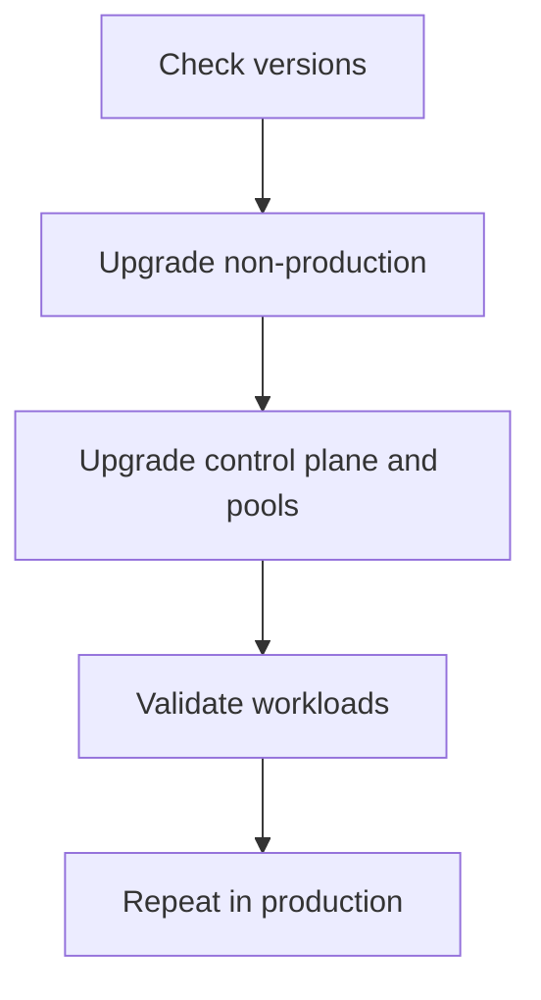

---
content_sources:
  diagrams:
  - id: operations-upgrades
    type: flowchart
    source: mslearn-adapted
    mslearn_url: https://learn.microsoft.com/en-us/azure/aks/learn/quick-kubernetes-deploy-cli
    based_on:
    - https://learn.microsoft.com/en-us/azure/aks/learn/quick-kubernetes-deploy-cli
    - https://learn.microsoft.com/en-us/azure/aks/upgrade-cluster
    - https://learn.microsoft.com/en-us/azure/azure-monitor/containers/container-insights-overview
    - https://learn.microsoft.com/en-us/azure/aks/supported-kubernetes-versions
    - https://learn.microsoft.com/en-us/azure/aks/release-tracker
content_validation:
  status: verified
  last_reviewed: 2026-07-18
  reviewer: agent
  core_claims:
    - claim: "AKS supports the latest GA Kubernetes minor version and the two previous GA minor versions (N, N-1, and N-2)."
      source: https://learn.microsoft.com/en-us/azure/aks/supported-kubernetes-versions
      verified: true
    - claim: "AKS performs pre-upgrade validations that check for API breaking changes, valid upgrade versions, Pod Disruption Budget issues, quota, subnet capacity, expired credentials, and managed resource locks."
      source: https://learn.microsoft.com/en-us/azure/aks/upgrade-options
      verified: true
    - claim: "Surge nodes require additional IP capacity, and AKS documents the subnet sizing formula as (number of nodes + maxSurge) * (1 + maxPods)."
      source: https://learn.microsoft.com/en-us/azure/aks/upgrade-options
      verified: true
    - claim: "AKS node image versions can't be downgraded."
      source: https://learn.microsoft.com/en-us/azure/aks/upgrade-node-image
      verified: true
---


# Upgrades

AKS upgrades touch both Kubernetes version and node image lifecycle. A safe upgrade is a staged change with explicit pre-checks, workload validation, and rollback criteria.

## Prerequisites

- Review supported versions and target version compatibility.
- Confirm workload manifests and controllers support the target version.
- Review maintenance windows, PDBs, and cluster autoscaler settings.

## When to Use

- Moving to a supported Kubernetes version.
- Applying node image updates.
- Aligning cluster posture with security or support policy.

## Procedure
<!-- diagram-id: operations-upgrades -->



```bash
az aks get-upgrades --resource-group $RG --name $CLUSTER_NAME --output table
az aks upgrade     --resource-group $RG     --name $CLUSTER_NAME     --kubernetes-version <target-version>     --yes
kubectl get nodes
kubectl get pods -A
```

## Verification

```bash
az aks show --resource-group $RG --name $CLUSTER_NAME --query kubernetesVersion --output tsv
kubectl version
kubectl get events -A --sort-by=.lastTimestamp
```

## Rollback / Troubleshooting

- AKS does not offer a simple in-place downgrade path for every upgrade scenario, so test first.
- If workloads fail after upgrade, inspect API deprecations, CRD/controller compatibility, and PDB constraints.
- If one pool is problematic, isolate validation there before widening the rollout.

## See Also

- [Version Support](../reference/version-support.md)
- [Reliability](../best-practices/reliability.md)
- [Upgrade Failure](../troubleshooting/playbooks/operations/upgrade-failure.md)

## Sources

- [Create an AKS cluster](https://learn.microsoft.com/azure/aks/learn/quick-kubernetes-deploy-cli)
- [Upgrade an AKS cluster](https://learn.microsoft.com/azure/aks/upgrade-cluster)
- [Monitor AKS with Container insights](https://learn.microsoft.com/azure/azure-monitor/containers/container-insights-overview)
- [Supported Kubernetes versions in AKS](https://learn.microsoft.com/azure/aks/supported-kubernetes-versions)
- [AKS release tracker](https://learn.microsoft.com/azure/aks/release-tracker)
