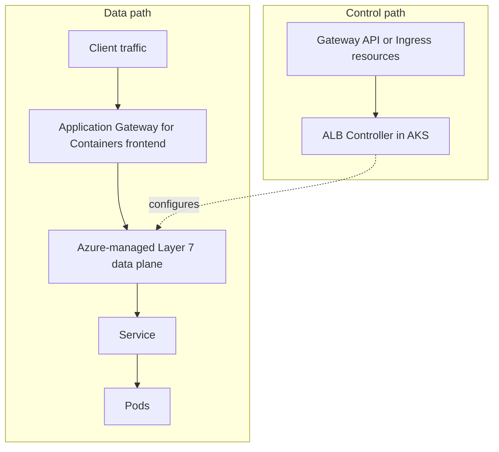

# Application Gateway for Containers

Application Gateway for Containers (AGC) is a newer Azure-managed ingress direction for Kubernetes workloads on AKS. It keeps the Layer 7 data plane outside the cluster while letting application teams describe routing with Kubernetes-native APIs.

## Main Content

<!-- diagram-id: platform-application-gateway-for-containers-flow -->


### Why teams look at AGC now

AGC is built for Kubernetes from the ground up and carries forward lessons from AGIC. The control model is intentionally different from classic Application Gateway plus AGIC:

- **Azure-managed ingress data plane** stays outside the cluster.
- **Kubernetes-native config** uses Ingress or Gateway API resources.
- **Gateway API direction** aligns with current AKS traffic-management guidance.
- **Faster app-platform separation** lets platform teams own the Azure ingress layer while app teams own routes.

That does **not** mean AGC universally replaces AGIC. It is a newer Azure-managed ingress direction. The right choice still depends on your workload shape, migration budget, existing Application Gateway footprint, and whether Gateway API adoption is part of the platform standard.

### Gateway API resource model

AGC supports both Ingress and Gateway API, but the long-term design is easier to understand through Gateway API objects:

| Resource | Role with AGC | What platform teams care about |
|---|---|---|
| `GatewayClass` | Declares the ALB controller implementation | Which controller owns the gateway lifecycle |
| `Gateway` | Defines listeners and entry points | Port exposure, TLS posture, shared ownership model |
| `HTTPRoute` | Defines hostname, path, header, and backend rules | App-team routing without editing shared infrastructure |
| `GRPCRoute` | Defines gRPC routing | Useful for service APIs that already standardize on gRPC |
| `ReferenceGrant` | Enables cross-namespace attachment where allowed | Multi-team boundary control |

The practical shift is that AGC reduces dependence on annotation-heavy ingress patterns. When you need richer traffic policy, Gateway API usually scales better than long controller-specific annotation lists.

### AGC versus AGIC versus ingress-nginx

| Option | Best fit | Strengths | Watch-outs |
|---|---|---|---|
| **Application Gateway for Containers** | New AKS platforms that want Azure-managed ingress and a Gateway API path | Azure-managed data plane, Ingress plus Gateway API support, WAF integration, health probes, traffic splitting | AKS add-on workflow still references preview feature registration in current Learn quickstarts, so verify current status before rollout |
| **AGIC** | Existing platforms already standardized on classic Application Gateway and Kubernetes Ingress | Proven Azure edge integration, reuse of existing App Gateway estates, familiar for brownfield teams | Older control model, less aligned with Gateway API direction, migration planning needed over time |
| **ingress-nginx** | Teams that need broad community compatibility or already depend on NGINX-specific behavior | Large ecosystem, common skills in Kubernetes teams | Upstream project retirement affects long-term planning, and Microsoft recommends planning migration paths |

### Where AGC fits relative to app routing and Istio gateways

- Use **AGC** when the platform wants an Azure-managed north-south ingress tier with Gateway API alignment.
- Use the **application routing add-on with NGINX** when you need a managed NGINX path now and have a near-term migration plan.
- Use an **Istio ingress gateway** when ingress policy is part of a broader service-mesh decision rather than only an ingress-controller decision.

AGC and Istio solve different layers of the platform problem. AGC is an Azure-managed ingress product. Istio is a service mesh with ingress capabilities.

### When to choose AGC

Choose AGC first when most of these are true:

1. You want Azure to operate the ingress data plane outside the cluster.
2. You want a Kubernetes-native control model that supports Gateway API.
3. You need Azure-managed health probes, WAF, retries, or traffic-splitting features at the ingress edge.
4. You are starting greenfield or can migrate from AGIC incrementally.

Stay with AGIC or another ingress when most of these are true:

1. You already have a mature Application Gateway plus AGIC estate.
2. You rely on AGIC-specific patterns that are not yet worth reworking.
3. You need a controller choice that matches an existing community or vendor standard more than Azure-managed direction.

### Current status and rollout note

Microsoft Learn documents AGC as an available service with a published region list in the overview article. For the **AKS-managed ALB Controller add-on path**, the current quickstart still requires registering `ManagedGatewayAPIPreview` and `ApplicationLoadBalancerPreview`. Treat that as a signal to verify the exact current add-on status on Learn before making it your default production standard.

### Verification commands

Show ALB controller pods:

```bash
kubectl get pods \
    --namespace kube-system
```

Verify the ALB GatewayClass exists:

```bash
kubectl get gatewayclass azure-alb-external \
    --output yaml
```

Check Gateway API resources:

```bash
kubectl get gateways.gateway.networking.k8s.io \
    --all-namespaces

kubectl get httproutes.gateway.networking.k8s.io \
    --all-namespaces
```

## See Also

- [Ingress and Load Balancing](ingress-load-balancing.md)
- [Istio Managed Add-on](istio-managed-addon.md)
- [Best Practices: Platform Extensions](../best-practices/platform-extensions.md)
- [AGC Traffic Not Flowing](../troubleshooting/playbooks/extensions/agc-traffic-not-flowing.md)

## Sources

- [What is Application Gateway for Containers?](https://learn.microsoft.com/en-us/azure/application-gateway/for-containers/overview)
- [Quickstart: Deploy Application Gateway for Containers ALB Controller using AKS Add-on](https://learn.microsoft.com/en-us/azure/application-gateway/for-containers/quickstart-deploy-application-gateway-for-containers-alb-controller-addon)
- [AKS managed NGINX ingress with the application routing add-on](https://learn.microsoft.com/en-us/azure/aks/app-routing)
- [Migrate from AGIC to Application Gateway for Containers](https://learn.microsoft.com/en-us/azure/application-gateway/for-containers/migrate-from-agic-to-agc)
