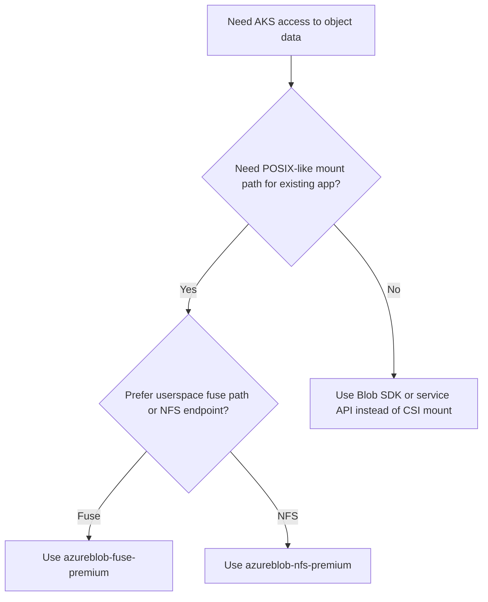

---
content_sources:
  diagrams:
    - id: platform-azure-blob-csi-access-paths
      type: flowchart
      source: self-generated
      justification: Azure Blob CSI access-path selection synthesized from Microsoft Learn AKS CSI driver and storage concepts documentation.
      based_on:
        - https://learn.microsoft.com/en-us/azure/aks/csi-storage-drivers
        - https://learn.microsoft.com/en-us/azure/aks/concepts-storage
content_validation:
  status: verified
  last_reviewed: 2026-07-18
  reviewer: agent
  core_claims:
    - claim: "AKS supports Azure Blob storage through the Azure Blob CSI driver."
      source: https://learn.microsoft.com/en-us/azure/aks/concepts-storage
      verified: true
    - claim: "Azure Blob CSI exposes blob storage to pods by using BlobFuse or NFS 3.0."
      source: https://learn.microsoft.com/en-us/azure/aks/csi-storage-drivers
      verified: true
    - claim: "The Azure Blob CSI driver includes built-in storage classes azureblob-fuse-premium and azureblob-nfs-premium."
      source: https://learn.microsoft.com/en-us/azure/aks/concepts-storage
      verified: true
    - claim: "Azure Blob CSI is intended for large unstructured datasets such as logs, images, documents, media, HPC data, and disaster recovery data."
      source: https://learn.microsoft.com/en-us/azure/aks/csi-storage-drivers
      verified: true
---

# Azure Blob CSI Driver

Azure Blob CSI is the AKS storage path for object-backed data that applications still want to consume through a filesystem mount. It works best when the data is large, unstructured, and shared more like content or archives than like a transactional disk.

## Main Content

### Choose the access path deliberately

<!-- diagram-id: platform-azure-blob-csi-access-paths -->

### What Azure Blob CSI is good at

| Use case | Why Blob CSI fits |
|---|---|
| Log, image, media, and document stores | Data is unstructured and naturally object-oriented. |
| Large read-heavy content sets | Blob storage is cost-efficient for scale-out object data. |
| HPC or analytics datasets already living in Blob or Data Lake | CSI mount avoids building an extra copy path just to feed AKS jobs. |
| Disaster recovery content or export bundles | The data often matters more than POSIX-perfect mutation semantics. |

### BlobFuse versus NFS semantics

| Access path | Best fit | Trade-off |
|---|---|---|
| BlobFuse | Existing app needs a mounted path over object data | Still an object store behind the mount, so filesystem expectations should be tested. |
| NFS 3.0 | Workloads that want an NFS endpoint over blob-backed data | Better for NFS-oriented tooling, but still not the same design target as Azure Files or Azure NetApp Files. |

The operator rule: **Blob CSI is a compatibility layer over object storage, not a substitute for block storage or a general-purpose shared POSIX file service.**

### When to choose Blob CSI versus Disk or Files

| If the workload needs... | Choose |
|---|---|
| Single-writer transactional block storage | [Azure Disk CSI Driver](azure-disk-csi-driver.md) |
| Multi-pod shared file access with RWX semantics | [Azure Files CSI Driver](azure-files-csi-driver.md) |
| Object-scale unstructured data exposed as a mount | Azure Blob CSI |

### Performance and operational expectations

- Expect Blob CSI performance to follow **object-storage access patterns**, not database-disk expectations.
- Test metadata-heavy and small-file workloads before standardizing on BlobFuse mounts.
- If the application can speak Blob or Data Lake APIs directly, that is often operationally cleaner than forcing a filesystem abstraction.

### Practical AKS guidance

- Use Blob CSI for **content**, **datasets**, and **recovery artifacts**.
- Do not make Blob CSI the default for StatefulSets just because it mounts.
- Reserve it for workloads whose data model is already comfortable with object-storage consistency and performance characteristics.

## See Also

- [Storage Options](storage-options.md)
- [Azure Disk CSI Driver](azure-disk-csi-driver.md)
- [Azure Files CSI Driver](azure-files-csi-driver.md)
- [Cluster Resource and PV Backup](../operations/cluster-resource-pv-backup.md)

## Sources

- [Storage concepts for AKS](https://learn.microsoft.com/en-us/azure/aks/concepts-storage)
- [Use CSI storage drivers on AKS](https://learn.microsoft.com/en-us/azure/aks/csi-storage-drivers)
