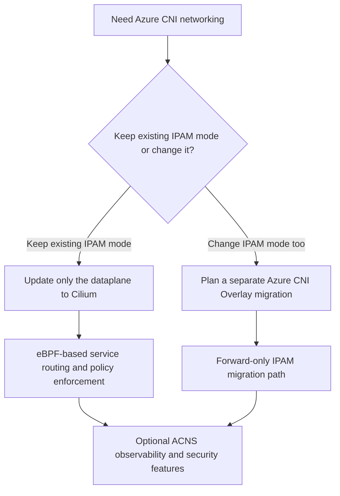

---
content_sources:
  diagrams:
    - id: platform-azure-cni-powered-by-cilium-decision-flow
      type: flowchart
      source: self-generated
      justification: Azure CNI Powered by Cilium data-plane and migration guidance synthesized from Microsoft Learn networking, Cilium, network policy, and Azure CNI update documentation.
      based_on:
        - https://learn.microsoft.com/en-us/azure/aks/azure-cni-powered-by-cilium
        - https://learn.microsoft.com/en-us/azure/aks/use-network-policies
        - https://learn.microsoft.com/en-us/azure/aks/update-azure-cni
        - https://learn.microsoft.com/en-us/azure/aks/advanced-container-networking-services-overview
content_validation:
  status: verified
  last_reviewed: 2026-07-18
  reviewer: agent
  core_claims:
    - claim: "Azure CNI Powered by Cilium combines the Azure CNI control plane with the Cilium data plane."
      source: https://learn.microsoft.com/en-us/azure/aks/azure-cni-powered-by-cilium
      verified: true
    - claim: "AKS Automatic uses Azure CNI Overlay powered by Cilium as its default virtual network."
      source: https://learn.microsoft.com/en-us/azure/aks/azure-cni-powered-by-cilium
      verified: true
    - claim: "AKS Standard can be created with Azure CNI Powered by Cilium as an optional networking configuration."
      source: https://learn.microsoft.com/en-us/azure/aks/azure-cni-powered-by-cilium
      verified: true
    - claim: "Existing Azure CNI clusters on node subnet, pod subnet, or overlay IPAM modes can update the data plane to Azure CNI Powered by Cilium."
      source: https://learn.microsoft.com/en-us/azure/aks/update-azure-cni
      verified: true
    - claim: "Kubenet clusters must migrate to Azure CNI Overlay before adopting Azure CNI Powered by Cilium."
      source: https://learn.microsoft.com/en-us/azure/aks/update-azure-cni
      verified: true
---

# Azure CNI Powered by Cilium

Azure CNI Powered by Cilium changes how AKS forwards packets and enforces pod policy inside the cluster. The important operator distinction is that this is a **data-plane choice**, not automatically an IP-address-management migration.

## Main Content

### What changes when AKS uses the Cilium dataplane

<!-- diagram-id: platform-azure-cni-powered-by-cilium-decision-flow -->


Azure CNI Powered by Cilium keeps Azure CNI in charge of AKS network integration while moving in-cluster forwarding and policy enforcement to Cilium.

Operationally, that means:

- AKS uses an eBPF-based dataplane instead of the older kube-proxy plus iptables-style model.
- Network policy enforcement happens through Cilium, so you don't install Azure NPM or Calico on top of it.
- The choice is compatible with Azure CNI overlay, pod-subnet, and node-subnet IP assignment modes.

### Why operators pick it

Microsoft Learn highlights these practical benefits:

- **Improved service routing**
- **More efficient network policy enforcement**
- **Better observability of cluster traffic**
- **Support for larger clusters**

The two biggest day-2 implications are usually:

1. **Packet handling path changes**. Incident patterns tied to kube-proxy rule growth, iptables complexity, or older policy engines look different after migration.
2. **Policy behavior changes**. Policy semantics remain Kubernetes-first, but the enforcing engine is different and some edge cases such as `ipBlock` behavior against pod or node IPs need explicit review.

### Cilium versus kube-proxy plus iptables or ipvs

| Topic | Older kube-proxy-oriented model | Azure CNI Powered by Cilium |
|---|---|---|
| Service forwarding | kube-proxy programs service rules on each node | Cilium handles service load balancing in the dataplane and AKS-created Cilium clusters do not use kube-proxy |
| Policy engine | Often Azure NPM or Calico added separately | Cilium enforces policy directly |
| Dataplane implementation | Rule-based packet handling on the node | eBPF-based packet handling in the kernel |
| Advanced observability | Separate tooling choices required | Cilium pairs naturally with Hubble-based observability through ACNS |

This does **not** mean every migration is automatically better. It means the cluster moves to a different operational contract, which is why policy validation and rollback planning matter.

### Feature set AKS exposes with Cilium

The base Azure CNI Powered by Cilium configuration supports:

- Kubernetes `NetworkPolicy`
- Cilium L3/L4 policy resources
- Cilium clusterwide policy resources
- Local Redirect Policy
- Cilium Endpoint Slices on supported Kubernetes versions

Microsoft Learn documents additional observability and security capabilities such as Hubble-backed metrics and logs, FQDN filtering, Layer 7 policy, WireGuard, and mTLS under **Advanced Container Networking Services (ACNS)** rather than as part of the bare dataplane.

Status guidance:

- **Azure CNI Powered by Cilium**: use the current Microsoft Learn page as the release-status source of truth: [Configure Azure CNI Powered by Cilium](https://learn.microsoft.com/en-us/azure/aks/azure-cni-powered-by-cilium).
- **Hubble or container network observability sub-features**: verify current status on the linked Microsoft Learn observability pages before rollout, because observability features can evolve independently from the base dataplane: [Set up Container Network Observability](https://learn.microsoft.com/en-us/azure/aks/container-network-observability-how-to) and [Advanced Container Networking Services overview](https://learn.microsoft.com/en-us/azure/aks/advanced-container-networking-services-overview).

### Migration constraints operators must plan for

The most important planning rule is: **IPAM migration and dataplane migration are separate operations**.

#### Supported dataplane migration paths

Existing clusters can update to the Cilium dataplane from:

- Azure CNI node-subnet mode
- Azure CNI dynamic IP allocation / pod-subnet mode
- Azure CNI overlay mode

Kubenet clusters **cannot** update directly to the Cilium dataplane. They must first move to Azure CNI Overlay, then update the dataplane as a separate step.

#### Constraints and disruption profile

- Updating to the Cilium dataplane triggers **simultaneous node-pool reimage operations**.
- Updating node pools one at a time for this feature isn't supported.
- Cilium starts enforcing network policy only **after all nodes are reimaged**.
- Clusters with **Windows node pools** can't be updated to Azure CNI Powered by Cilium.
- Clusters with **node auto-provisioning enabled** can't be updated until NAP is disabled.
- If the current cluster uses **Azure NPM or Calico**, that engine is removed and replaced by Cilium during the update.

#### Rollback constraints

Treat rollback as a **cluster recovery plan**, not as an assumption of instant reversibility.

For production change reviews, plan one of these paths before you start:

- **In-place update with validated maintenance window** when the cluster is already well understood and policy blast radius is small.
- **Blue/green cluster replacement** when policy behavior, add-on compatibility, or change-control requirements make rollback certainty more important than in-place simplicity.

### Example create and update commands

Create a new AKS Standard cluster with Azure CNI Overlay powered by Cilium:

```bash
az aks create \
    --resource-group "$RG" \
    --name "$CLUSTER_NAME" \
    --location "$LOCATION" \
    --network-plugin azure \
    --network-plugin-mode overlay \
    --network-dataplane cilium \
    --pod-cidr 192.168.0.0/16 \
    --generate-ssh-keys
```

| Command | Purpose |
| --- | --- |
| `az aks create` | Create a cluster with Cilium dataplane on overlay. |
| `--resource-group` | Resource group that contains the AKS cluster. |
| `--name` | Name of the AKS cluster. |
| `--location` | Azure region for the cluster. |
| `--network-plugin` | Container networking plugin. |
| `--network-plugin-mode` | Network plugin mode such as overlay. |
| `--network-dataplane` | Dataplane technology, Cilium for eBPF. |
| `--pod-cidr` | CIDR range for pod addresses. |
| `--generate-ssh-keys` | Generate SSH keys if none are provided. |

Update an existing Azure CNI cluster to the Cilium dataplane:

```bash
az aks update \
    --resource-group "$RG" \
    --name "$CLUSTER_NAME" \
    --network-dataplane cilium
```

| Command | Purpose |
| --- | --- |
| `az aks update` | Migrate the cluster to the Cilium dataplane. |
| `--resource-group` | Resource group that contains the AKS cluster. |
| `--name` | Name of the AKS cluster. |
| `--network-dataplane` | Dataplane technology, Cilium for eBPF. |

Confirm the active dataplane and network mode:

```bash
az aks show \
    --resource-group "$RG" \
    --name "$CLUSTER_NAME" \
    --query "networkProfile.{plugin:networkPlugin,mode:networkPluginMode,dataplane:networkDataplane,policy:networkPolicy}" \
    --output yaml
```

| Command | Purpose |
| --- | --- |
| `az aks show` | Show the plugin, mode, dataplane, and policy. |
| `--resource-group` | Resource group that contains the AKS cluster. |
| `--name` | Name of the AKS cluster. |
| `--query` | Selects plugin, mode, dataplane, and policy. |
| `--output` | Output format for the result. |

## See Also

- [Networking Models](networking-models.md)
- [CoreDNS on AKS](coredns-on-aks.md)
- [LocalDNS on AKS](node-local-dns-cache.md)
- [Best Practices: Networking](../best-practices/networking.md)
- [NetworkPolicy Migration Issues](../troubleshooting/playbooks/network-policy/cilium-dataplane-migration-issues.md)

## Sources

- [Configure Azure CNI Powered by Cilium in AKS](https://learn.microsoft.com/en-us/azure/aks/azure-cni-powered-by-cilium)
- [Secure pod traffic with network policies in AKS](https://learn.microsoft.com/en-us/azure/aks/use-network-policies)
- [Update Azure CNI IPAM mode and data plane for AKS clusters](https://learn.microsoft.com/en-us/azure/aks/update-azure-cni)
- [Advanced Container Networking Services overview](https://learn.microsoft.com/en-us/azure/aks/advanced-container-networking-services-overview)
- [Set up Container Network Observability for AKS](https://learn.microsoft.com/en-us/azure/aks/container-network-observability-how-to)
