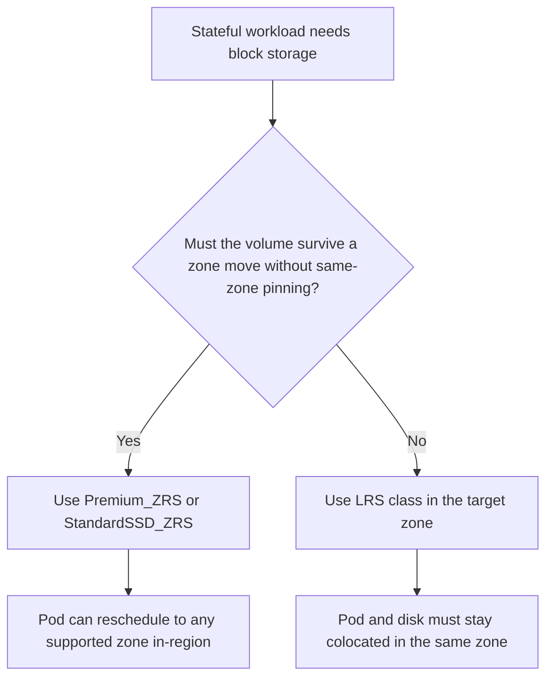

---
content_sources:
  diagrams:
    - id: platform-azure-disk-csi-placement
      type: flowchart
      source: self-generated
      justification: Azure Disk CSI placement and storage-class guidance synthesized from Microsoft Learn AKS storage concepts, CSI driver, and Azure Disk volume management articles.
      based_on:
        - https://learn.microsoft.com/en-us/azure/aks/concepts-storage
        - https://learn.microsoft.com/en-us/azure/aks/csi-storage-drivers
        - https://learn.microsoft.com/en-us/azure/aks/create-volume-azure-disk
        - https://learn.microsoft.com/en-us/azure/aks/azure-disk-customer-managed-keys
content_validation:
  status: verified
  last_reviewed: 2026-07-18
  reviewer: agent
  core_claims:
    - claim: "Azure Disks in AKS are mounted as ReadWriteOnce and are available to only one node at a time."
      source: https://learn.microsoft.com/en-us/azure/aks/concepts-storage
      verified: true
    - claim: "Beginning with Kubernetes version 1.29, AKS built-in managed disk storage classes use ZRS for multi-availability-zone clusters, while operators can still create custom LRS storage classes when cost or placement requires it."
      source: https://learn.microsoft.com/en-us/azure/aks/concepts-storage
      verified: true
    - claim: "The Azure Disk CSI driver supports Premium_ZRS and StandardSSD_ZRS, and ZRS disks can be scheduled on zonal or nonzonal nodes without the same-zone colocation restriction of zonal disks."
      source: https://learn.microsoft.com/en-us/azure/aks/csi-storage-drivers
      verified: true
    - claim: "Azure Disk CSI supports snapshots, clones, and online persistent-volume expansion."
      source: https://learn.microsoft.com/en-us/azure/aks/csi-storage-drivers
      verified: true
---

# Azure Disk CSI Driver

Azure Disk CSI is the default AKS choice for single-writer state that needs block-storage semantics, predictable latency, and Kubernetes-native lifecycle operations. The key operator job is matching disk redundancy, zone behavior, and disk-family performance to the way pods actually fail over.

## Main Content

### Placement model and redundancy choices

<!-- diagram-id: platform-azure-disk-csi-placement -->


Azure Disk decisions on AKS split into two questions:

- **Block semantics**: Azure Disk is the right fit when one pod instance owns the volume at a time.
- **Placement semantics**: choose whether the disk should be **zone-pinned** (LRS) or **zone-redundant** (ZRS).

### StorageClass options AKS operators actually use

| Option | Typical provisioner parameters | Best fit | Watch-outs |
|---|---|---|---|
| Built-in `managed-csi` | Standard SSD, AKS-managed defaults | Cost-sensitive production or nonproduction block storage | In multi-zone AKS 1.29+ clusters, built-in class uses ZRS; create a custom LRS class if you need explicit zone pinning. |
| Built-in `managed-csi-premium` | Premium SSD, AKS-managed defaults | Production block storage default | Same built-in ZRS behavior in multi-zone AKS 1.29+ clusters. |
| Custom `StandardSSD_LRS` | `skuName: StandardSSD_LRS` | Single-zone workloads, lower cost, explicit zone affinity | Volume stays tied to the zone where it was provisioned. |
| Custom `Premium_LRS` | `skuName: Premium_LRS` | Single-zone production workloads that want lower ZRS cost | Same zone-colocation constraint as other zonal disks. |
| Custom `StandardSSD_ZRS` | `skuName: StandardSSD_ZRS` | Shared regional recovery posture without Premium cost | Higher cost than LRS; validate region support. |
| Custom `Premium_ZRS` | `skuName: Premium_ZRS` | Multi-zone production workloads that must reattach across zones | More expensive than LRS, but easier failover behavior. |

Example custom class for explicit LRS pinning:

```yaml
apiVersion: storage.k8s.io/v1
kind: StorageClass
metadata:
  name: managed-premium-lrs
provisioner: disk.csi.azure.com
parameters:
  skuName: Premium_LRS
reclaimPolicy: Delete
volumeBindingMode: WaitForFirstConsumer
allowVolumeExpansion: true
```

### Zone-pinned versus zone-redundant behavior

**LRS (zone-pinned)**

- Best when the workload is intentionally anchored to a zone.
- Lower cost than ZRS.
- Requires the replacement pod to land in the same zone as the disk.
- Most likely to surface `FailedAttachVolume` after node or zone shifts if scheduling constraints drift.

**ZRS (zone-redundant)**

- Best when the workload should reattach inside the region without same-zone pinning.
- Simplifies failover after zonal node loss.
- Removes the “pod and disk must be in the same zone” constraint.
- Costs more, so use it where the failover benefit matters.

### Multi-zone constraints operators should expect

- Built-in AKS disk classes in multi-zone clusters already bias toward ZRS beginning with AKS 1.29.
- `WaitForFirstConsumer` is still the safest binding mode for custom zonal classes because it waits for actual pod scheduling before provisioning the disk.
- If you force LRS in a multi-zone cluster, treat the StatefulSet zone as part of the workload contract.

### Performance planning: family first, size second

For Azure Disk CSI, the **StorageClass chooses the disk family and redundancy**, but the **actual IOPS and throughput ceiling comes from the managed disk size SKU** that backs the PVC.

| Disk family | Planning rule | Operator takeaway |
|---|---|---|
| `StandardSSD_*` | Lower-cost SSD family with size-based performance ceilings | Use for moderate state, queues, and noncritical block storage. |
| `Premium_*` | Higher-performance SSD family with size-based performance ceilings | Default family for production StatefulSets. |
| `PremiumV2_LRS` / `UltraSSD_LRS` | Explicitly tunable IOPS and MB/s through storage-class parameters | Use when PVC size alone should not determine performance. |

If a workload needs a higher ceiling, increasing only replicas will not help the disk. Revisit the PVC size class or move to a custom Premium SSD v2 or Ultra Disk design.

### Encryption and customer-managed keys

Use customer-managed keys when the platform security baseline requires encryption ownership outside Microsoft-managed keys. Keep the operational implications in mind:

- The disk encryption set and managed disks must stay in the same region.
- Key availability becomes part of workload availability.
- Stateful restore drills should include the disk-encryption-set dependency, not just the PVC manifest.

## See Also

- [Storage Options](storage-options.md)
- [Azure Files CSI Driver](azure-files-csi-driver.md)
- [Snapshot Operations](../operations/snapshot-operations.md)
- [PVC Stuck in Pending](../troubleshooting/playbooks/storage/pvc-stuck-pending.md)
- [Volume Attach Failure](../troubleshooting/playbooks/storage/volume-attach-failure.md)

## Sources

- [Storage concepts for AKS](https://learn.microsoft.com/en-us/azure/aks/concepts-storage)
- [Use CSI storage drivers on AKS](https://learn.microsoft.com/en-us/azure/aks/csi-storage-drivers)
- [Create and manage Azure Disk persistent volumes on AKS](https://learn.microsoft.com/en-us/azure/aks/create-volume-azure-disk)
- [Use customer-managed keys with Azure Disk on AKS](https://learn.microsoft.com/en-us/azure/aks/azure-disk-customer-managed-keys)
