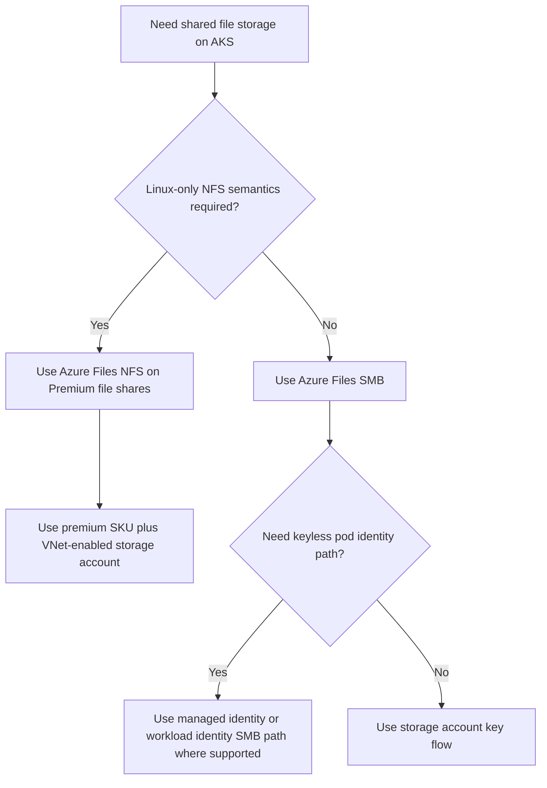

---
content_sources:
  diagrams:
    - id: platform-azure-files-csi-protocol-choice
      type: flowchart
      source: self-generated
      justification: Azure Files CSI protocol and authentication guidance synthesized from Microsoft Learn AKS Azure Files volume management and CSI driver documentation.
      based_on:
        - https://learn.microsoft.com/en-us/azure/aks/csi-storage-drivers
        - https://learn.microsoft.com/en-us/azure/aks/create-volume-azure-files
        - https://learn.microsoft.com/en-us/azure/aks/concepts-storage
content_validation:
  status: verified
  last_reviewed: 2026-07-18
  reviewer: agent
  core_claims:
    - claim: "Azure Files CSI on AKS supports SMB and NFS, and Azure Files can share data across multiple nodes and pods."
      source: https://learn.microsoft.com/en-us/azure/aks/concepts-storage
      verified: true
    - claim: "The Azure Files CSI driver mounts SMB file shares with key-based authentication, while NFS file shares do not require key-based authentication."
      source: https://learn.microsoft.com/en-us/azure/aks/create-volume-azure-files
      verified: true
    - claim: "Azure Files NFS on AKS requires premium file shares and a virtual-network-enabled storage account."
      source: https://learn.microsoft.com/en-us/azure/aks/create-volume-azure-files
      verified: true
    - claim: "Azure Files CSI supports volume expansion and volume snapshots on AKS."
      source: https://learn.microsoft.com/en-us/azure/aks/create-volume-azure-files
      verified: true
---

# Azure Files CSI Driver

Azure Files CSI is the AKS answer for shared file storage: multiple pods, multiple nodes, one persistent namespace. The important design choice is not just “Files versus Disk,” but also **SMB versus NFS**, **premium versus standard**, and **identity versus key-based mount behavior**.

## Main Content

### Start with protocol, not with storage account SKU

<!-- diagram-id: platform-azure-files-csi-protocol-choice -->

### SMB versus NFS on AKS

| Protocol | Best fit | Strengths | Watch-outs |
|---|---|---|---|
| SMB | Cross-platform shared files, Windows support, common RWX app patterns | Broad AKS compatibility, dynamic provisioning, standard or premium tiers | Default CSI path is key-based; security posture must account for secret handling or preview identity path. |
| NFS 4.1 | Linux RWX workloads that want POSIX-style file behavior | No key-based mount requirement, good fit for Linux shared-state patterns | Premium file shares only, VNet-enabled storage account required, no Windows worker-node support. |

### Premium, Standard, and large-file planning

| Choice | When to use it | Why |
|---|---|---|
| `PremiumV2_LRS` / `PremiumV2_ZRS` | New performance-sensitive shared storage | Best default for latency-sensitive RWX workloads and better throughput tuning headroom. |
| `Premium_LRS` / `Premium_ZRS` | Existing premium estates that are not yet on provisioned v2 | Solid fit, but newer designs should compare against Premium v2 first. |
| `StandardV2_*` / `Standard_*` | Lower-cost shared content, config, moderate I/O | Use when the workload is not bottlenecked on file-share latency. |

For large-file or metadata-heavy workloads, plan storage around the access pattern:

- **Large sequential read/write**: test NFS with recommended mount options such as `nconnect=4`.
- **Metadata-heavy SMB**: use premium storage and validate cache-sensitive mount options.
- **Massive file counts**: validate share limits and backup implications before production cutover.

### Identity propagation: storage account key, managed identity, or workload identity

AKS operators should treat Azure Files authentication as three distinct operating models:

1. **Storage account key**
    - Most familiar SMB path.
    - CSI can store the key in a Kubernetes secret.
    - Simplest compatibility story, but highest secret-management burden.
2. **Managed identity**
    - Reduces secret handling by using identity to obtain access for SMB mounts where supported.
    - Better when you want node or platform identity to own the mount path.
3. **Workload identity**
    - Best long-term least-privilege model for SMB scenarios that support `mountWithWorkloadIdentityToken`.
    - Keeps application identity at pod scope instead of node scope.

Practical guidance:

- Prefer **workload identity** over long-lived storage account keys when the feature path is supported for your workload.
- Keep **storage account key** as the compatibility fallback, especially for older patterns or constrained platform combinations.
- For **NFS**, focus on network reachability and export behavior rather than secret distribution.

### Mount and network considerations

- Azure Files can be provisioned dynamically through CSI storage classes or statically against existing shares.
- Private-endpoint or VNet-restricted storage accounts require explicit CSI and DNS planning.
- NFS shares need a VNet-enabled storage account and premium tier.
- Expansion is Kubernetes-native as long as the StorageClass allows it.

### Operator patterns that work well

- Use Azure Files when a StatefulSet or application needs **RWX** semantics across replicas.
- Keep Azure Files out of the path for write-heavy single-writer databases that really want block storage.
- If the workload cares about ultra-low latency or advanced NAS data management, compare with [NFS on AKS](nfs-on-aks.md) before standardizing on Azure Files.

## See Also

- [Storage Options](storage-options.md)
- [NFS on AKS](nfs-on-aks.md)
- [Cluster Resource and PV Backup](../operations/cluster-resource-pv-backup.md)
- [Restore Drills](../operations/restore-drills.md)
- [Volume Mount Failure](../troubleshooting/playbooks/storage/volume-mount-failure.md)

## Sources

- [Storage concepts for AKS](https://learn.microsoft.com/en-us/azure/aks/concepts-storage)
- [Use CSI storage drivers on AKS](https://learn.microsoft.com/en-us/azure/aks/csi-storage-drivers)
- [Create and manage Azure Files persistent volumes on AKS](https://learn.microsoft.com/en-us/azure/aks/create-volume-azure-files)
