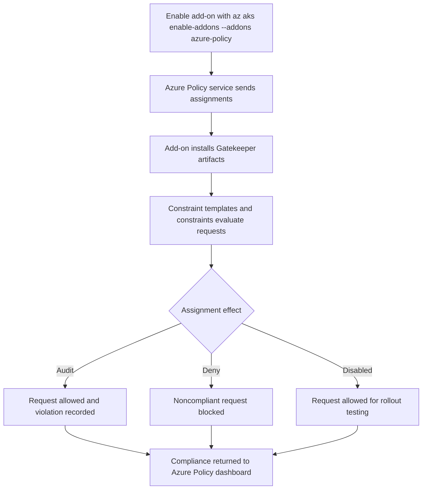

# Azure Policy Add-on

The Azure Policy add-on gives AKS a centralized governance path for Kubernetes admission controls. Use it when you need policy assignments, compliance reporting, and exception handling to live in Azure Policy instead of being scattered across hand-managed Gatekeeper installations.

## Main Content

<!-- diagram-id: platform-azure-policy-addon-flow -->


### What the add-on actually deploys

Azure Policy for Kubernetes is not a separate policy engine from Gatekeeper. The add-on deploys Azure Policy components into `kube-system` and Gatekeeper components into `gatekeeper-system`, then translates Azure Policy assignments into constraint templates and constraints that Gatekeeper evaluates.

Operational implication:

- Treat the Azure Policy add-on as the supported Gatekeeper distribution for AKS.
- Avoid keeping an older hand-installed Gatekeeper stack on the same cluster.
- Troubleshoot both the `azure-policy` and `gatekeeper` pods when enforcement or compliance looks wrong.

### Built-in initiatives for AKS

AKS governance usually starts from built-in Kubernetes initiatives rather than one-off definitions. The common entry points are the AKS baseline and restricted pod security initiatives for Linux-based workloads, then narrower built-ins for allowed images, capabilities, host namespaces, and similar controls.

Use this selection logic:

| Initiative pattern | Best fit | Typical rollout |
|---|---|---|
| Baseline pod security initiative | Shared application namespaces that need safer defaults without immediately breaking common workloads | Start with `audit`, fix drift, then move selected namespaces to `deny` |
| Restricted pod security initiative | Higher-trust workloads that can meet tighter `securityContext` and capability requirements | Pilot in one namespace first |
| Narrow built-in definitions | Specific controls such as allowed images or hostPath restrictions | Layer on top of baseline or restricted initiatives |
| Custom Gatekeeper-based definition | Organization-specific controls not covered by built-ins | Keep scope narrow and document exception ownership |

### Effect modes: audit, deny, disabled

The most important rollout decision is the assignment effect.

| Mode | What happens | When to use it |
|---|---|---|
| `audit` | Existing and new violations are reported as noncompliant, but requests continue | First rollout, discovery, and drift measurement |
| `deny` | New noncompliant admission requests are blocked | After teams have remediated the manifest set |
| `disabled` | Enforcement stays off while compliance results remain visible | Safe dry-run when validating a new definition or staged initiative update |

Practical guidance:

1. Start new initiatives in `audit`.
2. Validate namespace exclusions.
3. Review actual violating objects in Azure Policy.
4. Switch only the stable assignment set to `deny`.
5. Use `disabled` temporarily when testing updated policy content without breaking pipelines.

### Assignment scope and namespace handling

Azure Policy assignments happen at Azure scope, not at Kubernetes namespace scope alone. In practice, that means you usually assign at management group, subscription, or resource group scope, but the assignment must still include the AKS resource.

Then use parameters such as namespace exclusions to avoid breaking system namespaces and approved exception namespaces.

Common patterns:

- **Platform-wide baseline** at subscription or landing-zone resource group scope.
- **Higher-trust deny policy** at a dedicated production resource group scope.
- **Short-lived exception namespace** excluded through assignment parameters while teams remediate workloads.

### Compliance reporting flow

The add-on polls Azure Policy for assignment changes, creates or updates Gatekeeper artifacts, and sends evaluation results back to Azure Policy. That is what lights up the Azure Policy compliance dashboard.

Use the dashboard for these jobs:

- identify noncompliant clusters and namespaces,
- separate brownfield audit debt from new deny failures,
- confirm whether remediation reduced violation count,
- prove that a namespace exclusion or effect change did what you expected.

Remember the timing model from the Learn guidance: assignment sync and full cluster scans are periodic, so policy changes are not always reflected instantly.

### Verification commands

Enable the add-on:

```bash
az aks enable-addons \
    --addons azure-policy \
    --name "$CLUSTER_NAME" \
    --resource-group "$RG"
```

Verify the AKS add-on profile:

```bash
az aks show \
    --name "$CLUSTER_NAME" \
    --resource-group "$RG" \
    --query "addonProfiles.azurepolicy" \
    --output json
```

Verify Azure Policy and Gatekeeper pods:

```bash
kubectl get pods \
    --namespace kube-system

kubectl get pods \
    --namespace gatekeeper-system
```

Inspect installed constraint templates:

```bash
kubectl get constrainttemplates
```

## See Also

- [Pod Security Standards](pod-security-standards.md)
- [Defender for Containers](defender-for-containers.md)
- [Best Practices: Governance](../best-practices/governance.md)
- [Azure Policy Denies Workload](../troubleshooting/playbooks/security/azure-policy-denies-workload.md)
- [Best Practices: Security](../best-practices/security.md)

## Sources

- [Learn Azure Policy for Kubernetes](https://learn.microsoft.com/en-us/azure/governance/policy/concepts/policy-for-kubernetes)
- [Use Azure Policy to secure your Azure Kubernetes Service (AKS) clusters](https://learn.microsoft.com/en-us/azure/aks/use-azure-policy)
- [Azure Policy built-in definitions for Azure Kubernetes Service](https://learn.microsoft.com/en-us/azure/aks/policy-reference)
