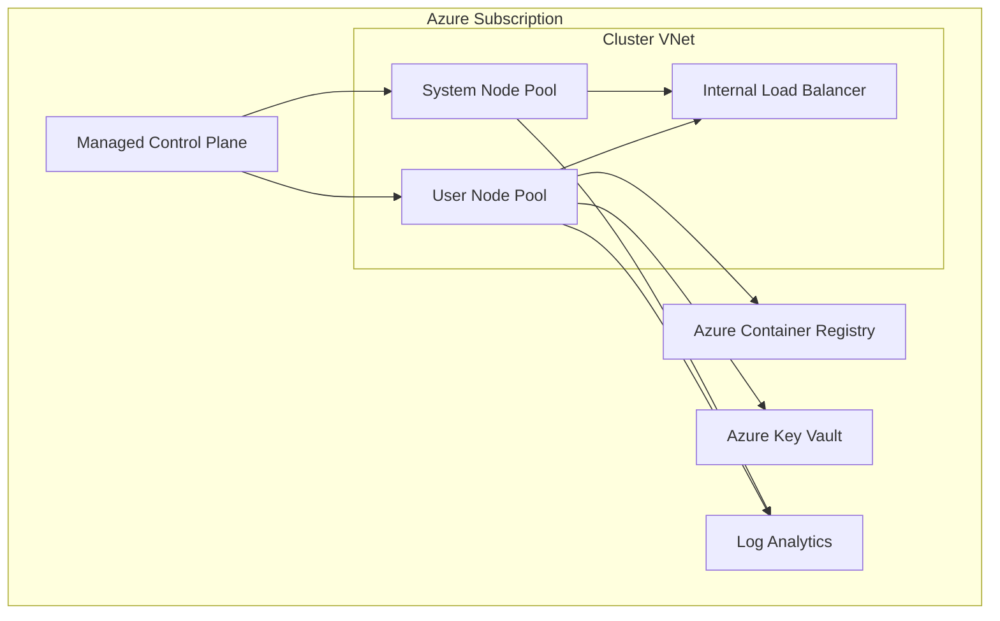

---
hide:
  - toc
---

# Cluster Architecture

AKS separates a Microsoft-managed control plane from customer-managed worker nodes. Most production design mistakes happen when teams treat the cluster as a single opaque box instead of a layered system.

## Main Content

### Control plane responsibilities

- Kubernetes API server, scheduler, controller manager, and etcd are managed by Azure.
- Control plane upgrades and health are Azure's responsibility, but your workload compatibility is still your responsibility.
- You don't SSH into the control plane; you interact through the Kubernetes API and Azure APIs.

### Data plane responsibilities

- Node pools, OS images, kubelet behavior, and workload placement remain your concern.
- Azure still manages AKS node image publishing, but you choose when to upgrade cluster and node pools.
- Networking, namespace boundaries, and workload isolation are customer-owned design areas.

### Azure resource relationships

- AKS creates and manages resources in the node resource group.
- Load balancers, managed disks, NICs, and public IPs often live there.
- Incident triage often requires checking both the cluster resource group and the node resource group.

## See Also

- [Platform](index.md)
- [Node Pools](node-pools.md)
- [Networking Models](networking-models.md)
- [Architecture Overview](../troubleshooting/architecture-overview.md)

## Sources

- [AKS core concepts for Kubernetes and workloads](https://learn.microsoft.com/azure/aks/concepts-clusters-workloads)
- [Azure Kubernetes Service (AKS) architecture](https://learn.microsoft.com/azure/architecture/reference-architectures/containers/aks/secure-baseline-aks)
