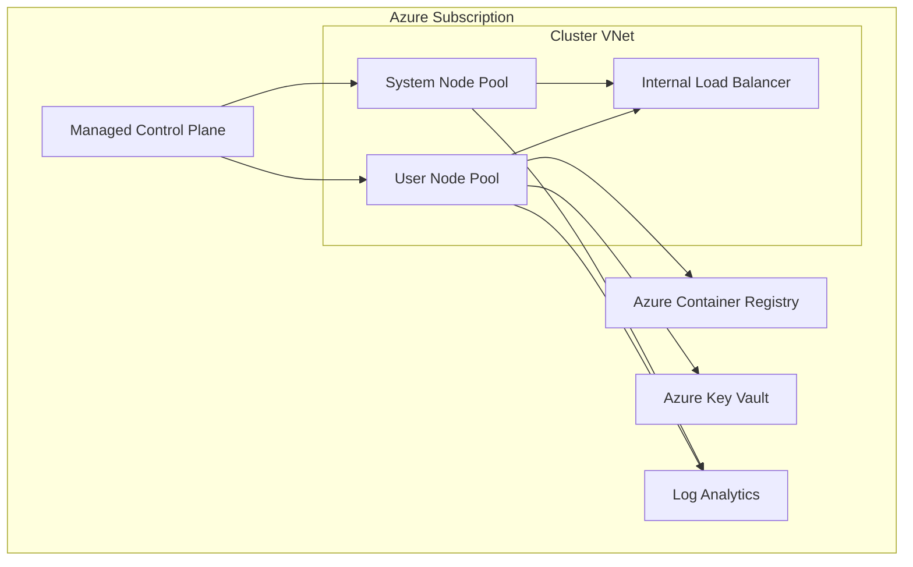
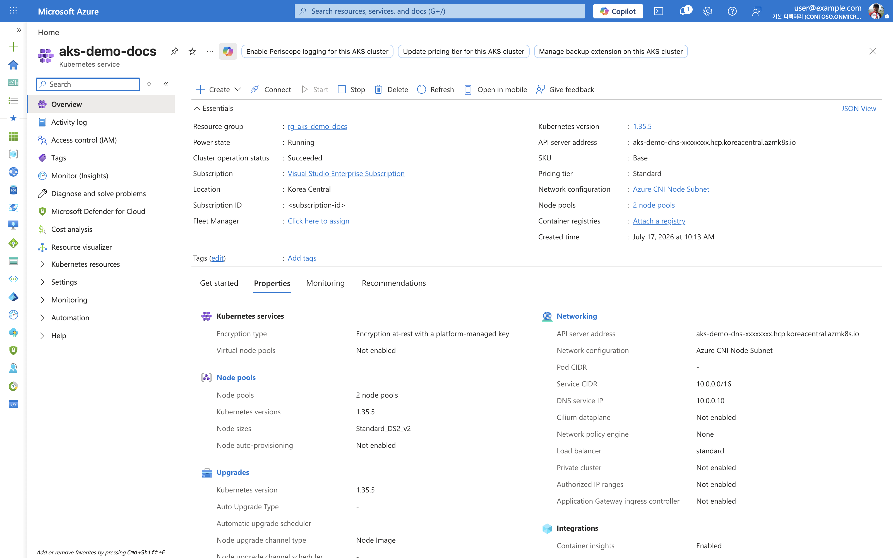
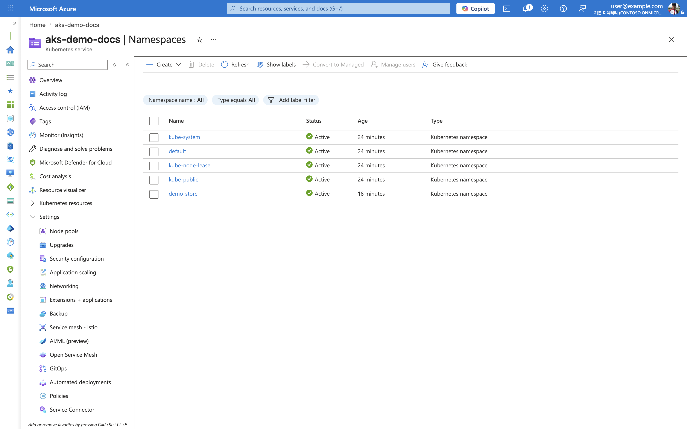

---
content_sources:
  diagrams:
  - id: platform-cluster-architecture
    type: flowchart
    source: mslearn-adapted
    mslearn_url: https://learn.microsoft.com/en-us/azure/aks/concepts-clusters-workloads
    based_on:
    - https://learn.microsoft.com/en-us/azure/aks/concepts-clusters-workloads
    - https://learn.microsoft.com/en-us/azure/architecture/reference-architectures/containers/aks/secure-baseline-aks
---

# Cluster Architecture

AKS separates a Microsoft-managed control plane from customer-managed worker nodes. Most production design mistakes happen when teams treat the cluster as a single opaque box instead of a layered system.

## Main Content
<!-- diagram-id: platform-cluster-architecture -->

### Control plane responsibilities

- Kubernetes API server, scheduler, controller manager, and etcd are managed by Azure.
- Control plane upgrades and health are Azure's responsibility, but your workload compatibility is still your responsibility.
- You don't SSH into the control plane; you interact through the Kubernetes API and Azure APIs.

### Data plane responsibilities

- Node pools, OS images, kubelet behavior, and workload placement remain your concern.
- Azure still manages AKS node image publishing, but you choose when to upgrade cluster and node pools.
- Networking, namespace boundaries, and workload isolation are customer-owned design areas.

### Azure resource relationships

- AKS creates and manages resources in the node resource group.
- Load balancers, managed disks, NICs, and public IPs often live there.
- Incident triage often requires checking both the cluster resource group and the node resource group.

### Confirm cluster identity in the Azure Portal

The **Overview** and **Properties** blades summarize the control plane, node pool count, Kubernetes version, and networking profile in one place.

Purpose: Show where to confirm the layered cluster identity — control plane version, node pool count, and networking profile — after provisioning.

Look for:

- **Provisioning state** shows `Succeeded` and **Power state** shows `Running`.
- The **Kubernetes version** matches the version this guide targets.
- The **API server address**, **Subscription ID**, and account header are sanitized (`aks-demo-dns-xxxxxxxx.hcp.<region>.azmk8s.io`, `<subscription-id>`, `user@example.com`).
- The **networking profile** (Azure CNI) and **node pool count** reflect the intended topology.

Expected result: The cluster reports a healthy managed control plane paired with the expected worker node pools and network plugin.

Next step: Open the Node pools blade to inspect system and user pool health and sizing.

### Review namespace boundaries

The **Namespaces** blade lists the Kubernetes namespaces that form your workload isolation boundaries, including system namespaces and your application namespaces.

Purpose: Confirm the namespace layout that separates platform add-ons from application workloads.

Look for:

- System namespaces (`kube-system`, `kube-public`, `kube-node-lease`, `default`) are present and `Active`.
- Your application namespace (for example, a dedicated app namespace) is `Active`.
- No unexpected namespaces exist that could indicate stray or unmanaged workloads.

Expected result: Namespaces cleanly separate system components from application workloads, supporting isolation and RBAC scoping.

## See Also

- [Platform](index.md)
- [Node Pools](node-pools.md)
- [Networking Models](networking-models.md)
- [Architecture Overview](../troubleshooting/architecture-overview.md)

## Sources

- [AKS core concepts for Kubernetes and workloads](https://learn.microsoft.com/azure/aks/concepts-clusters-workloads)
- [Azure Kubernetes Service (AKS) architecture](https://learn.microsoft.com/azure/architecture/reference-architectures/containers/aks/secure-baseline-aks)
