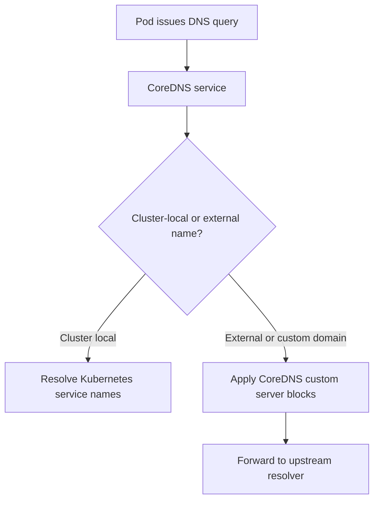

---
content_sources:
  diagrams:
    - id: platform-coredns-on-aks-query-path
      type: flowchart
      source: self-generated
      justification: AKS CoreDNS query path and customization guidance synthesized from Microsoft Learn DNS concepts and CoreDNS customization documentation.
      based_on:
        - https://learn.microsoft.com/en-us/azure/aks/coredns-custom
        - https://learn.microsoft.com/en-us/azure/aks/dns-concepts
content_validation:
  status: verified
  last_reviewed: 2026-07-18
  reviewer: agent
  core_claims:
    - claim: "AKS uses CoreDNS for cluster DNS management and resolution on Kubernetes 1.12.x and later."
      source: https://learn.microsoft.com/en-us/azure/aks/coredns-custom
      verified: true
    - claim: "AKS is a managed service, so operators do not modify the main CoreDNS CoreFile directly and instead use a ConfigMap for customizations."
      source: https://learn.microsoft.com/en-us/azure/aks/coredns-custom
      verified: true
    - claim: "CoreDNS customization entries in AKS must use names in the ConfigMap data section that end with .server or .override."
      source: https://learn.microsoft.com/en-us/azure/aks/coredns-custom
      verified: true
    - claim: "AKS uses CoreDNS as the default DNS service for internal name resolution."
      source: https://learn.microsoft.com/en-us/azure/aks/dns-concepts
      verified: true
    - claim: "CoreDNS pods run in the kube-system namespace in AKS."
      source: https://learn.microsoft.com/en-us/azure/aks/dns-concepts
      verified: true
---

# CoreDNS on AKS

CoreDNS is the default cluster DNS service in AKS. Operators rarely need to think about it when the cluster is small and healthy, but it becomes a first-class platform dependency once service discovery, custom forwarders, or high query volume enter production.

## Main Content

### Query path and where customization fits

<!-- diagram-id: platform-coredns-on-aks-query-path -->


In AKS, CoreDNS runs as pods in the `kube-system` namespace and provides internal service discovery for workloads. By default:

- cluster-local service names resolve through CoreDNS,
- external names are forwarded upstream,
- and AKS manages the main CoreDNS configuration.

The managed-service boundary matters: you customize CoreDNS by adding a `coredns-custom` ConfigMap, not by editing the primary CoreFile directly.

### Inspect the default AKS CoreDNS configuration

The first operator step is always to inspect the live configuration before adding overrides.

```bash
kubectl get configmaps \
    --namespace kube-system \
    coredns \
    --output yaml
```

```bash
kubectl get deployment \
    --namespace kube-system \
    coredns \
    --output yaml
```

Use this baseline to confirm:

- the active CoreDNS image and deployment shape,
- existing plugin ordering,
- and whether a previous team already introduced a custom override.

### Customization model: `.server` and `.override`

AKS supports CoreDNS customization through the `coredns-custom` ConfigMap. The naming convention is strict:

- entries that define new server blocks end with **`.server`**,
- entries that inject host mappings end with **`.override`**.

If the key names do not follow that convention, AKS does not treat them as valid CoreDNS customizations.

### Common customization patterns

#### Custom forward rules for a specific domain

Use this when a domain must resolve through a specific upstream resolver.

```yaml
apiVersion: v1
kind: ConfigMap
metadata:
  name: coredns-custom
  namespace: kube-system
data:
  corp.server: |
    corp.contoso.com:53 {
        errors
        cache 30
        forward . 10.20.0.10
    }
```

#### Conditional or stub-domain forwarding

Use this when only selected suffixes should resolve through custom DNS servers.

```yaml
apiVersion: v1
kind: ConfigMap
metadata:
  name: coredns-custom
  namespace: kube-system
data:
  branches.server: |
    branch.contoso.com:53 {
        errors
        cache 30
        forward . 10.30.0.10
    }
    partner.local:53 {
        errors
        cache 30
        forward . 10.40.0.10
    }
```

#### Rewrite or host override behavior

Use this sparingly, because custom rewrites can hide application or DNS-design problems.

### Safely applying and reloading changes

Apply the customization manifest:

```bash
kubectl apply \
    --filename coredns-custom.yaml
```

Verify the ConfigMap:

```bash
kubectl get configmaps \
    --namespace kube-system \
    coredns-custom \
    --output yaml
```

Restart CoreDNS cleanly so the new configuration loads:

```bash
kubectl rollout restart deployment/coredns \
    --namespace kube-system
```

### Scaling and replica tuning

AKS documentation for CoreDNS customization focuses on config changes, but the real production question is often whether centralized CoreDNS is still the right DNS concentration point.

Use these operator heuristics:

- If only one application or one namespace sees intermittent DNS timeouts, inspect that workload first.
- If many namespaces show DNS latency or dropped lookups together, inspect CoreDNS pod health, node pressure, and query concentration.
- If query volume is persistently high or conntrack pressure is visible, evaluate **LocalDNS** before repeatedly increasing only CoreDNS replicas.

CoreDNS replica tuning is usually appropriate when:

- the cluster is still using centralized DNS only,
- CPU or memory pressure on CoreDNS pods is visible,
- and the incident is not actually caused by upstream VNet DNS or custom forwarder failure.

LocalDNS is usually the better architectural move when:

- many nodes generate high DNS request rates,
- conntrack pressure or UDP DNS churn appears on nodes,
- or the cluster needs cached responses during short upstream DNS outages.

## See Also

- [Networking Models](networking-models.md)
- [LocalDNS on AKS](node-local-dns-cache.md)
- [Best Practices: Networking](../best-practices/networking.md)
- [CoreDNS Query Latency or Drops](../troubleshooting/playbooks/dns/coredns-query-latency-drops.md)
- [External Hostname Resolution Failure](../troubleshooting/playbooks/dns/external-hostname-resolution-failure.md)

## Sources

- [Customize CoreDNS for AKS](https://learn.microsoft.com/en-us/azure/aks/coredns-custom)
- [DNS in AKS](https://learn.microsoft.com/en-us/azure/aks/dns-concepts)
