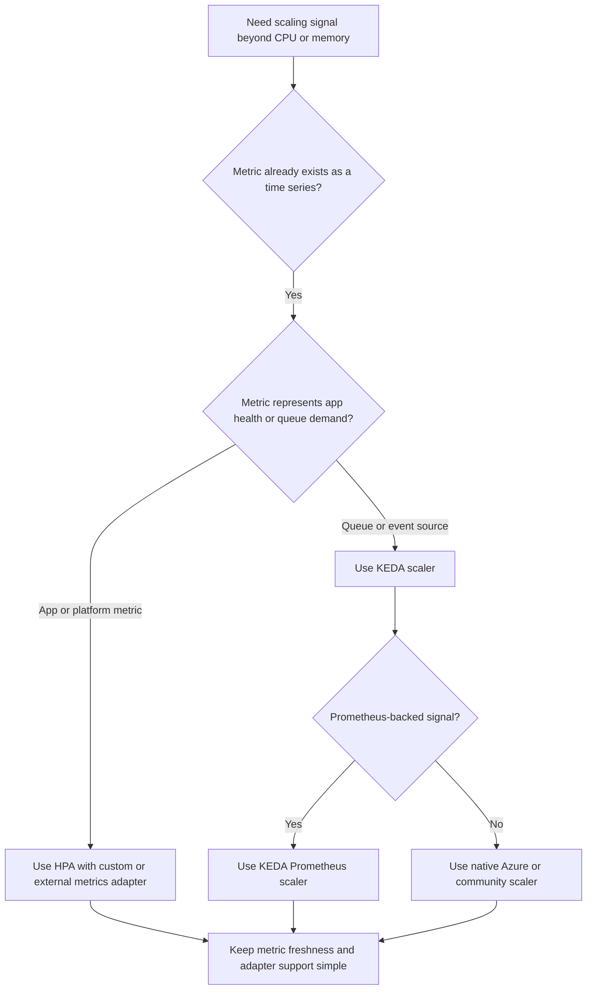

# Custom Metrics Scaling

Once CPU and memory stop being good proxies for work, AKS autoscaling becomes a metrics-architecture problem. The real decision is whether you want **HPA consuming custom metrics** or **KEDA translating external demand into HPA behavior**.

## Main Content

<!-- diagram-id: platform-custom-metrics-scaling-choice -->


### Decision rule: HPA first or KEDA first?

Use **HPA with custom metrics** when the metric is already a stable time series that directly represents how many replicas you need.

Use **KEDA** when the scaling signal is event-driven or when scale-to-zero matters.

Quick decision matrix:

| Pattern | Prefer | Why |
|---|---|---|
| Request concurrency, latency bucket, business queue depth already published as metrics | HPA with custom metrics adapter | Lets HPA reason directly over a metric stream |
| Service Bus, Storage Queue, Event Hubs, Kafka lag, or scheduled scaling | KEDA | Native event-driven model and scale-to-zero support |
| Prometheus metric representing asynchronous backlog | KEDA Prometheus scaler | Keeps the event-driven flow while querying Prometheus |
| Existing platform metric in Azure Monitor with no need for scale-to-zero | HPA with Azure Monitor-compatible path | Good when your ops model already centers on Azure Monitor |

### HPA with custom or external metrics adapters

This model fits when you already trust the metric pipeline and want Kubernetes-native HPA behavior.

Common adapter choices:

- **Prometheus adapter** for self-managed Prometheus ecosystems.
- **Azure Monitor-oriented metric path** when the source of truth already lives in Azure Monitor.
- **External metrics adapters** only when you fully understand ownership and support boundaries.

Best fit examples:

- scale a gateway based on in-flight requests,
- scale a controller based on per-tenant work rate,
- scale a batch API on a custom “jobs waiting” metric already emitted by the service.

### KEDA Prometheus scaler

KEDA is often the cleaner choice when the metric is in Prometheus but the workload still behaves like an event-driven system.

Use the KEDA Prometheus scaler when:

- the metric is backlog-like or bursty,
- scale-to-zero is desirable,
- or you want one KEDA control plane for mixed queue and Prometheus triggers.

Microsoft Learn explicitly notes that KEDA's Prometheus scaler supports **Azure managed service for Prometheus**. That makes it a strong default for new AKS environments that already use the Azure Monitor managed Prometheus stack.

### Azure Monitor metrics path

Azure Monitor is now the preferred observability direction for AKS metrics collection. Treat older Container insights custom metrics guidance as historical context only.

Operational meaning:

- avoid building new autoscaling designs around the retired Container insights custom metrics path,
- prefer managed Prometheus for Kubernetes and app metrics collection,
- keep Azure Monitor in the design when alerts, dashboards, and platform metrics already live there.

### Design trade-offs that prevent bad scaling

No matter which model you choose, bad autoscaling usually comes from metric quality problems:

- **metric latency**: signal updates arrive slower than scaling decisions,
- **metric ambiguity**: the metric shows stress, but not demand,
- **replica nonlinearity**: doubling replicas does not halve the observed pressure,
- **adapter sprawl**: too many metric adapters competing in the same cluster.

Prefer one understandable metric path per workload family.

### Example verification commands

Inspect HPA objects:

```bash
kubectl get hpa \
    --all-namespaces
```

Inspect KEDA ScaledObjects:

```bash
kubectl get scaledobjects.keda.sh \
    --all-namespaces
```

Check whether the AKS managed KEDA add-on is enabled:

```bash
az aks show \
    --resource-group "$RG" \
    --name "$CLUSTER_NAME" \
    --query "workloadAutoScalerProfile.keda.enabled" \
    --output tsv
```

Validate Prometheus metrics are available through the AKS monitoring stack:

```bash
az aks show \
    --resource-group "$RG" \
    --name "$CLUSTER_NAME" \
    --query "azureMonitorProfile.metrics.enabled" \
    --output tsv
```

## See Also

- [Scaling](scaling.md)
- [KEDA on AKS](keda-on-aks.md)
- [Best Practices: Autoscaling](../best-practices/autoscaling.md)
- [Scaling Operations](../operations/scaling-operations.md)
- [HPA Flapping](../troubleshooting/playbooks/scaling/hpa-flapping.md)

## Sources

- [Scaling options for applications in AKS](https://learn.microsoft.com/en-us/azure/aks/concepts-scale)
- [KEDA on AKS](https://learn.microsoft.com/en-us/azure/aks/keda-about)
- [KEDA integrations on AKS](https://learn.microsoft.com/en-us/azure/aks/keda-integrations)
- [Monitor AKS](https://learn.microsoft.com/en-us/azure/aks/monitor-aks)
- [Custom metrics collected by Container insights](https://learn.microsoft.com/en-us/previous-versions/azure/azure-monitor/containers/container-insights-custom-metrics)
