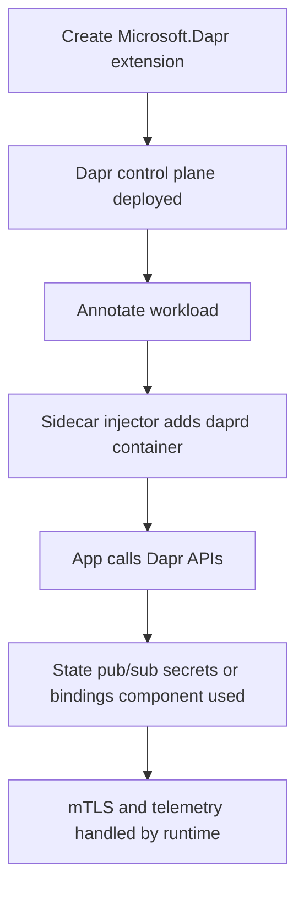

# Dapr Extension

The Dapr extension gives AKS a managed way to run the Distributed Application Runtime without hand-installing and hand-upgrading the runtime yourself. Use it when application teams want portable microservice building blocks that stay outside framework-specific code.

## Main Content

<!-- diagram-id: platform-dapr-extension-flow -->


### What the managed extension actually installs

The Dapr extension provisions the control-plane services for you. The most important ones are:

- `dapr-operator` for component and endpoint management,
- `dapr-sidecar-injector` for workload onboarding,
- `dapr-placement` for actors,
- `dapr-sentry` for mTLS certificate handling.

That is the operational boundary to remember. If the sidecar never appears, injection is the problem. If the sidecar appears but building blocks fail, component configuration or downstream auth is usually the problem.

### Managed sidecar model

Dapr on AKS uses a sidecar architecture. The application process stays in its container. The Dapr runtime runs alongside it as `daprd`.

Benefits:

- language-neutral APIs,
- app portability across backing services,
- per-workload adoption instead of cluster-wide rewrites,
- runtime-provided mTLS and telemetry primitives.

Trade-off:

- every onboarded workload pays another container tax in CPU, memory, startup path, and debugging surface.

### Building blocks that matter most

| Building block | Typical use | Platform review question |
|---|---|---|
| **State** | Key-value persistence behind an app-level API | Which backing store owns consistency and retention? |
| **Pub/Sub** | Event-driven service integration | Is delivery semantics acceptable for the business flow? |
| **Secrets** | Secret lookup through Dapr APIs | Should the app use Dapr secrets or Key Vault CSI directly? |
| **Bindings** | Input or output adapters to external systems | Is the component lifecycle managed like application code? |

These features are why teams choose Dapr over writing custom SDK glue into every service.

### Dapr versus service mesh

Dapr and Istio overlap in some service-to-service concerns such as mTLS, tracing, and retries. They are still different platform choices:

- **Dapr** is developer-centric and building-block oriented.
- **Istio** is infrastructure-centric and traffic-policy oriented.

If you need state APIs, pub/sub APIs, or bindings, Dapr is the right conversation. If you need route-level policy, canary control, or mesh authorization, start with Istio.

### Current status and rollout note

Microsoft Learn lists Dapr as a **currently available AKS cluster extension**. The install guide also distinguishes **stable** and **dev** release trains. Use the stable train for production and verify the exact extension version available for your cluster or region before rollout.

### Verification commands

List the Dapr extension:

```bash
az k8s-extension list \
    --cluster-name "$CLUSTER_NAME" \
    --cluster-type managedClusters \
    --resource-group "$RG" \
    --output table
```

| Command | Purpose |
| --- | --- |
| `az k8s-extension list` | List the cluster extensions installed on the cluster. |
| `--cluster-name` | Name of the AKS cluster. |
| `--cluster-type` | Cluster type, managedClusters for AKS. |
| `--resource-group` | Resource group that contains the AKS cluster. |
| `--output` | Output format for the result. |

Inspect the Dapr control plane:

```bash
kubectl get pods \
    --namespace dapr-system
```

Inspect an onboarded pod:

```bash
kubectl describe pod <pod-name> \
    --namespace <namespace>
```

## See Also

- [Istio Managed Add-on](istio-managed-addon.md)
- [Key Vault CSI](key-vault-csi.md)
- [Best Practices: Platform Extensions](../best-practices/platform-extensions.md)
- [Dapr Sidecar Fails to Start](../troubleshooting/playbooks/extensions/dapr-sidecar-fails-to-start.md)

## Sources

- [Install Dapr Extension for AKS](https://learn.microsoft.com/en-us/azure/aks/dapr)
- [Dapr Extension for AKS and Arc-enabled Kubernetes](https://learn.microsoft.com/en-us/azure/aks/dapr-overview)
- [Cluster extensions for AKS](https://learn.microsoft.com/en-us/azure/aks/cluster-extensions)
