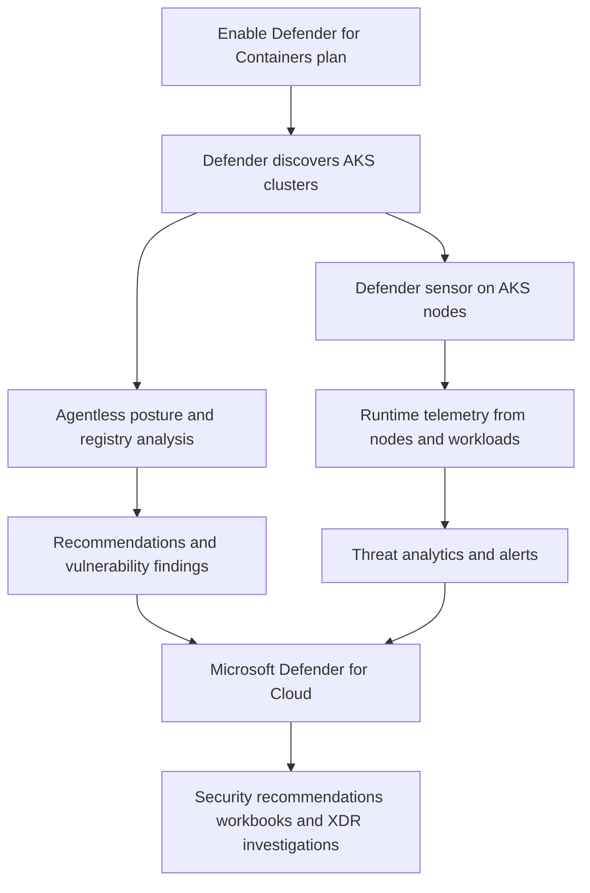

# Defender for Containers

Defender for Containers is the AKS security operations plane for runtime alerts, posture findings, and image risk visibility. Use it when you need more than admission control alone: policy tells you what should be prevented, while Defender tells you what was exposed, drifted, or actually looked suspicious at runtime.

## Main Content

<!-- diagram-id: platform-defender-for-containers-flow -->


### What it detects

Defender for Containers spans three operational signal families on AKS:

| Signal family | What operators get | Typical examples |
|---|---|---|
| Runtime threat detection | Alerts on suspicious cluster, node, and workload behavior | Exposed services, sensitive mounts, suspicious process activity, high-privilege actions |
| Vulnerability assessment | Findings on images and supported nodes | Newly disclosed CVEs, exploitable package risk, stale base image debt |
| Security posture and misconfiguration | Recommendations and posture drift views | Weak cluster configuration, missing sensors, missing policy coverage, exposed control surfaces |

This is why the service belongs in both platform and security workflows. It is not just “scan my registry,” and it is not just “block bad pods.”

### AKS footprint: agentless paths and in-cluster sensor paths

The architecture page separates capabilities into agentless and in-cluster modes:

- **Agentless**: image vulnerability assessment, posture assessment, and control-plane threat detection.
- **Sensor-based**: runtime threat detection from worker nodes and workloads.

For AKS specifically, the runtime path uses an AKS-integrated Defender sensor. The architecture page lists the main sensor pods and their resource limits so operators can understand the footprint before onboarding.

| Component | Kind | Operational role |
|---|---|---|
| `microsoft-defender-collector-ds-*` | DaemonSet | Collects runtime node telemetry with eBPF |
| `microsoft-defender-collector-misc-*` | Deployment | Collects cluster-level inventory and security events |
| `microsoft-defender-publisher-ds-*` | DaemonSet | Publishes collected telemetry to the Defender backend |

Important distinction:

- **Container Insights** is your general cluster observability baseline.
- **Defender sensor** is your runtime security telemetry path.

They complement each other. They are not substitutes.

### Findings flow into Microsoft Defender for Cloud

Defender for Containers surfaces its output through Microsoft Defender for Cloud. That is where operators triage recommendations, review active alerts, validate component coverage, and pivot into Microsoft Defender XDR when the alert requires security investigation depth.

Practical workflow:

1. Defender for Cloud shows the AKS cluster inventory and coverage state.
2. Recommendations expose misconfiguration and posture drift.
3. Vulnerability findings attach risk context to registry images and nodes.
4. Runtime alerts escalate suspicious activity for investigation.
5. Security teams correlate AKS findings with broader incident context in XDR if needed.

### Relationship to Azure Policy, Container Insights, and managed Prometheus

Defender for Containers can enable Azure Policy from the plan settings because posture governance and runtime protection work better together. Use the combination deliberately:

- **Azure Policy add-on**: admission control and compliance governance.
- **Container Insights**: node, pod, log, and event troubleshooting signals.
- **Managed Prometheus**: metric-driven SRE dashboards and alert rules.
- **Defender for Containers**: security recommendations, vulnerability findings, and runtime threat alerts.

Good operating model:

- Use Container Insights or managed Prometheus to prove performance symptoms.
- Use Defender to prove whether the event has a security dimension.
- Use Azure Policy to prevent recurrence when the root cause is a manifest or governance gap.

### Plan settings that matter on AKS

From the Defender for Containers plan settings, AKS operators should care most about these toggles:

- **Defender sensor** for runtime telemetry.
- **Azure Policy** for Kubernetes security posture assessments.
- **Kubernetes API access** for inventory and configuration analysis.
- **Registry access** for image vulnerability assessment.
- **Security findings** so new or updated pushed images are linked to findings.

If those toggles are misaligned, the team will see partial coverage and confusing gaps between registry findings, posture recommendations, and runtime alerts.

### Verification commands

Verify the Defender security profile on AKS:

```bash
az aks show \
    --name "$CLUSTER_NAME" \
    --resource-group "$RG" \
    --query "securityProfile.defender.securityMonitoring.enabled" \
    --output tsv
```

| Command | Purpose |
| --- | --- |
| `az aks show` | Check whether Defender security monitoring is enabled. |
| `--name` | Name of the AKS cluster. |
| `--resource-group` | Resource group that contains the AKS cluster. |
| `--query` | Selects the Defender security monitoring flag. |
| `--output` | Output format for the result. |

Inspect Defender sensor pods:

```bash
kubectl get pods \
    --namespace kube-system \
    --selector app=microsoft-defender-publisher
```

Inspect all Defender-related pods by name:

```bash
kubectl get pods \
    --namespace kube-system
```

Review Azure Policy enablement from the Containers plan separately if posture controls are expected.

## See Also

- [Azure Policy Add-on](azure-policy-addon.md)
- [Pod Security Standards](pod-security-standards.md)
- [Monitoring and Logging](../operations/monitoring-logging.md)
- [Best Practices: Governance](../best-practices/governance.md)
- [Defender Alert False Positive](../troubleshooting/playbooks/security/defender-alert-false-positive.md)

## Sources

- [Introduction to Microsoft Defender for Containers](https://learn.microsoft.com/en-us/azure/defender-for-cloud/defender-for-containers-introduction)
- [Enable Defender for Containers in Microsoft Defender for Cloud](https://learn.microsoft.com/en-us/azure/defender-for-cloud/defender-for-containers-enable-plan)
- [Defender for Containers deployment overview](https://learn.microsoft.com/en-us/azure/defender-for-cloud/defender-for-containers-deployment-overview)
- [Container security architecture](https://learn.microsoft.com/en-us/azure/defender-for-cloud/defender-for-containers-architecture)
