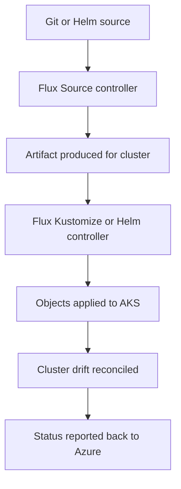

# Flux GitOps Extension

The Flux GitOps extension is the Azure-managed path for pull-based Kubernetes configuration and application delivery on AKS. It lets teams keep Git as the source of truth while Azure manages the extension lifecycle and surface area.

## Main Content

<!-- diagram-id: platform-flux-gitops-extension-flow -->


### What Azure manages

The Azure model has two layers:

1. the `microsoft.flux` **cluster extension**, and
2. one or more **`fluxConfigurations` resources** that define sources and sync behavior.

That matters because day-2 ownership is split cleanly:

- platform teams control whether Flux is installed and supported,
- app teams can own repo structure and Kustomizations,
- Azure remains the authoritative place to inspect extension state and configuration status.

### Source and Kustomization model

Flux on AKS follows a simple reconciliation pattern:

- a **source** object points to Git, Helm, Bucket, or Azure Blob storage,
- one or more **Kustomizations** define what path or package is applied,
- dependencies between Kustomizations control rollout order.

This is the most important mental model for troubleshooting. When GitOps looks stuck, the failure is usually in one of three places: source fetch, Kustomization render, or dependency sequencing.

### Multi-tenant patterns

Microsoft Learn documents multi-tenancy as part of the Azure Flux integration. The safest pattern for shared AKS platforms is:

| Pattern | Why it works | Watch-outs |
|---|---|---|
| One `fluxConfiguration` per team namespace | Keeps blast radius smaller | Avoid cross-namespace references |
| Separate platform repo and app repos | Splits cluster baseline from app delivery | Requires promotion contracts |
| Namespace-local Flux objects | Aligns with the multi-tenancy model | Old manifests may need refactoring |

The Azure guidance is strict here: cross-namespace source references can break once multi-tenancy enforcement is active.

### Flux extension versus self-managed Argo CD

| Option | Best fit | Strengths | Watch-outs |
|---|---|---|---|
| **Flux extension** | Teams that want Azure-managed lifecycle with pull-based GitOps | Native AKS extension model, Azure status visibility, strong Kustomize fit | UI-driven app promotion is lighter than Argo CD |
| **Self-managed Argo CD** | Teams that want Argo app-of-apps patterns or Argo-native UI workflows | Rich application dashboard and broad community adoption | You own deployment, upgrades, and cluster-side operations |

This is not a question of one being universally better. It is a question of whether Azure-managed GitOps control or self-managed application-delivery UX matters more.

### Current status and rollout note

Microsoft Learn lists Flux under **currently available AKS cluster extensions**. Learn also publishes rolling extension release notes and supports the most recent version plus the two previous versions. Treat that release-note stream as the authoritative place to verify the current production-ready version before broad rollout.

### Verification commands

Show the Flux extension:

```bash
az k8s-extension list \
    --cluster-name "$CLUSTER_NAME" \
    --cluster-type managedClusters \
    --resource-group "$RG" \
    --output table
```

| Command | Purpose |
| --- | --- |
| `az k8s-extension list` | List the cluster extensions installed on the cluster. |
| `--cluster-name` | Name of the AKS cluster. |
| `--cluster-type` | Cluster type, managedClusters for AKS. |
| `--resource-group` | Resource group that contains the AKS cluster. |
| `--output` | Output format for the result. |

Show Flux pods:

```bash
kubectl get pods \
    --namespace flux-system
```

Show GitRepository and Kustomization objects:

```bash
kubectl get gitrepositories.source.toolkit.fluxcd.io \
    --all-namespaces

kubectl get kustomizations.kustomize.toolkit.fluxcd.io \
    --all-namespaces
```

## See Also

- [Best Practices: Platform Extensions](../best-practices/platform-extensions.md)
- [Resource Governance](../best-practices/resource-governance.md)
- [Flux Reconciliation Stuck](../troubleshooting/playbooks/extensions/flux-reconciliation-stuck.md)

## Sources

- [Application deployments with GitOps (Flux v2)](https://learn.microsoft.com/en-us/azure/azure-arc/kubernetes/conceptual-gitops-flux2)
- [Cluster extensions for AKS](https://learn.microsoft.com/en-us/azure/aks/cluster-extensions)
- [Flux (GitOps) extension release notes](https://learn.microsoft.com/en-us/azure/azure-arc/kubernetes/flux-gitops-release-notes)
