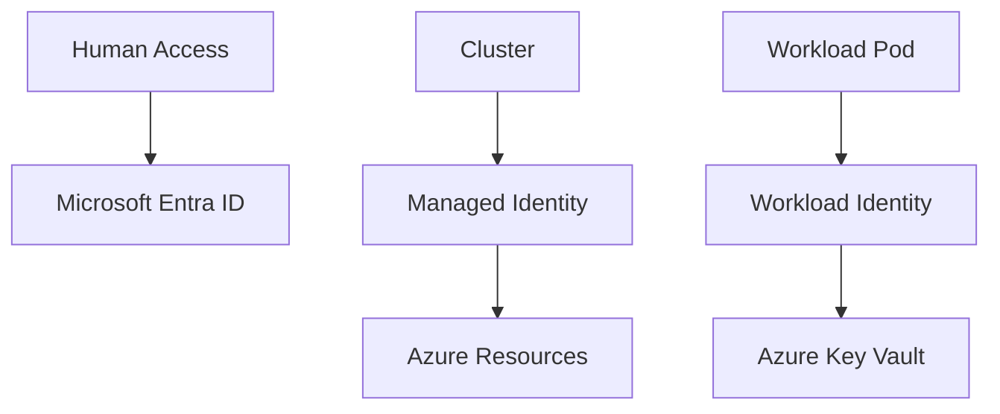

---
content_sources:
  diagrams:
  - id: platform-identity-and-secrets
    type: flowchart
    source: mslearn-adapted
    mslearn_url: https://learn.microsoft.com/en-us/azure/aks/managed-azure-ad
    based_on:
    - https://learn.microsoft.com/en-us/azure/aks/managed-azure-ad
    - https://learn.microsoft.com/en-us/azure/aks/workload-identity-deploy-cluster
    - https://learn.microsoft.com/en-us/azure/aks/csi-secrets-store-driver
content_validation:
  status: verified
  last_reviewed: 2026-07-18
  reviewer: agent
  core_claims:
    - claim: "AKS resource provider manages the client and server apps used for Microsoft Entra integration with the AKS control plane."
      source: https://learn.microsoft.com/en-us/azure/aks/entra-id-control-plane-authentication
      verified: true
    - claim: "You can enable Microsoft Entra Workload ID on a new or existing AKS cluster by enabling the OIDC issuer and workload identity."
      source: https://learn.microsoft.com/en-us/azure/aks/workload-identity-deploy-cluster
      verified: true
    - claim: "The Azure Key Vault provider for Secrets Store CSI Driver can mount secrets, keys, and certificates into a pod by using a CSI volume."
      source: https://learn.microsoft.com/en-us/azure/aks/csi-secrets-store-driver
      verified: true
---


# Identity and Secrets

Use Azure-native identity wherever possible so workloads authenticate without long-lived secrets. AKS security maturity improves dramatically when you separate cluster access, node identity, and workload identity.

## Main Content
<!-- diagram-id: platform-identity-and-secrets -->



### Identity layers

- **Cluster access**: Microsoft Entra ID-backed authentication and Kubernetes RBAC.
- **Cluster identity**: managed identity used by AKS to manage Azure resources.
- **Workload identity**: pod-to-Azure-resource authentication without storing secrets in Kubernetes.

### Secret handling guidance

- Prefer workload identity plus Key Vault over static Kubernetes Secrets when possible.
- Use the Secrets Store CSI Driver for mounted secret material that must appear as files.
- Keep Kubernetes Secrets only for data that must stay Kubernetes-native and protect them with RBAC and etcd encryption controls.

### Example commands

```bash
az aks update --resource-group $RG --name $CLUSTER_NAME --enable-oidc-issuer --enable-workload-identity
az aks get-credentials --resource-group $RG --name $CLUSTER_NAME --overwrite-existing
kubectl get serviceaccount -A
kubectl get secret -A
```

### Review cluster access in the Azure Portal

The **Access control (IAM)** blade shows Azure RBAC role assignments that govern who can manage the cluster and its resources.

[[[ shot("aks-identity-access-control-iam") ]]]

Purpose: Confirm that human and workload access to the cluster is governed by explicit Azure RBAC assignments.

Look for:

- The **Check access** tab lets you verify effective permissions for a specific identity.
- Role assignments follow least privilege — no broad `Owner` grants where a scoped role suffices.
- Account and directory identifiers are sanitized (`user@example.com`, `<object-id>`).

Expected result: Cluster access is explicit and auditable through Azure RBAC rather than implicit or shared credentials.

Next step: Confirm workload identity and OIDC settings on the Security configuration blade.

### Confirm workload identity configuration

The **Security configuration** blade shows whether the OIDC issuer and workload identity are enabled — the foundation for secret-free pod authentication.

[[[ shot("aks-identity-security-configuration") ]]]

Purpose: Verify that workload identity is enabled so pods can authenticate to Azure without stored secrets.

Look for:

- **Workload identity** is enabled and the **OIDC issuer URL** is populated.
- Tenant and cluster identifiers in the issuer URL are sanitized (`<tenant-id>`).
- The configuration matches the `--enable-oidc-issuer --enable-workload-identity` flags used at setup.

Expected result: The cluster exposes an OIDC issuer with workload identity enabled, allowing federated pod-to-Azure authentication.

Next step: Bind a Kubernetes service account to a managed identity following [Best Practices: Security](../best-practices/security.md).

## See Also

- [Cluster Architecture](cluster-architecture.md)
- [Best Practices: Security](../best-practices/security.md)
- [Credential Rotation](../operations/credential-rotation.md)
- [Image Pull Failure](../troubleshooting/playbooks/pod-issues/image-pull-failure.md)

## Sources

- [Use Microsoft Entra ID with AKS](https://learn.microsoft.com/azure/aks/managed-azure-ad)
- [Deploy and configure workload identity on AKS](https://learn.microsoft.com/azure/aks/workload-identity-deploy-cluster)
- [Use the Azure Key Vault provider for Secrets Store CSI Driver in AKS](https://learn.microsoft.com/azure/aks/csi-secrets-store-driver)
