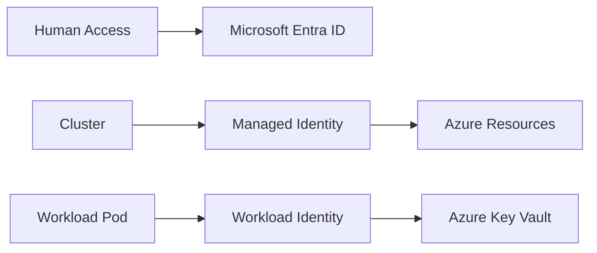

---
hide:
  - toc
---

# Identity and Secrets

Use Azure-native identity wherever possible so workloads authenticate without long-lived secrets. AKS security maturity improves dramatically when you separate cluster access, node identity, and workload identity.

## Main Content




### Identity layers

- **Cluster access**: Microsoft Entra ID-backed authentication and Kubernetes RBAC.
- **Cluster identity**: managed identity used by AKS to manage Azure resources.
- **Workload identity**: pod-to-Azure-resource authentication without storing secrets in Kubernetes.

### Secret handling guidance

- Prefer workload identity plus Key Vault over static Kubernetes Secrets when possible.
- Use the Secrets Store CSI Driver for mounted secret material that must appear as files.
- Keep Kubernetes Secrets only for data that must stay Kubernetes-native and protect them with RBAC and etcd encryption controls.

### Example commands

```bash
az aks update --resource-group $RG --name $CLUSTER_NAME --enable-oidc-issuer --enable-workload-identity
az aks get-credentials --resource-group $RG --name $CLUSTER_NAME --overwrite-existing
kubectl get serviceaccount -A
kubectl get secret -A
```

## See Also

- [Cluster Architecture](cluster-architecture.md)
- [Best Practices: Security](../best-practices/security.md)
- [Credential Rotation](../operations/credential-rotation.md)
- [Image Pull Failure](../troubleshooting/playbooks/pod-issues/image-pull-failure.md)

## Sources

- [Use Microsoft Entra ID with AKS](https://learn.microsoft.com/azure/aks/managed-azure-ad)
- [Deploy and configure workload identity on AKS](https://learn.microsoft.com/azure/aks/workload-identity-deploy-cluster)
- [Use the Azure Key Vault provider for Secrets Store CSI Driver in AKS](https://learn.microsoft.com/azure/aks/csi-secrets-store-driver)
