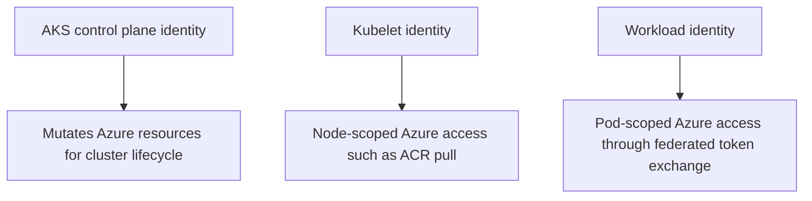

---
content_sources:
  diagrams:
    - id: platform-identity-model-comparison-boundaries
      type: flowchart
      source: self-generated
      justification: Identity boundary diagram synthesized from Microsoft Learn managed identity, kubelet identity, and workload identity guidance for AKS.
      based_on:
        - https://learn.microsoft.com/en-us/azure/aks/use-managed-identity
        - https://learn.microsoft.com/en-us/azure/aks/use-kubelet-identity-default-cluster
        - https://learn.microsoft.com/en-us/azure/aks/workload-identity-overview
content_validation:
  status: verified
  last_reviewed: 2026-07-18
  reviewer: agent
  core_claims:
    - claim: "AKS uses a managed identity for cluster resource management when the cluster is configured for managed identities."
      source: https://learn.microsoft.com/en-us/azure/aks/use-managed-identity
      verified: true
    - claim: "The kubelet identity is used by agent nodes for Azure resource access such as pulling images from Azure Container Registry."
      source: https://learn.microsoft.com/en-us/azure/aks/use-kubelet-identity-default-cluster
      verified: true
    - claim: "Workload identity is for pod-to-Azure-resource authentication and is separate from cluster and kubelet identities."
      source: https://learn.microsoft.com/en-us/azure/aks/workload-identity-overview
      verified: true
---

# Identity Model Comparison

AKS uses more than one Azure identity, and each one has a different blast radius. Operators avoid many misdiagnoses by separating control-plane identity, kubelet identity, and workload identity before assigning permissions or troubleshooting access failures.

## Main Content

### Why the distinction matters

The most common AKS identity mistake is granting the wrong identity access to the right resource. ACR pull failures, load balancer update failures, and Key Vault access failures are different problems because different AKS identities own them.

<!-- diagram-id: platform-identity-model-comparison-boundaries -->


### Identity roles in AKS

#### Control-plane identity

The control-plane identity is the AKS-managed identity used to create or update Azure infrastructure the cluster depends on, such as load balancers, route tables, managed disks, and other cluster-managed resources. When this identity is missing required permissions, cluster operations fail even if the workload itself is healthy.

#### Kubelet identity

The kubelet identity is used by node-side components. Operationally, it is the identity you check first for Azure Container Registry image pull permissions and other node-initiated Azure access paths. Replacing or rotating it has node-wide consequences because every pod on the node depends on successful node-side image acquisition.

#### Workload identity

Workload identity is pod-scoped and should be the default path for applications that must access Azure resources directly. It keeps application access separate from node and cluster privileges and reduces the need for static secrets.

### Operational consequence comparison

| Identity type | Primary scope | Typical resource actions | Common incident symptom | What to grant | Rotation consequence |
|---|---|---|---|---|---|
| Control-plane identity | Cluster infrastructure lifecycle | Create or update load balancers, managed disks, VMSS-linked resources, route updates | Service exposure, provisioning, or infrastructure reconciliation failures | Azure RBAC on cluster-managed Azure resources | Infrastructure mutations can fail until new grants propagate |
| Kubelet identity | Node-side Azure access | ACR pulls, node-initiated Azure API access | `ImagePullBackOff`, node bootstrap, add-on pull failures | Registry pull rights and other node-scoped Azure data-plane roles | New image pulls fail first; already-running pods may continue until restart or reschedule |
| Workload identity | Pod/application Azure access | Key Vault, Storage, SQL, or other app-level calls | Application gets Azure auth or downstream authorization errors | Least-privilege data-plane or app-plane access for the workload identity target | Fresh token requests fail if federation or resource grants are wrong |

### Decision guidance

Use this mental model:

- If the failing operation is **cluster infrastructure mutation**, inspect the control-plane identity.
- If the failing operation is **image pull or node-side Azure access**, inspect the kubelet identity.
- If the failing operation is **application access from inside the pod**, inspect workload identity and downstream authorization.

### Permission assignment patterns

- Grant ACR pull permissions to the **kubelet identity**, not to the workload identity, when the issue is image acquisition.
- Grant Key Vault data-plane access to the **workload identity** or the identity used by the Secrets Store CSI integration path for that workload.
- Grant cluster-managed Azure resource permissions to the **control-plane identity**, not to application identities.

### Validation commands

```bash
az aks show \
    --resource-group "$RG" \
    --name "$CLUSTER_NAME" \
    --query "{controlPlaneIdentity:identity,kubeletIdentity:identityProfile.kubeletidentity,oidcIssuer:oidcIssuerProfile.issuerUrl}" \
    --output json

az role assignment list \
    --assignee "<object-id>" \
    --scope "$RESOURCE_ID" \
    --output table
```

## See Also

- [Identity and Secrets](identity-and-secrets.md)
- [Microsoft Entra Workload Identity](workload-identity.md)
- [Azure Key Vault CSI Driver](key-vault-csi.md)
- [Credential Rotation](../operations/credential-rotation.md)
- [Image Pull Failure](../troubleshooting/playbooks/pod-issues/image-pull-failure.md)

## Sources

- [Use managed identities in AKS](https://learn.microsoft.com/en-us/azure/aks/use-managed-identity)
- [Use a pre-created kubelet managed identity in AKS](https://learn.microsoft.com/en-us/azure/aks/use-kubelet-identity-default-cluster)
- [Microsoft Entra Workload ID overview](https://learn.microsoft.com/en-us/azure/aks/workload-identity-overview)
