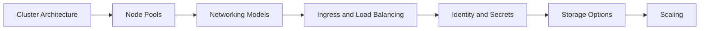

---
hide:
  - toc
---

# Platform

This section explains how AKS works so you can design clusters with realistic assumptions about networking, identity, storage, ingress, and scale.

## Main Content

| Document | Description |
|---|---|
| [Cluster Architecture](cluster-architecture.md) | Control plane, worker nodes, system components, and Azure resource relationships |
| [Node Pools](node-pools.md) | System vs user pools, OS choices, scheduling, and lifecycle boundaries |
| [Networking Models](networking-models.md) | Azure CNI Overlay, Azure CNI Pod Subnet, and Kubenet trade-offs |
| [Ingress and Load Balancing](ingress-load-balancing.md) | Ingress controllers, Services, public/private exposure, and edge paths |
| [Identity and Secrets](identity-and-secrets.md) | Microsoft Entra ID, workload identity, managed identity, and Key Vault integration |
| [Storage Options](storage-options.md) | Persistent volumes, CSI drivers, Azure Disks, Azure Files, and secret mounts |
| [Scaling](scaling.md) | Pod and node autoscaling, workload sizing, and cluster growth controls |

## Advanced Topics

- Separate platform decisions into cluster baseline, workload baseline, and environment baseline.
- Keep a cluster architecture decision record for network plugin, ingress pattern, and secret strategy.

## See Also

- [Start Here](../start-here/index.md)
- [Best Practices](../best-practices/index.md)
- [Operations](../operations/index.md)
- [Reference](../reference/index.md)

## Sources

- [Azure Kubernetes Service (AKS) documentation](https://learn.microsoft.com/azure/aks/)
- [What is Azure Kubernetes Service (AKS)?](https://learn.microsoft.com/azure/aks/intro-kubernetes)
