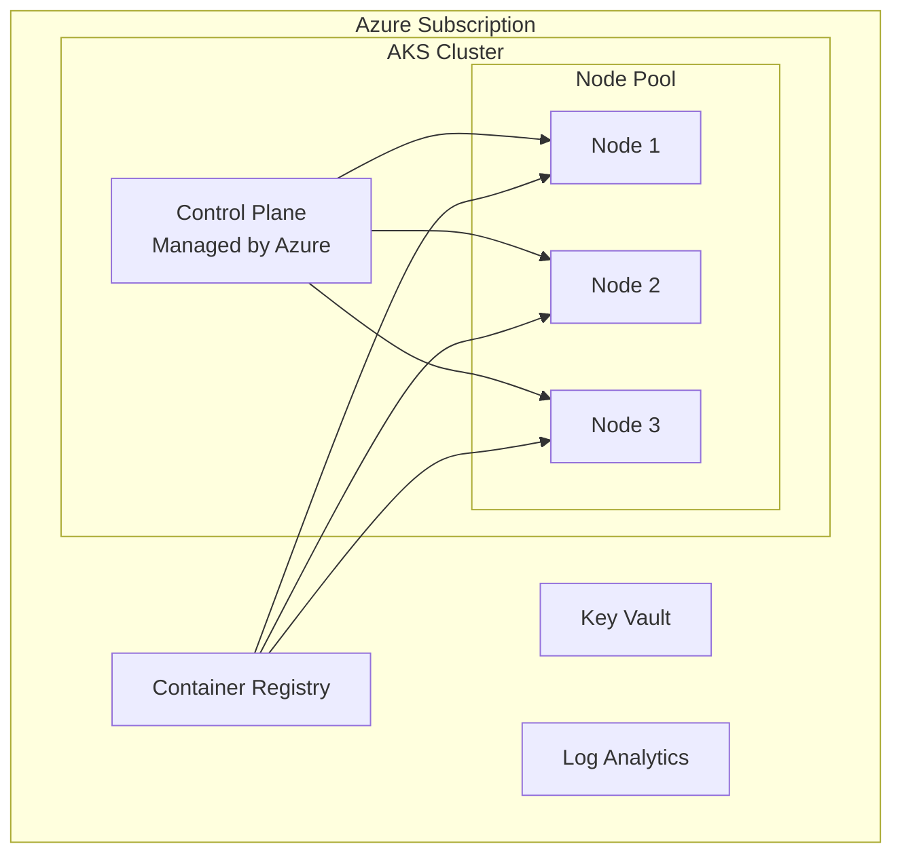

# Platform Overview

Azure Kubernetes Service (AKS) is a managed Kubernetes service that simplifies deploying, managing, and scaling containerized applications.

## Key Concepts

### Control Plane

The control plane is fully managed by Azure. It includes:

- API Server
- etcd (cluster state)
- Scheduler
- Controller Manager

### Node Pools

Node pools are groups of VMs that run your workloads. You can have:

- **System node pools** — Run critical system pods
- **User node pools** — Run application workloads

### Networking

AKS supports multiple networking models:

- **Kubenet** — Basic networking with NAT
- **Azure CNI** — Pods get VNet IP addresses
- **Azure CNI Overlay** — Overlay network for large clusters

## See Also

- [Best Practices](../best-practices/index.md)
- [Operations](../operations/index.md)

## Sources

- [AKS concepts](https://learn.microsoft.com/en-us/azure/aks/concepts-clusters-workloads)
- [AKS networking concepts](https://learn.microsoft.com/en-us/azure/aks/concepts-network)
