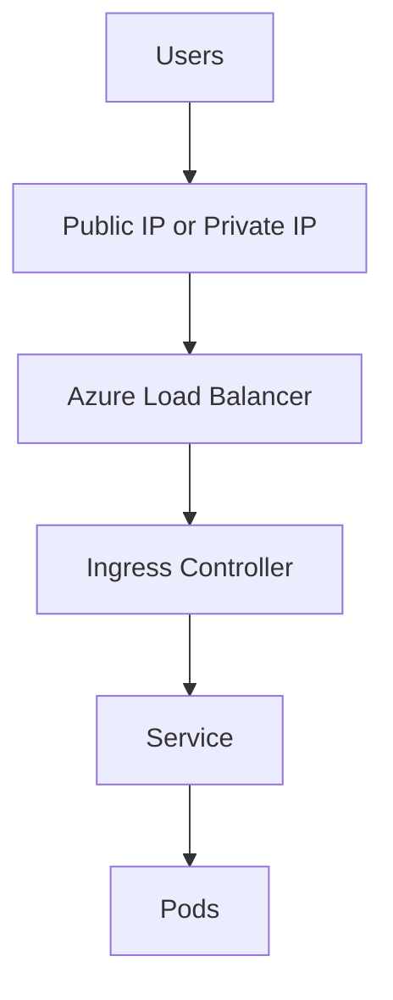

---
content_sources:
  diagrams:
  - id: platform-ingress-load-balancing
    type: flowchart
    source: mslearn-adapted
    mslearn_url: https://learn.microsoft.com/en-us/azure/aks/internal-lb
    based_on:
    - https://learn.microsoft.com/en-us/azure/aks/internal-lb
    - https://learn.microsoft.com/en-us/azure/aks/app-routing
content_validation:
  status: verified
  last_reviewed: 2026-07-18
  reviewer: agent
  core_claims:
    - claim: "Creating a Kubernetes load balancer on Azure also creates the corresponding Azure Load Balancer resource."
      source: https://learn.microsoft.com/en-us/azure/aks/concepts-network
      verified: true
    - claim: "An internal load balancer in AKS has no public IP address and makes a Kubernetes service reachable only through its private IP."
      source: https://learn.microsoft.com/en-us/azure/aks/internal-lb
      verified: true
    - claim: "When you create an Ingress object that uses the application routing add-on NGINX ingress classes, the add-on creates, configures, and manages one or more Ingress controllers in the AKS cluster."
      source: https://learn.microsoft.com/en-us/azure/aks/app-routing
      verified: true
    - claim: "AKS is moving to Gateway API as the long-term standard for ingress and Layer 7 traffic management."
      source: https://learn.microsoft.com/en-us/azure/aks/app-routing
      verified: true
---


# Ingress and Load Balancing

AKS traffic entry points combine Kubernetes Services, Azure load balancers, and one or more ingress controllers. Separate north-south routing from east-west service discovery in your design.

## Main Content
<!-- diagram-id: platform-ingress-load-balancing -->



### Core traffic primitives

- **Service type LoadBalancer** exposes a workload through an Azure load balancer.
- **Ingress** provides HTTP routing, TLS termination strategy, and path/host mapping.
- **Internal load balancer** patterns are common for private platform APIs.

### Common AKS ingress choices

- NGINX Ingress Controller for broad Kubernetes ecosystem compatibility.
- Application Gateway for Containers or app routing add-on when Azure-managed edge integration is preferred.
- Service meshes or gateway APIs for larger platform-standard traffic controls.

### Application Gateway for Containers as the newer Azure-managed ingress direction

Application Gateway for Containers (AGC) is the newer Azure-managed ingress direction for AKS workloads that want an Azure-managed Layer 7 data plane plus Kubernetes-native Ingress and Gateway API resources.

- Use AGC when you want Azure-managed ingress outside the cluster.
- Use AGC when Gateway API adoption is part of the platform standard.
- Do **not** treat AGC as a universal drop-in replacement for AGIC. Brownfield AGIC estates can still be the right near-term choice.

See [Application Gateway for Containers](application-gateway-for-containers.md) for the control model, migration posture, and AGC versus AGIC decision points.

### Istio gateways when ingress is part of a service-mesh decision

If the platform needs mTLS, service-to-service policy, and mesh telemetry, the ingress choice may belong to the Istio operating model instead of the standalone ingress-controller model.

- Use an Istio gateway when ingress policy is tightly coupled to a broader service-mesh strategy.
- Keep standalone ingress controllers for simpler north-south routing cases.
- If you use the AKS Istio add-on, align namespace onboarding and revision management before standardizing ingress.

See [Istio Managed Add-on](istio-managed-addon.md) for service-mesh lifecycle, sidecar injection, and ingress trade-offs.

> [!WARNING]
> ingress-nginx upstream maintenance ends in March 2026. In AKS, the application routing add-on can continue using NGINX through November 2026, but Gateway API is the recommended long-term direction for new designs.

### Useful commands

```bash
kubectl get ingress \
    --all-namespaces

kubectl get service \
    --all-namespaces

kubectl describe ingress <ingress-name> \
    --namespace <namespace>

az network public-ip list --resource-group MC_<managed-resource-group>_<cluster-name>_<location> --output table
```

### View services and ingresses in the Azure Portal

The **Services and ingresses** blade lists Kubernetes Services with their type and external endpoint, so you can confirm a `LoadBalancer` service received a public IP.

[[[ shot("aks-networking-services-ingresses") ]]]

Purpose: Confirm that a workload exposed through a `LoadBalancer` service obtained an external endpoint.

Look for:

- The service **type** shows `LoadBalancer` for the exposed workload.
- The **external IP** is populated (and sanitized as `<public-ip>` in this screenshot).
- The service maps to the expected namespace and backing pods.

Expected result: The exposed service has a reachable external endpoint, confirming the Azure load balancer provisioned correctly.

Next step: Add an ingress controller for HTTP routing and TLS termination as described above.

## See Also

- [Networking Models](networking-models.md)
- [Application Gateway for Containers](application-gateway-for-containers.md)
- [Istio Managed Add-on](istio-managed-addon.md)
- [Storage Options](storage-options.md)
- [Best Practices: Networking](../best-practices/networking.md)
- [Best Practices: Platform Extensions](../best-practices/platform-extensions.md)
- [Ingress Failure Playbook](../troubleshooting/playbooks/connectivity/ingress-failure.md)

## Sources

- [Create and use an internal load balancer with AKS](https://learn.microsoft.com/en-us/azure/aks/internal-lb)
- [AKS application routing add-on](https://learn.microsoft.com/en-us/azure/aks/app-routing)
