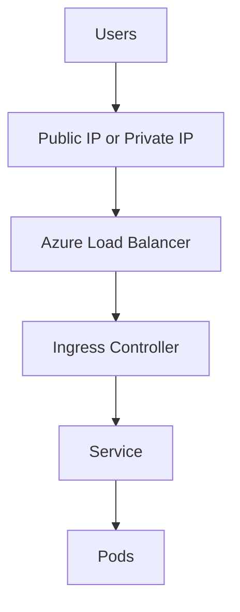

# Ingress and Load Balancing

AKS traffic entry points combine Kubernetes Services, Azure load balancers, and one or more ingress controllers. Separate north-south routing from east-west service discovery in your design.

## Main Content




### Core traffic primitives

- **Service type LoadBalancer** exposes a workload through an Azure load balancer.
- **Ingress** provides HTTP routing, TLS termination strategy, and path/host mapping.
- **Internal load balancer** patterns are common for private platform APIs.

### Common AKS ingress choices

- NGINX Ingress Controller for broad Kubernetes ecosystem compatibility.
- Application Gateway for Containers or app routing add-on when Azure-managed edge integration is preferred.
- Service meshes or gateway APIs for larger platform-standard traffic controls.

### Useful commands

```bash
kubectl get ingress -A
kubectl get svc -A
kubectl describe ingress <ingress-name> -n <namespace>
az network public-ip list --resource-group MC_<managed-resource-group>_<cluster-name>_<location> --output table
```

## See Also

- [Networking Models](networking-models.md)
- [Storage Options](storage-options.md)
- [Best Practices: Networking](../best-practices/networking.md)
- [Ingress Failure Playbook](../troubleshooting/playbooks/connectivity/ingress-failure.md)

## Sources

- [Create and use an internal load balancer with AKS](https://learn.microsoft.com/azure/aks/internal-lb)
- [AKS application routing add-on](https://learn.microsoft.com/azure/aks/app-routing)
