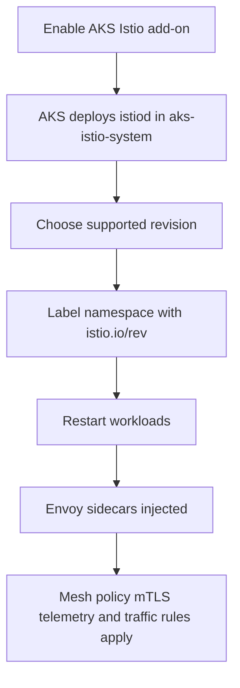

# Istio Managed Add-on

The Istio-based service mesh add-on is the AKS-managed path for teams that need mesh-level traffic policy, mTLS, and service-to-service observability. Use it when application networking is no longer only an ingress problem.

## Main Content

<!-- diagram-id: platform-istio-managed-addon-flow -->


### What the managed add-on changes

The add-on uses upstream Istio but changes the operating model:

- Microsoft tests add-on revisions against supported AKS versions.
- Microsoft manages control-plane packaging and upgrade flow for supported revisions.
- AKS adjusts related platform behavior such as `coredns` scaling when Istio is enabled.
- Azure support covers the managed add-on boundary instead of leaving everything to a self-managed mesh install.

That is the main value proposition. The managed add-on is not just “Istio preinstalled.” It is a constrained and supportable distribution.

### Managed control plane lifecycle

The first operational decision is **revision management**. The add-on is revisioned, and Learn recommends checking available revisions by region and AKS version with `az aks mesh get-revisions`.

Implications:

- Plan upgrades as a platform change, not as an app-team-only change.
- Keep revision ownership visible in cluster standards.
- Treat blocked or unsupported customizations as a support-boundary issue, not just a technical preference.

### Sidecar injection model

The add-on uses explicit revision labels for automatic sidecar injection. This is the part most teams get wrong during first rollout.

Key rules:

| Rule | Why it matters |
|---|---|
| Use `istio.io/rev=asm-X-Y` on namespaces | The add-on requires explicit revision matching |
| Do not rely on `istio-injection=enabled` | Learn states that label does not work for this add-on |
| Restart existing deployments after labeling | Existing pods are not retrofitted until they are recreated |
| Confirm `istio-proxy` exists in pods | This is the fastest proof that onboarding actually happened |

### Traffic management features that justify mesh adoption

Istio becomes worth the cost when you need policy between services, not only at the edge.

Common features that matter on AKS:

- traffic shifting for canary and A/B releases,
- retries and failover policy,
- fault injection for resilience testing,
- service-to-service mTLS,
- identity-based authorization,
- mesh-wide telemetry.

If your only requirement is basic north-south HTTP routing, an ingress controller is usually simpler than a mesh.

### Self-managed Istio versus managed add-on

| Option | Best fit | Strengths | Watch-outs |
|---|---|---|---|
| **Managed Istio add-on** | Most AKS platform teams that want supported service-mesh capabilities | Tested AKS compatibility, managed lifecycle, verified integrations | Customization boundaries are narrower than upstream |
| **Self-managed Istio** | Teams that need upstream speed or unsupported config surfaces | Full control over install mode and customization | You own lifecycle, compatibility testing, and incident boundaries |

Use self-managed Istio only when the unsupported or blocked add-on surface is a real requirement.

### OSM deprecation context

AKS now has a clear migration direction away from the managed Open Service Mesh add-on. Microsoft Learn states that AKS support for the OSM add-on ends on **September 30 2027**. That makes the Istio add-on the strategic managed service-mesh path for AKS platforms that previously depended on OSM.

### Current status and rollout note

The core Istio-based service mesh add-on is documented as an officially supported AKS integration. Learn also documents optional subfeatures with their own lifecycle notes. For example, the deployment article calls out **Istio CNI for the add-on as Preview**. Verify the current status of optional features such as Istio CNI or Gateway API automation on Learn before adopting them as production defaults.

### Verification commands

Show the service mesh mode:

```bash
az aks show \
    --resource-group "$RG" \
    --name "$CLUSTER_NAME" \
    --query "serviceMeshProfile.mode" \
    --output tsv
```

Inspect control-plane pods:

```bash
kubectl get pods \
    --namespace aks-istio-system
```

Verify injected pods:

```bash
kubectl describe pod <pod-name> \
    --namespace <namespace>
```

## See Also

- [Ingress and Load Balancing](ingress-load-balancing.md)
- [Application Gateway for Containers](application-gateway-for-containers.md)
- [Best Practices: Platform Extensions](../best-practices/platform-extensions.md)
- [Istio Sidecar Injection Failure](../troubleshooting/playbooks/extensions/istio-sidecar-injection-failure.md)

## Sources

- [Istio-based service mesh add-on for AKS](https://learn.microsoft.com/en-us/azure/aks/istio-about)
- [Deploy Istio-based service mesh add-on for AKS](https://learn.microsoft.com/en-us/azure/aks/istio-deploy-addon)
- [Configure Istio ingress with the Kubernetes Gateway API for AKS](https://learn.microsoft.com/en-us/azure/aks/istio-gateway-api)
- [Open Service Mesh in AKS](https://learn.microsoft.com/en-us/azure/aks/open-service-mesh-about)
