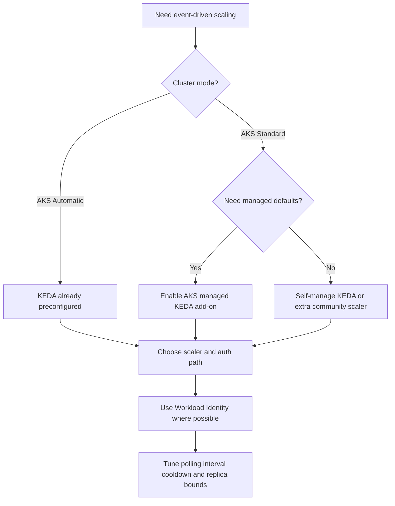

# KEDA on AKS

KEDA extends AKS beyond CPU- and memory-driven HPA rules. Use it when workload demand comes from queues, streams, schedules, or external systems where replica count must follow event volume rather than in-cluster resource saturation.

## Main Content

<!-- diagram-id: platform-keda-on-aks-decision-flow -->


### Managed add-on versus self-managed KEDA

Use this rule first:

- **AKS Automatic**: KEDA is already present. Focus on `ScaledObject` and authentication design.
- **AKS Standard + managed add-on**: best default for most production teams that want supported lifecycle management.
- **Self-managed KEDA**: reserve for cases where you need upstream-only customization, community add-ons, or unsupported external scalers that the AKS add-on doesn't install.

Operational trade-off:

| Option | Best fit | Strengths | Watch-outs |
|---|---|---|---|
| AKS Automatic | Default production path | KEDA is preconfigured and platform defaults are already in place | Less cluster-level customization than AKS Standard |
| AKS Standard + managed add-on | Supported event-driven scaling on a managed cluster | Simple enablement with AKS-managed lifecycle | The add-on exposes only common configuration and should remain the only external metrics adapter |
| Self-installed KEDA | Advanced customization or community-only features | Full upstream flexibility | You own lifecycle, compatibility testing, and support boundaries |

### Scaler families that matter most on AKS

The AKS KEDA integration page highlights a wide Azure-facing scaler catalog. In practice, these patterns cover most platform designs:

| Scaler type | Typical trigger | Good fit | Notes |
|---|---|---|---|
| Azure Service Bus | Queue depth or subscription backlog | Worker APIs and background processors | Best when queue backlog is the true work signal |
| Azure Storage Queue | Message count | Lightweight asynchronous jobs | Useful for simple queue-driven fan-out |
| Azure Event Hubs | Partition lag or event backlog | Stream processors and analytics consumers | Match scaling targets to consumer-group behavior |
| Kafka | Topic lag | Streaming workloads on Kafka-compatible platforms | Keep broker reachability and auth troubleshooting ready |
| Prometheus | Custom time-series query | App-specific concurrency, latency, or business metrics | Managed Prometheus is supported; self-hosted Prometheus is outside AKS support scope |
| Azure Cosmos DB change feed external scaler | Change feed backlog | Event ingestion on Cosmos DB | External scaler path is community supported, not installed with the add-on |

KEDA also supports Azure Monitor, Azure Log Analytics, Azure Blob Storage, and other Azure services. Choose the scaler that is closest to the work queue itself, not just the easiest metric to access.

### Authentication: prefer Workload Identity

AKS guidance is clear: prefer **Microsoft Entra Workload ID** instead of older pod identity patterns. For KEDA this means:

1. Enable Workload Identity on the cluster before enabling the KEDA add-on when possible.
2. Bind the workload or operator path to the exact Azure resource it needs.
3. Restart KEDA operator pods if Workload Identity is enabled after KEDA, so the expected environment variables are injected.

This matters because scaler failures often look like “KEDA is not triggering,” when the real fault is token acquisition, missing federated credential setup, or missing data-plane rights on the target service.

### Scale-to-zero and cooldown windows

KEDA is the AKS-native answer when you need **scale-to-zero**. That is the biggest behavioral difference from a standard HPA-only pattern.

Use these knobs deliberately:

- **`pollingInterval`**: how often KEDA checks the event source.
- **`cooldownPeriod`**: how long KEDA waits before scaling back down after activity drops.
- **`minReplicaCount`**: keep this at `0` only when cold-start cost is acceptable.
- **`advanced.horizontalPodAutoscalerConfig.behavior`**: use this when you need extra damping after KEDA hands external metrics to HPA.

Practical tuning pattern:

- Keep `minReplicaCount: 0` for disposable workers.
- Keep `minReplicaCount` above zero for latency-sensitive APIs that can't tolerate cold start.
- Increase `cooldownPeriod` when queue depth drops briefly between bursts and pods are thrashing.
- Keep polling fast enough for backlog protection, but not so fast that the scaler amplifies noise.

### When to stay with KEDA and when to leave the add-on path

Stay on the managed add-on when:

- Supported Azure service scalers are enough.
- You want AKS-managed lifecycle and version mapping.
- Workload Identity meets the auth requirement.

Move to a self-managed or mixed model only when:

- You need a community external scaler not installed by the add-on.
- You need deep Helm-level customization the add-on doesn't expose.
- Your support model already accepts upstream KEDA responsibility.

### Verification commands

Enable the add-on on AKS Standard:

```bash
az aks update \
    --resource-group "$RG" \
    --name "$CLUSTER_NAME" \
    --enable-keda
```

| Command | Purpose |
| --- | --- |
| `az aks update` | Enable the KEDA add-on on the cluster. |
| `--resource-group` | Resource group that contains the AKS cluster. |
| `--name` | Name of the AKS cluster. |
| `--enable-keda` | Enable the KEDA workload autoscaler. |

Confirm the add-on is enabled:

```bash
az aks show \
    --resource-group "$RG" \
    --name "$CLUSTER_NAME" \
    --query "workloadAutoScalerProfile.keda.enabled" \
    --output tsv
```

| Command | Purpose |
| --- | --- |
| `az aks show` | Check whether the KEDA add-on is enabled. |
| `--resource-group` | Resource group that contains the AKS cluster. |
| `--name` | Name of the AKS cluster. |
| `--query` | Selects the KEDA enabled flag. |
| `--output` | Output format for the result. |

Inspect the KEDA control-plane pods:

```bash
kubectl get pods \
    --namespace kube-system \
    --selector app.kubernetes.io/part-of=keda-operator
```

Watch ScaledObject state and recent events:

```bash
kubectl get scaledobjects.keda.sh \
    --all-namespaces
```

## See Also

- [Scaling](scaling.md)
- [Custom Metrics Scaling](custom-metrics-scaling.md)
- [Workload Identity](workload-identity.md)
- [Best Practices: Autoscaling](../best-practices/autoscaling.md)
- [KEDA Scaler Not Triggering](../troubleshooting/playbooks/scaling/keda-scaler-not-triggering.md)

## Sources

- [Kubernetes Event-Driven Autoscaling (KEDA) in AKS](https://learn.microsoft.com/en-us/azure/aks/keda-about)
- [Install the KEDA add-on using Azure CLI](https://learn.microsoft.com/en-us/azure/aks/keda-deploy-add-on-cli)
- [KEDA integrations on AKS](https://learn.microsoft.com/en-us/azure/aks/keda-integrations)
- [Scaling with KEDA](https://learn.microsoft.com/en-us/training/modules/aks-app-scale-keda/2-concept-keda-scaling)
