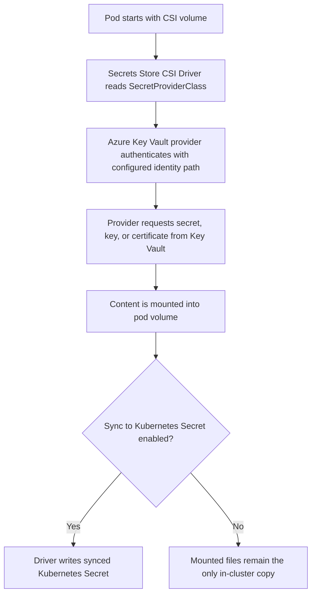

---
content_sources:
  diagrams:
    - id: platform-key-vault-csi-mount-flow
      type: flowchart
      source: self-generated
      justification: Mount and refresh flow synthesized from Microsoft Learn AKS Key Vault CSI driver and identity access guidance.
      based_on:
        - https://learn.microsoft.com/en-us/azure/aks/csi-secrets-store-driver
        - https://learn.microsoft.com/en-us/azure/aks/csi-secrets-store-identity-access
        - https://learn.microsoft.com/en-us/azure/aks/workload-identity-overview
content_validation:
  status: verified
  last_reviewed: 2026-07-18
  reviewer: agent
  core_claims:
    - claim: "The Azure Key Vault provider for Secrets Store CSI Driver can mount secrets, keys, and certificates into pods running on AKS."
      source: https://learn.microsoft.com/en-us/azure/aks/csi-secrets-store-driver
      verified: true
    - claim: "The add-on can optionally sync mounted content into Kubernetes Secrets."
      source: https://learn.microsoft.com/en-us/azure/aks/csi-secrets-store-driver
      verified: true
    - claim: "Azure Key Vault access for the provider depends on an authorized identity path such as workload identity or managed identity."
      source: https://learn.microsoft.com/en-us/azure/aks/csi-secrets-store-identity-access
      verified: true
---

# Azure Key Vault CSI Driver

The Azure Key Vault provider for Secrets Store CSI Driver lets AKS mount Key Vault secrets, certificates, and keys into pods without baking them into images or storing them as long-lived Kubernetes secrets. Operationally, it is a mount-and-refresh system, not a generic secret replication platform.

## Main Content

### Mount flow

At pod start, the CSI driver and Azure Key Vault provider resolve the `SecretProviderClass`, authenticate to Azure, fetch the requested objects, and mount them into the pod filesystem.

<!-- diagram-id: platform-key-vault-csi-mount-flow -->


### Identity path selection

The driver still needs an Azure identity path. In current AKS guidance, use workload identity or another supported managed identity path. The downstream Key Vault permissions must match the identity that the provider actually uses.

This distinction matters operationally:

- If Azure token exchange fails, the mount usually never materializes correctly.
- If token exchange succeeds but Key Vault denies access, the volume path exists only partially or the provider logs permission errors.
- If the wrong identity is granted access, the workload can look healthy until the first mount or refresh call touches Key Vault.

### Sync-to-Kubernetes-Secret behavior

The optional sync behavior copies mounted content into a Kubernetes `Secret` so workloads that require Kubernetes-native secret references can still consume the same Key Vault value.

Use the sync option deliberately:

- It helps workloads that expect `envFrom`, `secretKeyRef`, or other native Kubernetes secret consumption.
- It does **not** remove the CSI mount dependency; the synced secret is produced from the mount pipeline.
- It does **not** make secret rotation instantaneous for environment variables already injected into running containers.
- It does create another in-cluster copy whose lifecycle, RBAC exposure, and restart semantics you must manage.

### Polling, event refresh, and rotation expectations

The CSI model is eventually consistent, not event-atomic. Secret rotation depends on the provider's refresh behavior and the application's ability to re-read the mounted file.

- **Mounted file refresh**: updated values appear after the driver's refresh loop detects the new version and remounts content.
- **Kubernetes Secret sync refresh**: the synced secret updates after the mounted content refreshes.
- **Environment-variable consumers**: containers that loaded secret values into environment variables normally need a restart or rollout to observe the new value.

Expect latency between a Key Vault secret update and the moment every pod consumes the new value. The exact delay depends on driver polling/refresh timing and workload reload behavior, so validate the end-to-end path in production-like conditions instead of assuming immediate consistency.

### Access model migration considerations

Migrating Key Vault from access policies to Azure RBAC, or vice versa, changes the authorization plane the provider depends on.

- Existing mounted files can remain present in running containers until the next refresh or remount.
- New pod starts or refresh cycles will fail if the new access model does not yet grant equivalent rights.
- Revoke operations are not retroactive to already-read file contents inside a running process.

The safe sequence is: grant the replacement model first, validate a fresh pod mount, then remove the old model.

### Validation commands

```bash
az aks show \
    --resource-group "$RG" \
    --name "$CLUSTER_NAME" \
    --query "addonProfiles.azureKeyvaultSecretsProvider" \
    --output yaml

kubectl get secretproviderclass \
    --all-namespaces

kubectl describe pod "$POD_NAME" \
    --namespace "$NAMESPACE"

kubectl get secret "$SECRET_NAME" \
    --namespace "$NAMESPACE" \
    --output yaml
```

## See Also

- [Identity and Secrets](identity-and-secrets.md)
- [Microsoft Entra Workload Identity](workload-identity.md)
- [Identity Model Comparison](identity-model-comparison.md)
- [Credential Rotation](../operations/credential-rotation.md)
- [RBAC Success but Key Vault Still Fails](../troubleshooting/playbooks/identity/rbac-success-key-vault-fail.md)

## Sources

- [Use the Azure Key Vault provider for Secrets Store CSI Driver in AKS](https://learn.microsoft.com/en-us/azure/aks/csi-secrets-store-driver)
- [Configure access to Azure Key Vault provider for Secrets Store CSI Driver in AKS](https://learn.microsoft.com/en-us/azure/aks/csi-secrets-store-identity-access)
