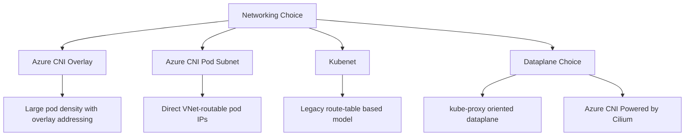

---
content_sources:
  diagrams:
    - id: platform-networking-models
      type: flowchart
      source: mslearn-adapted
      mslearn_url: https://learn.microsoft.com/en-us/azure/aks/concepts-network
      based_on:
        - https://learn.microsoft.com/en-us/azure/aks/concepts-network
        - https://learn.microsoft.com/en-us/azure/aks/azure-cni-powered-by-cilium
        - https://learn.microsoft.com/en-us/azure/aks/update-azure-cni
content_validation:
  status: verified
  last_reviewed: 2026-07-18
  reviewer: agent
  core_claims:
    - claim: "In the AKS overlay network model, pods receive IP addresses from a private CIDR that is separate from the Azure virtual network subnet used by the nodes."
      source: https://learn.microsoft.com/en-us/azure/aks/concepts-network
      verified: true
    - claim: "In the AKS flat network model, pods receive IP addresses from the same Azure virtual network subnet as the AKS nodes."
      source: https://learn.microsoft.com/en-us/azure/aks/concepts-network
      verified: true
    - claim: "Azure CNI Powered by Cilium is supported on Azure CNI node-subnet, pod-subnet, and overlay IPAM modes."
      source: https://learn.microsoft.com/en-us/azure/aks/update-azure-cni
      verified: true
    - claim: "Updating the dataplane to Azure CNI Powered by Cilium does not change the cluster IPAM mode."
      source: https://learn.microsoft.com/en-us/azure/aks/update-azure-cni
      verified: true
    - claim: "AKS Automatic uses Azure CNI Overlay powered by Cilium as the default virtual network."
      source: https://learn.microsoft.com/en-us/azure/aks/azure-cni-powered-by-cilium
      verified: true
---

# Networking Models

AKS networking determines pod IP assignment, routability, subnet pressure, and now the dataplane used for packet forwarding and policy enforcement. It is one of the hardest platform choices to change later, so design the IP model and the dataplane together.

## Main Content

<!-- diagram-id: platform-networking-models -->


### Comparison summary

| Model | Pod IP Behavior | Best Fit | Main Caution |
|---|---|---|---|
| Azure CNI Overlay | Pods use overlay addresses while nodes stay in VNet | Most new AKS clusters | Requires understanding overlay routing behavior |
| Azure CNI Pod Subnet | Pods get IPs from delegated subnets | Deep VNet integration and direct routability | Subnet sizing becomes critical |
| Kubenet | Pods use private address space with NAT through nodes | Legacy or transitional clusters only | Retirement planning and migration constraints matter |

CNI selection decides pod addressing and routability. Outbound networking decides how traffic leaves the cluster and who owns SNAT capacity. After choosing the CNI model, review [Outbound Networking](outbound-networking.md) for `loadBalancer`, NAT Gateway, and UDR decisions.

### Dataplane choice after the CNI mode comparison

The IP model answers **where pod IPs come from**. The dataplane answers **how packets are forwarded and how policy is enforced on the node**.

#### Common operator combinations

| IP model | Typical dataplane posture | Notes |
|---|---|---|
| Azure CNI Overlay | Often paired with Azure CNI Powered by Cilium | This is the default virtual-network posture for AKS Automatic |
| Azure CNI Pod Subnet | Can stay on a non-Cilium dataplane or move to Cilium | Useful when direct pod routability matters |
| Azure CNI Node Subnet | Can move to Cilium without changing IPAM mode | Still needs careful subnet planning |
| Kubenet | Cannot move directly to Cilium dataplane | Must migrate to Azure CNI Overlay first |

#### Practical decision rule

- If you are designing a **new** AKS platform, prefer choosing both the IP model and the dataplane deliberately up front.
- If you are changing an **existing** cluster, remember that an IPAM migration and a dataplane migration are separate operations with separate blast radius.

### What to decide early

- Required pod-to-VNet routability.
- Subnet size and IP growth model.
- Network policy engine and private-cluster requirements.
- Whether the organization standardizes on overlay for simpler IP planning.
- Whether the cluster should adopt Azure CNI Powered by Cilium now or only as part of a later migration.

### Example cluster creation

```bash
az aks create \
    --resource-group "$RG" \
    --name "$CLUSTER_NAME" \
    --location "$LOCATION" \
    --network-plugin azure \
    --network-plugin-mode overlay \
    --network-dataplane cilium \
    --pod-cidr 192.168.0.0/16 \
    --service-cidr 10.0.0.0/16 \
    --dns-service-ip 10.0.0.10 \
    --generate-ssh-keys
```

### Confirm the active network profile

```bash
az aks show \
    --resource-group "$RG" \
    --name "$CLUSTER_NAME" \
    --query "networkProfile.{plugin:networkPlugin,mode:networkPluginMode,dataplane:networkDataplane,policy:networkPolicy,serviceCidr:serviceCidr,dnsServiceIp:dnsServiceIP}" \
    --output yaml
```

## See Also

- [Cluster Architecture](cluster-architecture.md)
- [Azure CNI Powered by Cilium](azure-cni-powered-by-cilium.md)
- [CoreDNS on AKS](coredns-on-aks.md)
- [LocalDNS on AKS](node-local-dns-cache.md)
- [Outbound Networking](outbound-networking.md)
- [Best Practices: Networking](../best-practices/networking.md)
- [CNI IP Exhaustion](../troubleshooting/playbooks/node-issues/cni-ip-exhaustion.md)

## Sources

- [AKS network concepts](https://learn.microsoft.com/en-us/azure/aks/concepts-network)
- [Configure Azure CNI Powered by Cilium in AKS](https://learn.microsoft.com/en-us/azure/aks/azure-cni-powered-by-cilium)
- [Update Azure CNI IPAM mode and data plane for AKS clusters](https://learn.microsoft.com/en-us/azure/aks/update-azure-cni)
