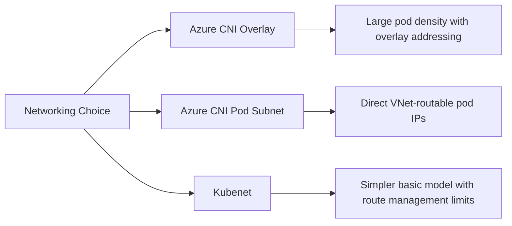

---
content_sources:
  diagrams:
  - id: platform-networking-models
    type: flowchart
    source: mslearn-adapted
    mslearn_url: https://learn.microsoft.com/en-us/azure/aks/concepts-network
    based_on:
    - https://learn.microsoft.com/en-us/azure/aks/concepts-network
    - https://learn.microsoft.com/en-us/azure/aks/azure-cni-overlay
---


# Networking Models

AKS networking determines pod IP assignment, routability, and subnet pressure. This is one of the most important design choices because it is painful to change later.

## Main Content
<!-- diagram-id: platform-networking-models -->

<!-- diagram-id: platform-networking-models -->



### Comparison summary

| Model | Pod IP Behavior | Best Fit | Main Caution |
|---|---|---|---|
| Azure CNI Overlay | Pods use overlay addresses while nodes stay in VNet | Most new AKS clusters | Requires understanding overlay routing behavior |
| Azure CNI Pod Subnet | Pods get IPs from delegated subnets | Deep VNet integration and direct routability | Subnet sizing becomes critical |
| Kubenet | Pods use private address space with NAT through nodes | Legacy/smaller clusters | Feature limits and future preference toward Azure CNI options |

### What to decide early

- Required pod-to-VNet routability.
- Subnet size and IP growth model.
- Network policy engine and private cluster requirements.
- Whether your org standardizes on overlay for simpler IP planning.

### Example cluster creation

```bash
az aks create     --resource-group $RG     --name $CLUSTER_NAME     --location $LOCATION     --network-plugin azure     --network-plugin-mode overlay     --pod-cidr 192.168.0.0/16     --service-cidr 10.0.0.0/16     --dns-service-ip 10.0.0.10
```

## See Also

- [Cluster Architecture](cluster-architecture.md)
- [Ingress and Load Balancing](ingress-load-balancing.md)
- [Best Practices: Networking](../best-practices/networking.md)
- [CNI IP Exhaustion](../troubleshooting/playbooks/node-issues/cni-ip-exhaustion.md)

## Sources

- [AKS network concepts](https://learn.microsoft.com/azure/aks/concepts-network)
- [Create an AKS cluster with Azure CNI Overlay](https://learn.microsoft.com/azure/aks/azure-cni-overlay)
