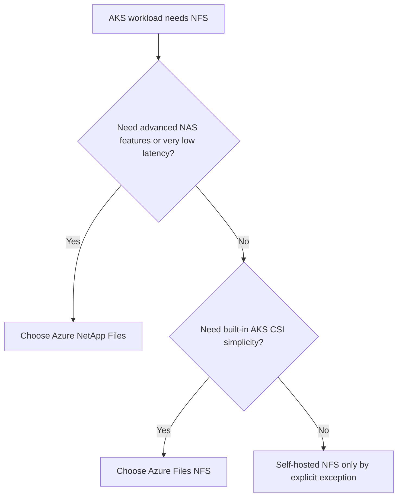

---
content_sources:
  diagrams:
    - id: platform-nfs-on-aks-service-choice
      type: flowchart
      source: self-generated
      justification: NFS service selection guidance synthesized from Microsoft Learn AKS storage concepts, Azure Files, Azure NetApp Files, and Azure Storage NFS comparison documentation.
      based_on:
        - https://learn.microsoft.com/en-us/azure/aks/concepts-storage
        - https://learn.microsoft.com/en-us/azure/aks/create-volume-azure-files
        - https://learn.microsoft.com/en-us/azure/aks/azure-netapp-files
        - https://learn.microsoft.com/en-us/azure/aks/azure-netapp-files-nfs
        - https://learn.microsoft.com/en-us/azure/storage/common/nfs-comparison
content_validation:
  status: verified
  last_reviewed: 2026-07-18
  reviewer: agent
  core_claims:
    - claim: "AKS storage concepts include Azure Files and Azure NetApp Files as file-storage options, and Azure Files can mount NFS 4.1 shares."
      source: https://learn.microsoft.com/en-us/azure/aks/concepts-storage
      verified: true
    - claim: "Azure Files NFS on AKS requires premium file shares and a virtual-network-enabled storage account."
      source: https://learn.microsoft.com/en-us/azure/aks/create-volume-azure-files
      verified: true
    - claim: "Azure NetApp Files supports NFSv3 and NFSv4.1 for AKS workloads, and dynamic provisioning is done through Trident rather than the built-in AKS CSI drivers."
      source: https://learn.microsoft.com/en-us/azure/aks/azure-netapp-files
      verified: true
    - claim: "Microsoft positions Azure Blob NFS, Azure Files NFS, and Azure NetApp Files NFS for different access patterns: Blob for large read-heavy sequential data, Azure Files for random-access shared files, and Azure NetApp Files for low-latency advanced NAS scenarios."
      source: https://learn.microsoft.com/en-us/azure/storage/common/nfs-comparison
      verified: true
---

# NFS on AKS

“Use NFS” is not a single AKS design. In practice, AKS operators choose among **Azure Files NFS**, **Azure NetApp Files**, and the exceptional case of **self-hosted NFS**. The right answer depends on latency, data-management expectations, and how much storage control plane you want to own yourself.

## Main Content

### Pick the NFS service by operational goal

<!-- diagram-id: platform-nfs-on-aks-service-choice -->

### Option comparison

| Option | Best fit | Strengths | Watch-outs |
|---|---|---|---|
| Azure Files NFS | Shared Linux file storage on AKS with built-in CSI flow | Native AKS storage-class workflow, full POSIX support, easier operational model than running your own NFS servers | Premium shares only, VNet-enabled storage account required, not the right fit for the most latency-sensitive NAS workloads. |
| Azure NetApp Files | Enterprise NAS, very low latency, rich data-management features | NFSv3/NFSv4.1, advanced management, stronger fit for demanding shared-state workloads | Separate service and operating model; dynamic provisioning uses Trident rather than the built-in AKS drivers. |
| Self-hosted NFS | Exception path for legacy or specialized constraints | Maximum protocol-level control | You own patching, HA, export policy, scale, backup, and incident recovery. |

### Azure Files NFS on AKS

Use Azure Files NFS when you want the AKS-native CSI experience and the workload needs shared Linux file storage.

Key implications:

- Requires **premium** file shares.
- Requires a **virtual-network-enabled** storage account.
- Works well for shared files, RWX Linux state, and container-native file patterns.
- Tuning usually starts with `nconnect=4`, `noresvport`, and metadata-aware mount options.

### Azure NetApp Files on AKS

Use Azure NetApp Files when NFS is part of a broader enterprise NAS requirement, not just a PVC request.

It is the stronger fit when you need:

- Lower latency and more demanding performance envelopes.
- Richer NAS data-management features.
- NFSv3 or NFSv4.1 with more advanced storage expectations.

AKS note: dynamic provisioning is typically done through **Trident**, not the built-in AKS Azure Files/Azure Disk/Azure Blob CSI path.

### Self-hosted NFS on AKS

Self-hosted NFS is an exception path, not the default recommendation. Consider it only when a managed Azure NFS service does not satisfy a hard technical requirement.

If you choose it, you inherit:

- NFS server patching and lifecycle
- export-policy governance
- failover and HA design
- backup and restore ownership
- performance troubleshooting down to the server tier

That trade-off is sometimes necessary, but it is almost never the simplest day-2 model.

### Decision guidance

- Choose **Azure Files NFS** when you want AKS-native simplicity and the workload fits premium shared file storage.
- Choose **Azure NetApp Files** when the workload is truly NAS-centric and needs richer performance or management capabilities.
- Choose **self-hosted NFS** only when you are intentionally accepting infrastructure ownership.

## See Also

- [Storage Options](storage-options.md)
- [Azure Files CSI Driver](azure-files-csi-driver.md)
- [StatefulSet Day-2 Operations](../operations/statefulset-day-2-operations.md)
- [Restore Drills](../operations/restore-drills.md)

## Sources

- [Storage concepts for AKS](https://learn.microsoft.com/en-us/azure/aks/concepts-storage)
- [Create and manage Azure Files persistent volumes on AKS](https://learn.microsoft.com/en-us/azure/aks/create-volume-azure-files)
- [Configure Azure NetApp Files for AKS](https://learn.microsoft.com/en-us/azure/aks/azure-netapp-files)
- [Provision Azure NetApp Files NFS volumes for AKS](https://learn.microsoft.com/en-us/azure/aks/azure-netapp-files-nfs)
- [Compare NFS access to Azure Files, Blob Storage, and Azure NetApp Files](https://learn.microsoft.com/en-us/azure/storage/common/nfs-comparison)
