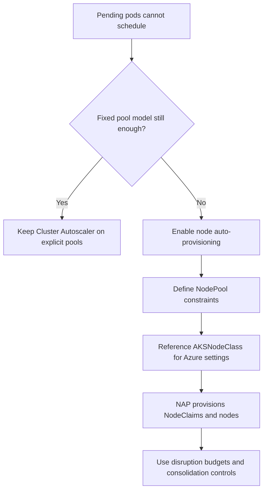

# Node Autoprovisioning

Node autoprovisioning (NAP) changes the AKS scaling contract from “grow these fixed pools” to “provision the right nodes for pending pods.” Use it when fixed VM-size planning and per-pool min/max tuning are creating more operational drag than value.

## Main Content

<!-- diagram-id: platform-node-autoprovisioning-flow -->


### What NAP is doing under the hood

NAP is the AKS-managed Karpenter path. Instead of scaling only predeclared agent pools, it evaluates pending pod requirements and provisions nodes that satisfy them.

That changes operator responsibility:

- With **Cluster Autoscaler**, you prebuild pools and tune their bounds.
- With **NAP**, you define constraints and policies, then let Karpenter choose matching capacity.

Microsoft Learn currently positions **AKS Automatic** as the recommended default for most production workloads and states that AKS Automatic includes NAP preconfigured. For release state, support boundaries, and limitations, use the current NAP Learn page as the source of truth at deployment time rather than relying on stale assumptions.

### Core objects: NodePool, AKSNodeClass, NodeClaim

| Object | Purpose | What the operator controls |
|---|---|---|
| `NodePool` | Scheduling and provisioning constraints | Capacity type, SKU families, limits, taints, weights, disruption policy |
| `AKSNodeClass` | Azure-specific node configuration | Image family, OS disk, subnet, max pods, kubelet settings, tags |
| `NodeClaim` | Realized provisioned node state | Mostly observed rather than hand-authored |

Important distinction:

- **NodePool** expresses *what kind of node is acceptable*.
- **AKSNodeClass** expresses *how Azure should build that node*.

This split is what makes NAP more flexible than Cluster Autoscaler on fixed pools.

### Cluster Autoscaler versus NAP

| Decision factor | Cluster Autoscaler | NAP |
|---|---|---|
| Node shape selection | You predefine VM sizes in agent pools | Karpenter selects matching capacity from your constraints |
| Scaling scope | Pool count within min/max bounds | New NAP-managed nodes from NodePool rules |
| Good fit | Stable workload classes and explicit pool ownership | Diverse workload mix or frequent right-sizing pain |
| Operational model | Azure CLI profile and per-pool bounds | Kubernetes CRDs and disruption policies |
| Mutual exclusivity | Can run without NAP | Side-by-side with Cluster Autoscaler is supported only on the documented feature-flagged migration path, not as a steady state |

Migration signal: if you keep creating more user pools just to match slightly different shapes, affinities, or spot/on-demand mixes, you are probably at the point where NAP becomes simpler than another round of Cluster Autoscaler tuning.

### NodePool design rules

NAP works best when NodePools are mutually understandable and intentional.

Use separate NodePools when you need to differentiate:

- **on-demand vs. spot**
- **general-purpose vs. memory-heavy vs. compute-heavy**
- **strict taints or topology preferences**
- **different disruption tolerance**

Keep NodePools understandable by platform teams:

- Use requirements to constrain SKU families and capacity types.
- Use limits to cap total resource growth.
- Use weights only when multiple NodePools could satisfy the same workload and you want a preferred landing zone.

### Disruption and consolidation behavior

NAP is not just a scale-out engine. It also consolidates and replaces capacity. That is why disruption controls matter.

Relevant controls from the NAP guidance:

- `consolidationPolicy`
- `consolidateAfter`
- `expireAfter`
- `spec.disruption.budgets`
- `spec.template.spec.terminationGracePeriod`

Use stricter disruption budgets when:

- workload warm-up is slow,
- stateful pods need more drain time,
- or the cluster already sees frequent spot churn.

Use faster consolidation only when pods are cheap to move and the cluster is suffering from idle-node waste.

### Status and rollout guidance

Do **not** hard-code a long-lived statement like “NAP is GA” or “NAP is preview” into your runbooks without rechecking the Learn page. The page is the required status source of truth for this repository. At authoring time, the safe guidance is:

- verify current feature status on Microsoft Learn,
- verify current limitations before rollout,
- verify that your networking, identity, and load balancer choices are within the documented NAP support matrix.

### Verification commands

Enable NAP on an existing cluster:

```bash
az aks update \
    --name "$CLUSTER_NAME" \
    --resource-group "$RG" \
    --node-provisioning-mode Auto
```

List NAP-managed nodes:

```bash
kubectl get nodes \
    --selector karpenter.sh/nodepool
```

Inspect NodePools:

```bash
kubectl get nodepools.karpenter.sh
```

Inspect AKSNodeClass resources:

```bash
kubectl get aksnodeclasses.karpenter.azure.com
```

Watch Karpenter and NAP events:

```bash
kubectl get events \
    --field-selector source=karpenter-events
```

## See Also

- [Scaling](scaling.md)
- [Node Pools](node-pools.md)
- [Best Practices: Autoscaling](../best-practices/autoscaling.md)
- [Scaling Operations](../operations/scaling-operations.md)
- [NAP Fails to Provision](../troubleshooting/playbooks/scaling/nap-fails-to-provision.md)

## Sources

- [Overview of node auto-provisioning in AKS](https://learn.microsoft.com/en-us/azure/aks/node-auto-provisioning)
- [Configure NodePools for node auto-provisioning in AKS](https://learn.microsoft.com/en-us/azure/aks/node-auto-provisioning-node-pools)
- [Configure AKSNodeClass for node auto-provisioning in AKS](https://learn.microsoft.com/en-us/azure/aks/node-auto-provisioning-aksnodeclass)
- [Configure node disruption policies for NAP nodes](https://learn.microsoft.com/en-us/azure/aks/node-auto-provisioning-disruption)
- [Migrate from cluster autoscaler to node auto-provisioning](https://learn.microsoft.com/en-us/azure/aks/migrate-from-autoscaler-to-node-auto-provisioning)
