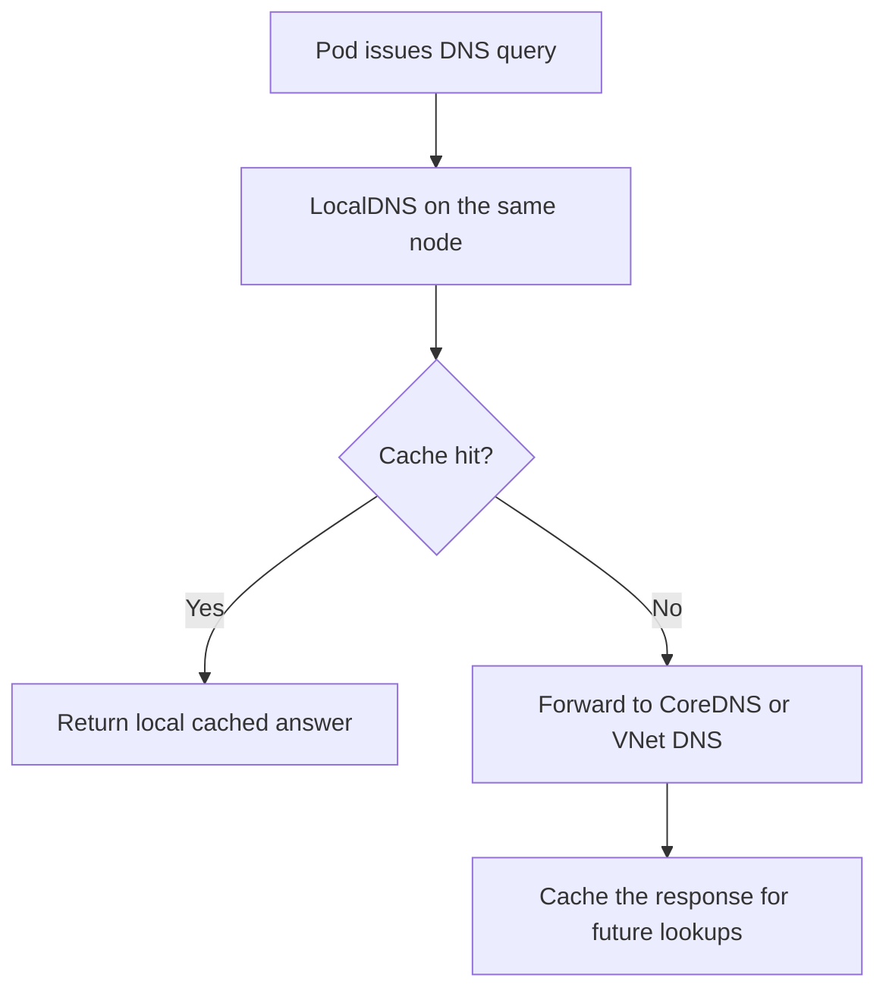

---
content_sources:
  diagrams:
    - id: platform-localdns-on-aks-query-path
      type: flowchart
      source: self-generated
      justification: AKS LocalDNS architecture and rollout guidance synthesized from Microsoft Learn DNS concepts and LocalDNS configuration documentation.
      based_on:
        - https://learn.microsoft.com/en-us/azure/aks/dns-concepts
        - https://learn.microsoft.com/en-us/azure/aks/localdns-custom
        - https://learn.microsoft.com/en-us/azure/aks/operator-best-practices-network
content_validation:
  status: verified
  last_reviewed: 2026-07-18
  reviewer: agent
  core_claims:
    - claim: "LocalDNS deploys a DNS proxy on each node and serves pod DNS queries locally to reduce latency and improve resiliency."
      source: https://learn.microsoft.com/en-us/azure/aks/dns-concepts
      verified: true
    - claim: "AKS Automatic comes preconfigured with LocalDNS."
      source: https://learn.microsoft.com/en-us/azure/aks/dns-concepts
      verified: true
    - claim: "AKS Standard can enable and configure LocalDNS separately."
      source: https://learn.microsoft.com/en-us/azure/aks/dns-concepts
      verified: true
    - claim: "Enabling LocalDNS on an AKS node pool triggers a reimage operation on all nodes in that pool."
      source: https://learn.microsoft.com/en-us/azure/aks/localdns-custom
      verified: true
    - claim: "AKS does not recommend enabling both upstream Kubernetes NodeLocal DNSCache and AKS LocalDNS in the same node pool."
      source: https://learn.microsoft.com/en-us/azure/aks/localdns-custom
      verified: true
---

# LocalDNS on AKS

AKS now documents the node-local DNS-cache pattern as **LocalDNS**. If your team still says “NodeLocal DNSCache,” treat that as the upstream concept and use **LocalDNS** for AKS-specific design, rollout, and troubleshooting.

## Main Content

### How AKS LocalDNS changes the query path

<!-- diagram-id: platform-localdns-on-aks-query-path -->


LocalDNS deploys a DNS proxy as a `systemd` service on each node. Pods send queries to the node-local resolver first, which changes the cluster DNS behavior in three important ways:

- fewer network hops for repeated lookups,
- less pressure on centralized CoreDNS pods,
- and less UDP DNS churn in conntrack state.

### When to enable it

LocalDNS is the right fit when one or more of these are true:

- the cluster has high DNS query volume,
- CoreDNS is becoming a concentration point,
- node conntrack pressure is visible during application spikes,
- or you want cached DNS responses to survive brief upstream DNS interruptions.

The Microsoft Learn best-practice guidance is direct: enable LocalDNS on node pools to improve DNS performance and reliability and to reduce load on centralized CoreDNS pods.

### AKS Automatic versus AKS Standard

| Cluster mode | LocalDNS posture |
|---|---|
| AKS Automatic | Preconfigured by default |
| AKS Standard | Optional, enabled and tuned per node pool |

For AKS Automatic, the main operator job is validating and monitoring the default behavior.

For AKS Standard, the main operator job is deciding which node pools should use LocalDNS and planning the rollout disruption correctly.

### Deployment and rollout constraints

LocalDNS is configured **per node pool** in AKS Standard.

Example update command:

```bash
az aks nodepool update \
    --resource-group "$RG" \
    --cluster-name "$CLUSTER_NAME" \
    --name "$NODEPOOL_NAME" \
    --localdns-config ./localdnsconfig.json
```

Important rollout note: enabling LocalDNS on a node pool triggers a **node reimage** across that pool. Treat the change like a disruptive platform operation and validate:

- PodDisruptionBudgets,
- zone balance,
- autoscaler headroom,
- and application readiness behavior.

### Default configuration shape and tuning knobs

AKS uses `localdnsconfig.json` for configuration. The main knobs operators care about are:

- `mode`
- `protocol`
- `forwardDestination`
- `forwardPolicy`
- `cacheDurationInSeconds`
- `serveStaleDurationInSeconds`
- `serveStale`

`mode` is especially important:

- `Required`: LocalDNS is installed and enforced.
- `Disabled`: the node pool does not use LocalDNS.
- `Preferred`: AKS validates syntax but does not enable LocalDNS; this still triggers a reimage and is best treated as validation-only mode.

### Query-rate and latency effects

LocalDNS helps most when the DNS problem is architectural rather than application-specific.

Expected improvements include:

- lower DNS resolution latency from local handling,
- lower CoreDNS query concentration,
- less conntrack table churn from UDP DNS,
- and better resiliency during brief upstream DNS outages through cached responses.

Do not oversell it:

- LocalDNS does not fix broken upstream DNS servers.
- LocalDNS caching is best effort and stale responses are not guaranteed under all cache-pressure conditions.
- A bad domain-specific forwarding rule can still break lookups, just closer to the node.

### Interaction with Network Policy and Cilium

When the cluster uses Azure CNI Powered by Cilium, policies must explicitly allow pod egress to the LocalDNS IP range or host entity path described in Microsoft Learn. This is a common cause of “DNS broke after policy rollout” incidents.

Also, AKS guidance explicitly says not to enable both upstream Kubernetes NodeLocal DNSCache and AKS LocalDNS in the same node pool. Use the AKS-managed LocalDNS model instead of stacking both.

## See Also

- [CoreDNS on AKS](coredns-on-aks.md)
- [Azure CNI Powered by Cilium](azure-cni-powered-by-cilium.md)
- [Best Practices: Networking](../best-practices/networking.md)
- [CoreDNS Query Latency or Drops](../troubleshooting/playbooks/dns/coredns-query-latency-drops.md)
- [External Hostname Resolution Failure](../troubleshooting/playbooks/dns/external-hostname-resolution-failure.md)

## Sources

- [DNS in AKS](https://learn.microsoft.com/en-us/azure/aks/dns-concepts)
- [Configure LocalDNS in AKS](https://learn.microsoft.com/en-us/azure/aks/localdns-custom)
- [Best practices for network resources in AKS](https://learn.microsoft.com/en-us/azure/aks/operator-best-practices-network)
