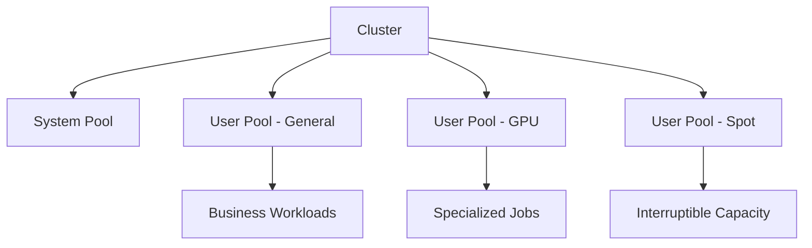

---
hide:
  - toc
---

# Node Pools

Node pools are the core workload isolation and lifecycle boundary in AKS. Treat them as operational contracts, not just groups of VMs.

## Main Content




### Design principles

- Keep at least one dedicated **system** node pool for critical add-ons.
- Use **user** pools for application workloads and isolate by workload class when needed.
- Use taints and tolerations intentionally; don't rely only on node labels.
- Match VM family to workload profile instead of making every app share one pool.

### Common operations

```bash
az aks nodepool add     --resource-group $RG     --cluster-name $CLUSTER_NAME     --name user01     --mode User     --node-count 3     --node-vm-size Standard_D4ds_v5
kubectl get nodes --show-labels
kubectl describe node <node-name>
```

### Decision points

- Linux-only or mixed Linux/Windows cluster.
- General-purpose vs memory-optimized vs compute-optimized pools.
- Spot pools for interruptible work.
- Autoscaler enabled or fixed-capacity pools.

## See Also

- [Cluster Architecture](cluster-architecture.md)
- [Scaling](scaling.md)
- [Node Pool Operations](../operations/node-pool-operations.md)
- [Resource Governance](../best-practices/resource-governance.md)

## Sources

- [AKS core concepts for Kubernetes and workloads](https://learn.microsoft.com/azure/aks/concepts-clusters-workloads)
- [Azure Kubernetes Service (AKS) architecture](https://learn.microsoft.com/azure/architecture/reference-architectures/containers/aks/secure-baseline-aks)
- [Scale applications in AKS](https://learn.microsoft.com/azure/aks/concepts-scale)
- [Cluster autoscaler in AKS](https://learn.microsoft.com/azure/aks/cluster-autoscaler)
- [Vertical Pod Autoscaler for AKS](https://learn.microsoft.com/azure/aks/vertical-pod-autoscaler)
