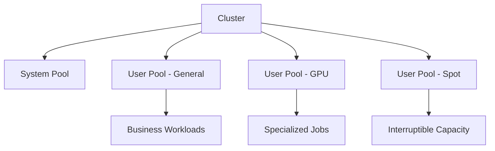

---
content_sources:
  diagrams:
  - id: platform-node-pools
    type: graph
    source: mslearn-adapted
    mslearn_url: https://learn.microsoft.com/en-us/azure/aks/concepts-clusters-workloads
    based_on:
    - https://learn.microsoft.com/en-us/azure/aks/concepts-clusters-workloads
    - https://learn.microsoft.com/en-us/azure/architecture/reference-architectures/containers/aks/secure-baseline-aks
    - https://learn.microsoft.com/en-us/azure/aks/concepts-scale
    - https://learn.microsoft.com/en-us/azure/aks/cluster-autoscaler
    - https://learn.microsoft.com/en-us/azure/aks/vertical-pod-autoscaler
content_validation:
  status: verified
  last_reviewed: 2026-07-18
  reviewer: agent
  core_claims:
    - claim: "In AKS, nodes with the same configuration are grouped into node pools, and those node pools contain the underlying virtual machine scale sets and virtual machines that run applications."
      source: https://learn.microsoft.com/en-us/azure/aks/core-aks-concepts
      verified: true
    - claim: "When you create an AKS cluster, the initial node definition creates a system node pool."
      source: https://learn.microsoft.com/en-us/azure/aks/core-aks-concepts
      verified: true
    - claim: "System node pools host critical system pods such as CoreDNS and konnectivity-agent, while user node pools primarily host application pods."
      source: https://learn.microsoft.com/en-us/azure/aks/core-aks-concepts
      verified: true
---


# Node Pools

Node pools are the core workload isolation and lifecycle boundary in AKS. Treat them as operational contracts, not just groups of VMs.

## Main Content
<!-- diagram-id: platform-node-pools -->



### Design principles

- Keep at least one dedicated **system** node pool for critical add-ons.
- Use **user** pools for application workloads and isolate by workload class when needed.
- Use taints and tolerations intentionally; don't rely only on node labels.
- Match VM family to workload profile instead of making every app share one pool.

### Common operations

```bash
az aks nodepool add     --resource-group $RG     --cluster-name $CLUSTER_NAME     --name user01     --mode User     --node-count 3     --node-vm-size Standard_D4ds_v5
kubectl get nodes --show-labels
kubectl describe node <node-name>
```

### Decision points

- Linux-only or mixed Linux/Windows cluster.
- General-purpose vs memory-optimized vs compute-optimized pools.
- Spot pools for interruptible work.
- Autoscaler enabled or fixed-capacity pools.

### Inspect node pools in the Azure Portal

The **Node pools** blade lists every pool with its mode, node count, VM size, Kubernetes version, and provisioning/power state.

[[[ shot("aks-node-pools-list") ]]]

Purpose: Confirm the system/user pool split and per-pool health after provisioning or scaling.

Look for:

- A dedicated **system** pool and at least one **user** pool are present.
- **Provisioning state** shows `Succeeded` and **Power state** shows `Running` for each pool.
- The **node count** and **VM size** match the intended sizing for each workload class.

Expected result: Each node pool is healthy and sized as designed, with the system pool isolated from user workloads.

Next step: Open the Upgrades blade to review the cluster Kubernetes version and upgrade policy.

### Review upgrade posture

The **Upgrades** blade shows the current Kubernetes version, automatic upgrade channel, and any planned maintenance schedule.

[[[ shot("aks-node-pools-upgrades") ]]]

Purpose: Confirm the cluster version and upgrade strategy that govern node pool lifecycle.

Look for:

- The **Kubernetes version** matches what this guide targets.
- The **Automatic upgrade type** and **Node channel type** reflect your intended maintenance policy.
- The **AKS pricing tier** matches the tier your workloads require.

Expected result: The cluster's version and upgrade channel are known and intentional, not left at unexpected defaults.

Next step: Plan node pool upgrades from the [Node Pool Operations](../operations/node-pool-operations.md) runbook.

## See Also

- [Cluster Architecture](cluster-architecture.md)
- [Scaling](scaling.md)
- [Node Pool Operations](../operations/node-pool-operations.md)
- [Resource Governance](../best-practices/resource-governance.md)

## Sources

- [AKS core concepts for Kubernetes and workloads](https://learn.microsoft.com/azure/aks/concepts-clusters-workloads)
- [Azure Kubernetes Service (AKS) architecture](https://learn.microsoft.com/azure/architecture/reference-architectures/containers/aks/secure-baseline-aks)
- [Scale applications in AKS](https://learn.microsoft.com/azure/aks/concepts-scale)
- [Cluster autoscaler in AKS](https://learn.microsoft.com/azure/aks/cluster-autoscaler)
- [Vertical Pod Autoscaler for AKS](https://learn.microsoft.com/azure/aks/vertical-pod-autoscaler)
