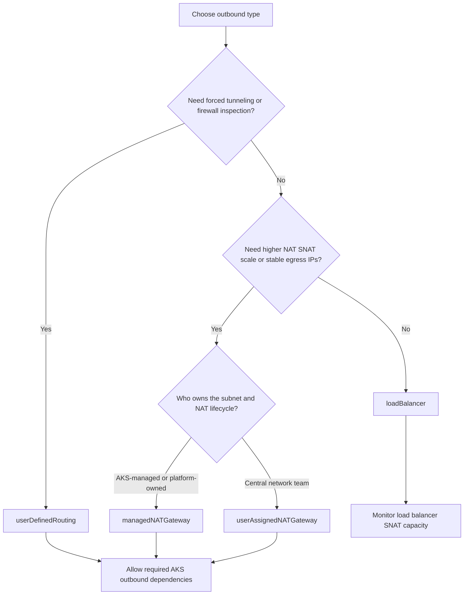

---
content_sources:
  diagrams:
    - id: platform-outbound-networking-decision
      type: flowchart
      source: self-generated
      justification: Decision flow synthesized from Microsoft Learn outbound type, NAT Gateway, and restricted-egress guidance.
      based_on:
        - https://learn.microsoft.com/en-us/azure/aks/egress-outboundtype
        - https://learn.microsoft.com/en-us/azure/aks/nat-gateway
        - https://learn.microsoft.com/en-us/azure/aks/outbound-rules-control-egress
content_validation:
  status: verified
  last_reviewed: 2026-07-18
  reviewer: agent
  core_claims:
    - claim: "AKS commonly used outbound types include loadBalancer, managedNATGateway, userAssignedNATGateway, and userDefinedRouting, and Microsoft Learn also documents additional types such as managedNATGatewayV2, none, and block."
      source: https://learn.microsoft.com/en-us/azure/aks/egress-outboundtype
      verified: true
    - claim: "The loadBalancer outbound type uses an AKS-managed Standard Load Balancer for egress."
      source: https://learn.microsoft.com/en-us/azure/aks/egress-outboundtype
      verified: true
    - claim: "AKS can use Azure NAT Gateway for egress with the managedNATGateway and userAssignedNATGateway outbound types."
      source: https://learn.microsoft.com/en-us/azure/aks/nat-gateway
      verified: true
    - claim: "With the userDefinedRouting outbound type, egress is routed through customer-managed routes and you must allow the required AKS outbound dependencies."
      source: https://learn.microsoft.com/en-us/azure/aks/egress-outboundtype
      verified: true
    - claim: "Restricted-egress AKS clusters must allow the required outbound network rules and FQDNs for cluster dependencies."
      source: https://learn.microsoft.com/en-us/azure/aks/outbound-rules-control-egress
      verified: true
---

# Outbound Networking

Outbound networking in AKS decides how cluster traffic leaves the virtual network, which public egress identity downstream systems see, and who owns SNAT and firewall capacity. Treat it as a creation-time design choice: `outboundType` can be updated after cluster creation, but the supported transitions are limited and the change is disruptive, so it is far cheaper to validate the egress model up front.

## Main Content

### What outbound networking controls

Outbound networking controls these operator concerns:

- The default egress path for nodes and pods that must reach external services.
- The public IP identity or NAT path seen by downstream dependencies.
- The SNAT behavior and who must monitor or scale that capacity.
- Whether Azure-managed load balancer rules, Azure NAT Gateway, or customer-managed routes and firewalls own outbound translation.
- Whether restricted-egress clusters still have the required AKS dependencies and FQDNs reachable.

### AKS outbound types

| Outbound type | What AKS uses | Best fit | Main caution |
|---|---|---|---|
| `loadBalancer` | AKS-managed Standard Load Balancer outbound rules | Simple public egress for general clusters | SNAT capacity is finite and must be monitored and scaled deliberately |
| `managedNATGateway` | AKS-managed Azure NAT Gateway | Managed virtual network clusters that need higher NAT SNAT scale with less network-team ownership | NAT behavior improves scale, but AKS still needs required outbound dependencies allowed |
| `userAssignedNATGateway` | Customer NAT Gateway attached to the subnet | Enterprise environments where the subnet and NAT lifecycle are centrally owned | Requires subnet, NAT Gateway, and public IP lifecycle ownership outside AKS |
| `userDefinedRouting` | Customer route table plus firewall, NVA, or forced-tunnel path | Compliance-driven egress inspection, Azure Firewall, or centralized forced tunneling | UDR shifts egress ownership to the customer; it does not remove the need to allow required AKS outbound destinations |

The four types above cover the mainstream production choices. Microsoft Learn also documents additional outbound types — `managedNATGatewayV2` (Preview), and `none` / `block` (Preview) for clusters that intentionally have no AKS-managed outbound path. Confirm the current preview status and regional availability in the Microsoft Learn source before designing around them.

### Decision criteria

Use these questions to choose the outbound type deliberately:

- Do you need firewall inspection or forced tunneling before traffic reaches the internet?
- Do downstream systems require stable egress IP addresses?
- Who owns SNAT scale and failure analysis: the AKS platform team, the central network team, or both?
- Is the cluster using an AKS-managed virtual network or a custom subnet with central ownership?
- Are the required AKS outbound FQDNs and dependencies reachable through the chosen route?
- Can private endpoints or service endpoints remove some public egress instead of scaling more SNAT?

<!-- diagram-id: platform-outbound-networking-decision -->


### SNAT responsibility boundary

SNAT is part of outbound design, but the operational metrics belong in the shared metrics reference. Use this page to choose who owns SNAT scale and failure handling, then use [Ingress and Networking Metrics](../reference/metrics/ingress-networking-metrics.md) for metric names and interpretation.

### Restricted egress and required dependencies

Private clusters and restricted-egress clusters still require outbound dependencies. Private API access is not the same as zero outbound dependency. If you use UDR, Azure Firewall, a proxy, or another centralized egress path, explicitly allow the AKS-required FQDNs and endpoints or cluster creation, upgrades, image pulls, and control-plane-dependent operations can fail.

### Validation commands

Use these commands after cluster creation to confirm the outbound design is the one you intended:

```bash
az aks show \
    --resource-group "$RG" \
    --name "$CLUSTER_NAME" \
    --query "networkProfile" \
    --output json

az network nat gateway show \
    --resource-group "$RG" \
    --name "$NAT_GATEWAY_NAME" \
    --output json

az network route-table route list \
    --resource-group "$RG" \
    --route-table-name "$ROUTE_TABLE_NAME" \
    --output table

az network lb outbound-rule list \
    --resource-group "$NODE_RG" \
    --lb-name "$LOAD_BALANCER_NAME" \
    --output table
```

| Command | Purpose |
| --- | --- |
| `az aks show` | Show the cluster network profile. |
| `--resource-group` | Resource group that contains the AKS cluster. |
| `--name` | Name of the AKS cluster. |
| `--query` | Selects the network profile. |
| `--output` | Output format for the result. |
| `az network nat gateway show` | Show the NAT gateway used for egress. |
| `--resource-group` | Resource group that contains the NAT gateway. |
| `--name` | Name of the NAT gateway. |
| `--output` | Output format for the result. |
| `az network route-table route list` | List the routes in the cluster route table. |
| `--resource-group` | Resource group that contains the route table. |
| `--route-table-name` | Name of the route table. |
| `--output` | Output format for the result. |
| `az network lb outbound-rule list` | List outbound rules on the load balancer. |
| `--resource-group` | Node resource group that contains the load balancer. |
| `--lb-name` | Name of the load balancer. |
| `--output` | Output format for the result. |

## See Also

- [Networking Models](networking-models.md)
- [Ingress and Load Balancing](ingress-load-balancing.md)
- [Private Cluster API Connectivity](../best-practices/private-cluster-api-connectivity.md)
- [Ingress and Networking Metrics](../reference/metrics/ingress-networking-metrics.md)

## Sources

- [Customize cluster egress with outbound types in AKS](https://learn.microsoft.com/en-us/azure/aks/egress-outboundtype)
- [Use a managed or user-assigned NAT gateway in AKS](https://learn.microsoft.com/en-us/azure/aks/nat-gateway)
- [Control egress traffic for cluster nodes in AKS](https://learn.microsoft.com/en-us/azure/aks/outbound-rules-control-egress)
