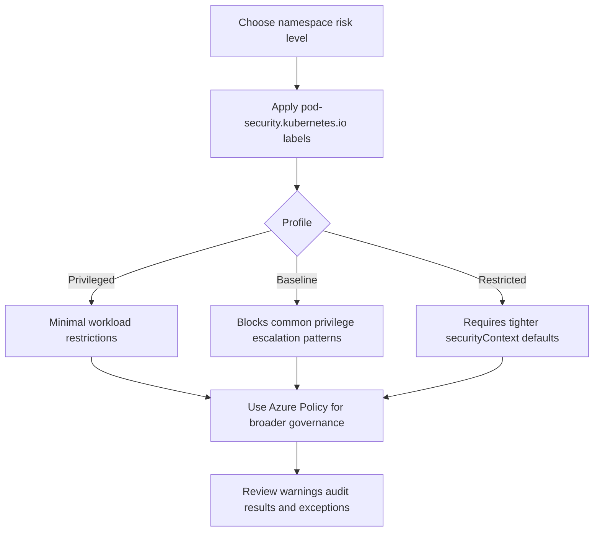

# Pod Security Standards

Pod Security Standards (PSS) are the namespace-scoped baseline for workload hardening in AKS. They are enforced through Pod Security Admission (PSA), which is built into AKS, and they give teams a simple way to express how strict a namespace should be before layering broader governance with Azure Policy.

## Main Content

<!-- diagram-id: platform-pod-security-standards-flow -->


### The three profiles: privileged, baseline, restricted

PSS is a profile model, not a custom rule engine.

| Profile | Intent | Best fit |
|---|---|---|
| `privileged` | Allows the broadest workload behavior | Migration namespaces, platform system exceptions, legacy workloads during remediation |
| `baseline` | Blocks well-known risky settings while staying compatible with many app workloads | Default application namespaces |
| `restricted` | Requires stronger workload hardening such as non-root and tighter `securityContext` usage | High-trust production namespaces and internet-facing apps after manifest cleanup |

Use the profiles as an adoption ladder, not as a binary switch.

### Namespace label model

PSA enforcement is driven by namespace labels. The core label families are:

- `pod-security.kubernetes.io/enforce`
- `pod-security.kubernetes.io/warn`
- `pod-security.kubernetes.io/audit`

That label model lets you separate hard blocking from signal collection:

- **enforce** rejects new noncompliant pods.
- **warn** gives deploy-time feedback without blocking.
- **audit** records violations for later review.

Typical rollout:

1. Start with `warn=baseline` or `audit=baseline`.
2. Fix workloads that rely on risky defaults.
3. Move stable namespaces to `enforce=baseline`.
4. Promote selected namespaces to `restricted` only after the manifest set is ready.

### PSS and Azure Policy are complementary

Do not model PSS as a replacement for Azure Policy. They solve different scopes.

| Control plane | Strength | Best use |
|---|---|---|
| Pod Security Admission | Simple built-in namespace guardrails | Fast namespace-level pod hardening inside a cluster |
| Azure Policy add-on | Centralized assignment, compliance, and exception workflow | Cross-cluster governance, compliance reporting, and custom Gatekeeper-based constraints |

Use both when needed:

- PSS for immediate namespace posture.
- Azure Policy for organization-wide enforcement, reporting, and non-PSS controls such as allowed images or custom constraints.

### Migration guidance from PodSecurityPolicy-era clusters

Pod Security Admission and PodSecurityPolicy are **not interchangeable objects**. PSS is the current standards model enforced through namespace labels and admission behavior. Old PSP-era clusters usually need an intent translation exercise, not a one-for-one manifest conversion.

Good migration pattern:

1. Inventory which workloads depended on broad PSP-era privileges.
2. Classify each namespace as `privileged`, `baseline`, or `restricted`.
3. Add `warn` and `audit` labels first.
4. Fix workload manifests to satisfy the target profile.
5. Use Azure Policy for controls that were never purely namespace-profile decisions.

Examples of controls that usually need manifest cleanup before `restricted`:

- missing `runAsNonRoot`,
- missing `allowPrivilegeEscalation: false`,
- extra Linux capabilities,
- missing `seccompProfile`,
- broad host access patterns.

### Deployment Safeguards interaction

If you use AKS Deployment Safeguards, the service can also manage PSS level choices as part of the wider safeguards posture. That is useful when you want a supported AKS-native way to roll out `Warn` or `Enforce` behavior and pair it with broader safeguards and namespace exclusions.

Operationally, that means teams should be clear about who owns the effective PSS state:

- namespace labels directly,
- Deployment Safeguards configuration,
- or both under a documented platform standard.

### Verification commands

Apply `restricted` enforcement to one namespace:

```bash
kubectl label --overwrite namespace production \
    pod-security.kubernetes.io/enforce=restricted \
    pod-security.kubernetes.io/warn=restricted \
    pod-security.kubernetes.io/audit=restricted
```

Apply cluster-wide warnings for a first rollout:

```bash
kubectl label --overwrite namespace \
    --all \
    pod-security.kubernetes.io/warn=baseline
```

Inspect namespace labels:

```bash
kubectl get namespace production \
    --show-labels
```

## See Also

- [Azure Policy Add-on](azure-policy-addon.md)
- [Defender for Containers](defender-for-containers.md)
- [Best Practices: Governance](../best-practices/governance.md)
- [PSS Enforcement Breaks Deployment](../troubleshooting/playbooks/security/pss-enforcement-breaks-deployment.md)
- [Best Practices: Security](../best-practices/security.md)

## Sources

- [Use Pod Security Admission in Azure Kubernetes Service (AKS)](https://learn.microsoft.com/en-us/azure/aks/use-psa)
- [Use Deployment Safeguards to Enforce Best Practices in Azure Kubernetes Service (AKS)](https://learn.microsoft.com/en-us/azure/aks/deployment-safeguards)
- [Use Azure Policy to secure your Azure Kubernetes Service (AKS) clusters](https://learn.microsoft.com/en-us/azure/aks/use-azure-policy)
