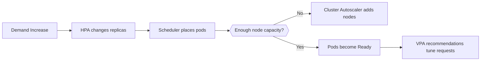

---
hide:
  - toc
---

# Scaling

AKS scaling operates at multiple layers: pods, nodes, and sometimes cluster topology. Stable scaling comes from correct workload requests, good probes, and realistic capacity boundaries.

## Main Content




### Scaling building blocks

- **Horizontal Pod Autoscaler (HPA)** changes replica count.
- **Cluster Autoscaler** adds or removes nodes when pods cannot schedule or capacity is idle.
- **Vertical Pod Autoscaler (VPA)** recommends or applies request changes based on observed usage.

### Operational examples

```bash
kubectl get hpa -A
kubectl top pods -A
az aks update     --resource-group $RG     --name $CLUSTER_NAME     --enable-cluster-autoscaler     --min-count 3     --max-count 10
```

### Common failure modes

- HPA scales replicas but requests are too large for existing nodes.
- Autoscaler is enabled but subnet IPs or quotas block node growth.
- Workloads have no CPU/memory requests, so autoscaling decisions are noisy.

## See Also

- [Node Pools](node-pools.md)
- [Best Practices: Cost Optimization](../best-practices/cost-optimization.md)
- [Scaling Operations](../operations/scaling-operations.md)
- [Scaling Failure](../troubleshooting/playbooks/operations/scaling-failure.md)

## Sources

- [Scale applications in AKS](https://learn.microsoft.com/azure/aks/concepts-scale)
- [Cluster autoscaler in AKS](https://learn.microsoft.com/azure/aks/cluster-autoscaler)
- [Vertical Pod Autoscaler for AKS](https://learn.microsoft.com/azure/aks/vertical-pod-autoscaler)
