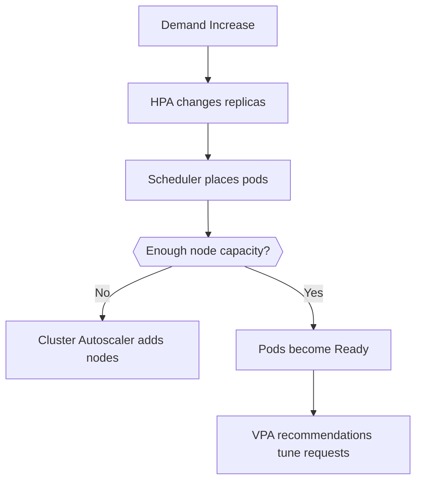
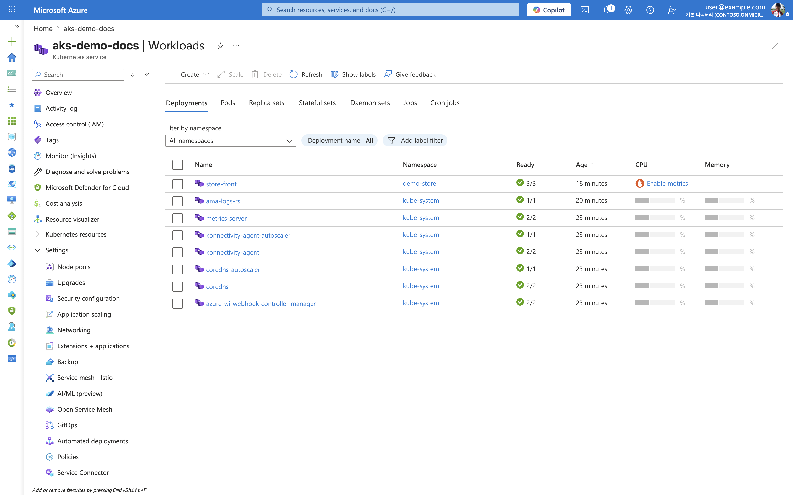
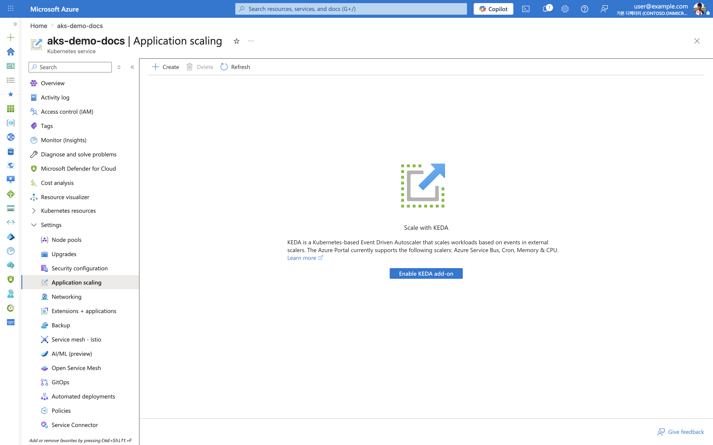

---
content_sources:
  diagrams:
  - id: platform-scaling
    type: flowchart
    source: mslearn-adapted
    mslearn_url: https://learn.microsoft.com/en-us/azure/aks/concepts-scale
    based_on:
    - https://learn.microsoft.com/en-us/azure/aks/concepts-scale
    - https://learn.microsoft.com/en-us/azure/aks/cluster-autoscaler
    - https://learn.microsoft.com/en-us/azure/aks/vertical-pod-autoscaler
---


# Scaling

AKS scaling operates at multiple layers: pods, nodes, and sometimes cluster topology. Stable scaling comes from correct workload requests, good probes, and realistic capacity boundaries.

## Main Content
<!-- diagram-id: platform-scaling -->



### Scaling building blocks

- **Horizontal Pod Autoscaler (HPA)** changes replica count.
- **Cluster Autoscaler** adds or removes nodes when pods cannot schedule or capacity is idle.
- **Vertical Pod Autoscaler (VPA)** recommends or applies request changes based on observed usage.

### Operational examples

```bash
kubectl get hpa -A
kubectl top pods -A
az aks update     --resource-group $RG     --name $CLUSTER_NAME     --enable-cluster-autoscaler     --min-count 3     --max-count 10
```

### Common failure modes

- HPA scales replicas but requests are too large for existing nodes.
- Autoscaler is enabled but subnet IPs or quotas block node growth.
- Workloads have no CPU/memory requests, so autoscaling decisions are noisy.

### Inspect workload health in the Azure Portal

The **Workloads** blade lists Deployments, ReplicaSets, and Pods with ready/desired replica counts, so you can confirm scaling actions converged.



Purpose: Confirm that a Deployment reached its desired replica count after an HPA or manual scaling event.

Look for:

- The Deployment shows **Ready** equal to **Desired** (for example, `3/3`).
- No pods are stuck in `Pending`, which would indicate capacity or scheduling limits.
- Replica counts match what the HPA target or manual scale command requested.

Expected result: The workload is fully scheduled with all replicas Ready, confirming the scaling path worked end to end.

Next step: Enable event-driven scaling from the **Application scaling** blade if your workload scales on external signals.

### Enable event-driven scaling (KEDA)

The **Application scaling** blade is where you enable the KEDA add-on for event-driven autoscaling based on external scalers.



Purpose: Show where to enable KEDA when workloads must scale on events (queues, cron, custom metrics) rather than CPU/memory alone.

Look for:

- The **Scale with KEDA** panel and **Enable KEDA add-on** action are available.
- The supported scaler list (Azure Service Bus, Cron, Memory & CPU) matches your scaling triggers.

Expected result: You can enable KEDA to complement HPA with event-driven scaling for bursty or queue-based workloads.

Next step: Follow [Scaling Operations](../operations/scaling-operations.md) to configure a ScaledObject.

## See Also

- [Node Pools](node-pools.md)
- [Best Practices: Cost Optimization](../best-practices/cost-optimization.md)
- [Scaling Operations](../operations/scaling-operations.md)
- [Scaling Failure](../troubleshooting/playbooks/operations/scaling-failure.md)

## Sources

- [Scale applications in AKS](https://learn.microsoft.com/azure/aks/concepts-scale)
- [Cluster autoscaler in AKS](https://learn.microsoft.com/azure/aks/cluster-autoscaler)
- [Vertical Pod Autoscaler for AKS](https://learn.microsoft.com/azure/aks/vertical-pod-autoscaler)
