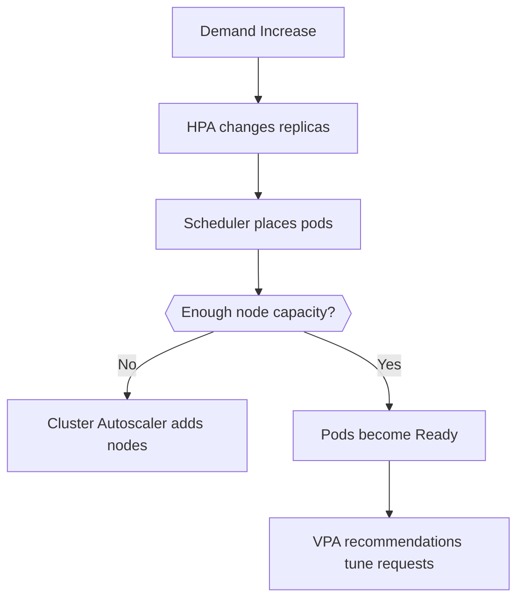

---
content_sources:
  diagrams:
  - id: platform-scaling
    type: flowchart
    source: mslearn-adapted
    mslearn_url: https://learn.microsoft.com/en-us/azure/aks/concepts-scale
    based_on:
    - https://learn.microsoft.com/en-us/azure/aks/concepts-scale
    - https://learn.microsoft.com/en-us/azure/aks/cluster-autoscaler
    - https://learn.microsoft.com/en-us/azure/aks/vertical-pod-autoscaler
content_validation:
  status: verified
  last_reviewed: 2026-07-18
  reviewer: agent
  core_claims:
    - claim: "The Horizontal Pod Autoscaler monitors resource demand and automatically scales the number of pods."
      source: https://learn.microsoft.com/en-us/azure/aks/concepts-scale
      verified: true
    - claim: "The cluster autoscaler adjusts the number of nodes in a node pool based on requested compute resources and unschedulable pods."
      source: https://learn.microsoft.com/en-us/azure/aks/concepts-scale
      verified: true
    - claim: "The Vertical Pod Autoscaler provides recommendations for CPU and memory requests and can automatically set resource requests and limits for containers based on past usage."
      source: https://learn.microsoft.com/en-us/azure/aks/vertical-pod-autoscaler
      verified: true
    - claim: "KEDA extends Kubernetes with a custom resource definition named ScaledObject."
      source: https://learn.microsoft.com/en-us/azure/aks/concepts-scale
      verified: true
    - claim: "HPA is metrics-driven based on resource utilization such as CPU and memory."
      source: https://learn.microsoft.com/en-us/azure/aks/concepts-scale
      verified: true
---


# Scaling

AKS scaling operates at multiple layers: pods, nodes, and sometimes cluster topology. Stable scaling comes from correct workload requests, good probes, and realistic capacity boundaries.

## Main Content
<!-- diagram-id: platform-scaling -->



### Scaling building blocks

- **Horizontal Pod Autoscaler (HPA)** changes replica count.
- **Cluster Autoscaler** adds or removes nodes when pods cannot schedule or capacity is idle.
- **Vertical Pod Autoscaler (VPA)** recommends or applies request changes based on observed usage.
- **KEDA** adds event-driven and scale-to-zero behavior for external triggers.
- **Node autoprovisioning (NAP)** replaces fixed-pool growth logic with constraint-based node provisioning.

### Operational examples

```bash
kubectl get hpa \
    --all-namespaces
kubectl top pods \
    --all-namespaces
az aks update \
    --resource-group "$RG" \
    --name "$CLUSTER_NAME" \
    --enable-cluster-autoscaler \
    --min-count 3 \
    --max-count 10
```

| Command | Purpose |
| --- | --- |
| `kubectl get hpa` | List HorizontalPodAutoscalers across namespaces. |
| `kubectl top pods` | Show current pod CPU and memory usage. |
| `az aks update` | Enable the cluster autoscaler bounds. |
| `--resource-group` | Resource group that contains the AKS cluster. |
| `--name` | Name of the AKS cluster. |
| `--enable-cluster-autoscaler` | Turn on the cluster autoscaler. |
| `--min-count` | Minimum node count for autoscaling. |
| `--max-count` | Maximum node count for autoscaling. |

### Common failure modes

- HPA scales replicas but requests are too large for existing nodes.
- Autoscaler is enabled but subnet IPs or quotas block node growth.
- Workloads have no CPU/memory requests, so autoscaling decisions are noisy.

### When you outgrow HPA + Cluster Autoscaler

The default HPA-plus-Cluster-Autoscaler model is still the best starting point for many clusters. Move beyond it when one of these becomes true:

- **Demand is event-driven**, not resource-driven.
- **Scale-to-zero** matters for worker cost control.
- **One fixed VM pool per workload class** is creating too much operational sprawl.
- **Application metrics** such as backlog, concurrency, or latency are better scaling signals than CPU.

Use this decision guide:

| If the real problem is... | Prefer | Why |
|---|---|---|
| Queue depth, event lag, or bursty asynchronous work | [KEDA on AKS](keda-on-aks.md) | KEDA scales from external demand and supports scale-to-zero |
| Too many near-duplicate node pools and VM-shape choices | [Node Autoprovisioning](node-autoprovisioning.md) | NAP provisions node shapes from constraints instead of only scaling fixed pools |
| CPU and memory are poor proxies for demand | [Custom Metrics Scaling](custom-metrics-scaling.md) | HPA or KEDA can follow custom or Prometheus-backed signals instead |

### Inspect workload health in the Azure Portal

The **Workloads** blade lists Deployments, ReplicaSets, and Pods with ready/desired replica counts, so you can confirm scaling actions converged.

[[[ shot("aks-scaling-workloads") ]]]

Purpose: Confirm that a Deployment reached its desired replica count after an HPA or manual scaling event.

Look for:

- The Deployment shows **Ready** equal to **Desired** (for example, `3/3`).
- No pods are stuck in `Pending`, which would indicate capacity or scheduling limits.
- Replica counts match what the HPA target or manual scale command requested.

Expected result: The workload is fully scheduled with all replicas Ready, confirming the scaling path worked end to end.

Next step: Enable event-driven scaling from the **Application scaling** blade if your workload scales on external signals.

### Enable event-driven scaling (KEDA)

The **Application scaling** blade is where you enable the KEDA add-on for event-driven autoscaling based on external scalers.

[[[ shot("aks-scaling-application-scaling") ]]]

Purpose: Show where to enable KEDA when workloads must scale on events (queues, cron, custom metrics) rather than CPU/memory alone.

Look for:

- The **Scale with KEDA** panel and **Enable KEDA add-on** action are available.
- The supported scaler list (Azure Service Bus, Cron, Memory & CPU) matches your scaling triggers.

Expected result: You can enable KEDA to complement HPA with event-driven scaling for bursty or queue-based workloads.

Next step: Follow [Scaling Operations](../operations/scaling-operations.md) to configure a ScaledObject.

## See Also

- [Node Pools](node-pools.md)
- [KEDA on AKS](keda-on-aks.md)
- [Node Autoprovisioning](node-autoprovisioning.md)
- [Custom Metrics Scaling](custom-metrics-scaling.md)
- [Best Practices: Cost Optimization](../best-practices/cost-optimization.md)
- [Best Practices: Autoscaling](../best-practices/autoscaling.md)
- [Scaling Operations](../operations/scaling-operations.md)
- [Scaling Failure](../troubleshooting/playbooks/operations/scaling-failure.md)

## Sources

- [Scale applications in AKS](https://learn.microsoft.com/en-us/azure/aks/concepts-scale)
- [Cluster autoscaler in AKS](https://learn.microsoft.com/en-us/azure/aks/cluster-autoscaler)
- [Vertical Pod Autoscaler for AKS](https://learn.microsoft.com/en-us/azure/aks/vertical-pod-autoscaler)
