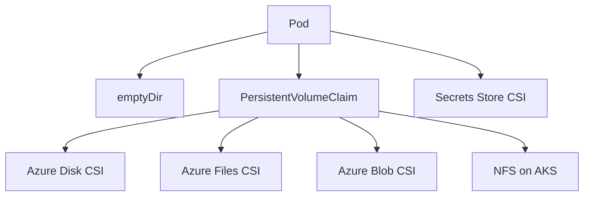

---
content_sources:
  diagrams:
    - id: platform-storage-options
      type: flowchart
      source: mslearn-adapted
      mslearn_url: https://learn.microsoft.com/en-us/azure/aks/concepts-storage
      based_on:
        - https://learn.microsoft.com/en-us/azure/aks/concepts-storage
        - https://learn.microsoft.com/en-us/azure/aks/csi-storage-drivers
        - https://learn.microsoft.com/en-us/azure/aks/create-volume-azure-disk
        - https://learn.microsoft.com/en-us/azure/aks/create-volume-azure-files
content_validation:
  status: verified
  last_reviewed: 2026-07-18
  reviewer: agent
  core_claims:
    - claim: "An emptyDir volume persists only for the lifetime of the pod and is deleted when the pod is deleted."
      source: https://learn.microsoft.com/en-us/azure/aks/concepts-storage
      verified: true
    - claim: "Azure Disks are mounted as ReadWriteOnce and are available to only one node in AKS."
      source: https://learn.microsoft.com/en-us/azure/aks/concepts-storage
      verified: true
    - claim: "Azure Files can share data across multiple nodes and pods."
      source: https://learn.microsoft.com/en-us/azure/aks/concepts-storage
      verified: true
    - claim: "The CSI storage driver support on AKS allows Azure Disks, Azure Files, and Azure Blob storage to be used as persistent storage for AKS applications."
      source: https://learn.microsoft.com/en-us/azure/aks/csi-storage-drivers
      verified: true
---


# Storage Options

AKS supports both ephemeral and persistent storage. Match the storage pattern to workload behavior instead of assuming all containers should be stateless or all data should live on Azure Disk.

## Main Content
<!-- diagram-id: platform-storage-options -->



### Storage patterns

| Option | Best For | Notes |
|---|---|---|
| `emptyDir` | Scratch space, caches, temporary processing | Lost when pod is rescheduled |
| Azure Disk CSI | Single-writer durable state | Strong fit for databases requiring block storage |
| Azure Files CSI | Shared file access across pods | Easier RWX semantics, different performance model |
| Azure Blob CSI | Large unstructured datasets | Mount path over object storage, not a transactional disk substitute |
| NFS on AKS | Linux shared-state patterns | Choose between Azure Files NFS, Azure NetApp Files, or an exception-path self-hosted NFS design |
| Secrets Store CSI | Mounted external secrets and certs | Not a replacement for general data storage |

### Stateful storage design questions

Use these questions to narrow the decision quickly:

- **Does only one pod instance write to the volume at a time?** Start with Azure Disk CSI.
- **Do multiple pods or nodes need concurrent file access?** Start with Azure Files CSI or another NFS path.
- **Is the data naturally object-oriented and very large?** Start with Azure Blob CSI instead of forcing block semantics.
- **Do you need advanced NAS behavior or very low latency shared storage?** Evaluate Azure NetApp Files.

### Example inspection commands

```bash
kubectl get pvc --all-namespaces
kubectl get pv
kubectl describe pvc <pvc-name> --namespace <namespace>
kubectl get storageclass
```

### Design cautions

- Stateful workloads still need backup and restore design.
- Understand zone behavior for managed disks.
- Do not use persistent volumes as a substitute for object storage or external databases without clear reason.

### AKS-specific deep dives

- [Azure Disk CSI Driver](azure-disk-csi-driver.md)
- [Azure Files CSI Driver](azure-files-csi-driver.md)
- [Azure Blob CSI Driver](azure-blob-csi-driver.md)
- [NFS on AKS](nfs-on-aks.md)

## See Also

- [Azure Disk CSI Driver](azure-disk-csi-driver.md)
- [Azure Files CSI Driver](azure-files-csi-driver.md)
- [Azure Blob CSI Driver](azure-blob-csi-driver.md)
- [NFS on AKS](nfs-on-aks.md)
- [Identity and Secrets](identity-and-secrets.md)
- [Best Practices: Reliability](../best-practices/reliability.md)
- [Pending Pods](../troubleshooting/playbooks/pod-issues/pending-pods.md)

## Sources

- [Storage concepts for AKS](https://learn.microsoft.com/en-us/azure/aks/concepts-storage)
- [Use CSI storage drivers on AKS](https://learn.microsoft.com/en-us/azure/aks/csi-storage-drivers)
- [Create and manage Azure Disk persistent volumes on AKS](https://learn.microsoft.com/en-us/azure/aks/create-volume-azure-disk)
- [Create and manage Azure Files persistent volumes on AKS](https://learn.microsoft.com/en-us/azure/aks/create-volume-azure-files)
