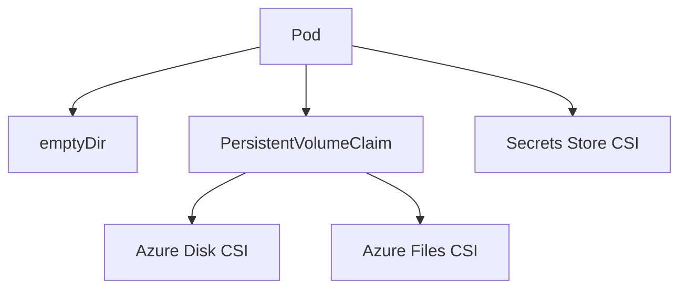

---
content_sources:
  diagrams:
  - id: platform-storage-options
    type: flowchart
    source: mslearn-adapted
    mslearn_url: https://learn.microsoft.com/en-us/azure/aks/concepts-storage
    based_on:
    - https://learn.microsoft.com/en-us/azure/aks/concepts-storage
    - https://learn.microsoft.com/en-us/azure/aks/azure-disk-csi
    - https://learn.microsoft.com/en-us/azure/aks/azure-files-csi
content_validation:
  status: verified
  last_reviewed: 2026-07-18
  reviewer: agent
  core_claims:
    - claim: "An emptyDir volume persists only for the lifetime of the pod and is deleted when the pod is deleted."
      source: https://learn.microsoft.com/en-us/azure/aks/concepts-storage
      verified: true
    - claim: "Azure Disks are mounted as ReadWriteOnce and are available to only one node in AKS."
      source: https://learn.microsoft.com/en-us/azure/aks/concepts-storage
      verified: true
    - claim: "Azure Files can share data across multiple nodes and pods."
      source: https://learn.microsoft.com/en-us/azure/aks/concepts-storage
      verified: true
    - claim: "The CSI storage driver support on AKS allows Azure Disks, Azure Files, and Azure Blob storage to be used as persistent storage for AKS applications."
      source: https://learn.microsoft.com/en-us/azure/aks/csi-storage-drivers
      verified: true
---


# Storage Options

AKS supports both ephemeral and persistent storage. Match the storage pattern to workload behavior instead of assuming all containers should be stateless or all data should live on Azure Disk.

## Main Content
<!-- diagram-id: platform-storage-options -->



### Storage patterns

| Option | Best For | Notes |
|---|---|---|
| `emptyDir` | Scratch space, caches, temporary processing | Lost when pod is rescheduled |
| Azure Disk CSI | Single-writer durable state | Strong fit for databases requiring block storage |
| Azure Files CSI | Shared file access across pods | Easier RWX semantics, different performance model |
| Secrets Store CSI | Mounted external secrets and certs | Not a replacement for general data storage |

### Example inspection commands

```bash
kubectl get pvc -A
kubectl get pv
kubectl describe pvc <pvc-name> -n <namespace>
kubectl get storageclass
```

### Design cautions

- Stateful workloads still need backup and restore design.
- Understand zone behavior for managed disks.
- Do not use persistent volumes as a substitute for object storage or external databases without clear reason.

## See Also

- [Identity and Secrets](identity-and-secrets.md)
- [Best Practices: Reliability](../best-practices/reliability.md)
- [Pending Pods](../troubleshooting/playbooks/pod-issues/pending-pods.md)

## Sources

- [AKS storage concepts](https://learn.microsoft.com/azure/aks/concepts-storage)
- [Azure Disk CSI driver on AKS](https://learn.microsoft.com/azure/aks/azure-disk-csi)
- [Azure Files CSI driver on AKS](https://learn.microsoft.com/azure/aks/azure-files-csi)
