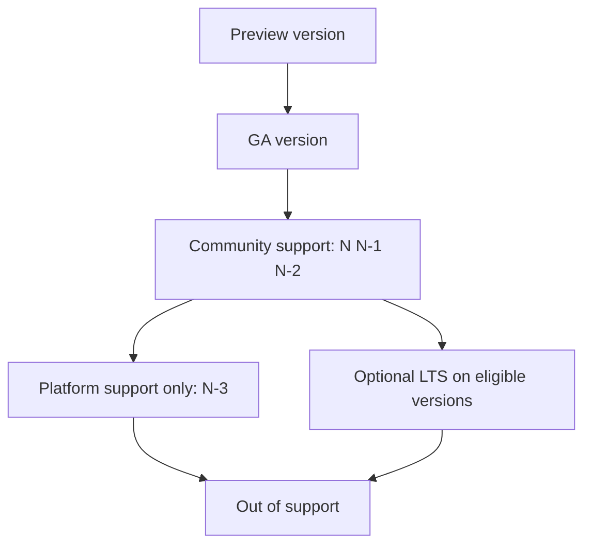

---
content_sources:
  diagrams:
    - id: platform-version-lifecycle-support-states
      type: flowchart
      source: self-generated
      justification: AKS version lifecycle model synthesized from Microsoft Learn support-policy, LTS, and release-tracker documentation.
      based_on:
        - https://learn.microsoft.com/en-us/azure/aks/supported-kubernetes-versions
        - https://learn.microsoft.com/en-us/azure/aks/long-term-support
        - https://learn.microsoft.com/en-us/azure/aks/release-tracker
content_validation:
  status: verified
  last_reviewed: 2026-07-18
  reviewer: agent
  core_claims:
    - claim: "AKS supports the latest GA Kubernetes minor version and the two previous GA minor versions, referred to as N, N-1, and N-2."
      source: https://learn.microsoft.com/en-us/azure/aks/supported-kubernetes-versions
      verified: true
    - claim: "AKS provides platform support only for an additional N-3 GA minor version window, where Azure platform operations continue but Kubernetes component support is reduced."
      source: https://learn.microsoft.com/en-us/azure/aks/supported-kubernetes-versions
      verified: true
    - claim: "AKS preview Kubernetes versions are explicitly labeled preview and are subject to preview terms rather than the GA support policy."
      source: https://learn.microsoft.com/en-us/azure/aks/supported-kubernetes-versions
      verified: true
    - claim: "Long-term support requires the Premium tier and the AKSLongTermSupport support plan, and Premium-tier LTS billing starts when the cluster version exits community support and enters the LTS window."
      source: https://learn.microsoft.com/en-us/azure/aks/long-term-support
      verified: true
---

# AKS Version Lifecycle

AKS version lifecycle planning is about more than picking a Kubernetes number. Operators need to understand which versions are generally available, which are preview-only, when a version moves from full support to platform support, and when long-term support is the right trade-off.

## Main Content

### Support states operators must distinguish

<!-- diagram-id: platform-version-lifecycle-support-states -->


The practical lifecycle states are:

- **Preview**: test only. Preview versions are not the same as GA support.
- **GA community support**: the current supported operating window for N, N-1, and N-2.
- **Platform support only**: the N-3 window, where core Azure platform operations still exist but Kubernetes component support is reduced.
- **Long-term support**: an explicit opt-in support plan that extends the lifecycle for eligible GA versions.
- **Out of support**: the version no longer belongs in a production cluster plan.

### GA cadence and the N-2 window

AKS tracks upstream Kubernetes minor releases and then rolls them out through Azure safe deployment practices. In operational terms, this means:

- New Kubernetes minors appear on a predictable cadence rather than as random one-off events.
- AKS supports the latest GA minor plus the previous two GA minors.
- When a new GA minor enters the service, the oldest GA minor moves toward retirement.

This is why teams that wait until the oldest supported minor version are already late. You are spending your buffer at the exact moment you need the most schedule flexibility.

### What platform support means

Platform support is not the same as normal support. During the N-3 period:

- Azure platform operations such as start/stop, scaling, storage, and networking still exist.
- Kubernetes-component hotfix expectations change.
- You should treat the cluster as being in a recovery state, not a steady-state operating target.

The key design implication: platform support is time you use to finish migration, not time you use to postpone planning.

### Preview versus GA

Preview versions help you validate new behavior early, but they are not the right place to anchor a production lifecycle policy. For production planning:

- Base lifecycle commitments on **GA** versions.
- Use preview only for validation of future changes.
- Do not assume preview availability means region-wide production readiness.

### Long-term support (LTS)

LTS exists for teams that need a longer planning runway. It extends the support window for eligible AKS versions, but it changes the support contract and operational assumptions.

#### What LTS is for

LTS is appropriate when:

- You have application dependencies that cannot absorb yearly minor-version churn easily.
- A regulated or change-controlled estate needs more time for validation.
- You need a deliberate bridge while you modernize controllers, CRDs, or operating processes.

LTS is not a reason to stop upgrading forever. It is a longer runway to the next planned move.

#### What LTS requires

To enable LTS, AKS requires:

- **Premium tier**
- **`AKSLongTermSupport` support plan**
- An explicit operator decision to opt in

CLI examples:

```bash
az aks create \
    --resource-group "$RG" \
    --name "$CLUSTER_NAME" \
    --tier premium \
    --k8s-support-plan AKSLongTermSupport \
    --kubernetes-version <lts-version> \
    --auto-upgrade-channel patch \
    --generate-ssh-keys

az aks update \
    --resource-group "$RG" \
    --name "$CLUSTER_NAME" \
    --tier premium \
    --k8s-support-plan AKSLongTermSupport \
    --auto-upgrade-channel patch
```

| Command | Purpose |
| --- | --- |
| `az aks create` | Create a premium cluster on long-term support. |
| `--resource-group` | Resource group that contains the AKS cluster. |
| `--name` | Name of the AKS cluster. |
| `--tier` | Cluster SKU tier, premium for LTS. |
| `--k8s-support-plan` | Support plan, AKSLongTermSupport for LTS. |
| `--kubernetes-version` | Target LTS Kubernetes version. |
| `--auto-upgrade-channel` | Auto-upgrade channel to use. |
| `--generate-ssh-keys` | Generate SSH keys if none are provided. |
| `az aks update` | Move an existing cluster to premium LTS. |
| `--resource-group` | Resource group that contains the AKS cluster. |
| `--name` | Name of the AKS cluster. |
| `--tier` | Cluster SKU tier, premium for LTS. |
| `--k8s-support-plan` | Support plan, AKSLongTermSupport for LTS. |
| `--auto-upgrade-channel` | Auto-upgrade channel to use. |

#### LTS trade-offs

LTS buys time, but it changes how you should think about cluster ownership:

- You still need patch discipline; AKS recommends the patch auto-upgrade channel.
- LTS supports only the most recent supported patch set for that eligible version range.
- Some add-ons and features are not supported in the LTS posture.
- The next migration can become larger if you let the extra runway turn into inaction.

### Release tracker as lifecycle evidence

The AKS release tracker is the operational companion to the support policy:

- It shows which Kubernetes versions are available by region.
- It shows node image release trains separately from Kubernetes minors.
- It helps prove whether the target patch or image is actually landed where your cluster runs.

Use the support calendar for policy and the release tracker for current regional reality.

## See Also

- [Version Support](../reference/version-support.md)
- [Upgrades](../operations/upgrades.md)
- [Auto-Upgrade Channels](../operations/auto-upgrade-channels.md)
- [Blue-Green Upgrades](../operations/blue-green-upgrades.md)

## Sources

- [Supported Kubernetes versions in AKS](https://learn.microsoft.com/en-us/azure/aks/supported-kubernetes-versions)
- [Long-term support for AKS versions](https://learn.microsoft.com/en-us/azure/aks/long-term-support)
- [AKS release tracker](https://learn.microsoft.com/en-us/azure/aks/release-tracker)
