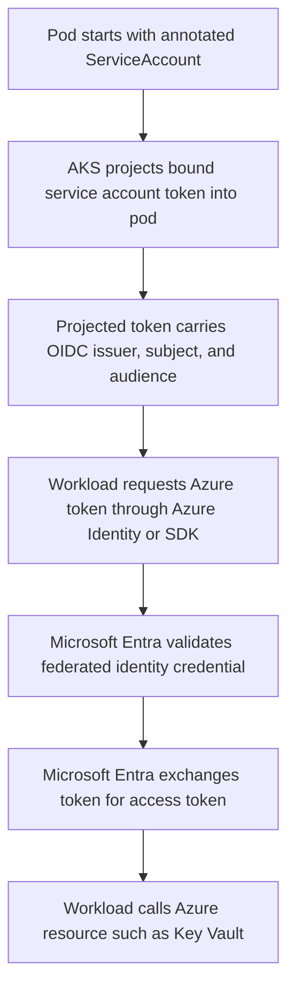

---
content_sources:
  diagrams:
    - id: platform-workload-identity-token-exchange
      type: flowchart
      source: self-generated
      justification: Token exchange flow synthesized from Microsoft Learn workload identity overview and deployment guidance for AKS.
      based_on:
        - https://learn.microsoft.com/en-us/azure/aks/workload-identity-overview
        - https://learn.microsoft.com/en-us/azure/aks/workload-identity-deploy-cluster
content_validation:
  status: verified
  last_reviewed: 2026-07-18
  reviewer: agent
  core_claims:
    - claim: "AKS workload identity requires both the cluster OIDC issuer and workload identity to be enabled."
      source: https://learn.microsoft.com/en-us/azure/aks/workload-identity-deploy-cluster
      verified: true
    - claim: "AKS workload identity uses Kubernetes service account token projection and Microsoft Entra token exchange instead of storing Azure credentials in pods."
      source: https://learn.microsoft.com/en-us/azure/aks/workload-identity-overview
      verified: true
    - claim: "A federated identity credential binds a managed identity or app registration to a specific issuer, subject, and audience combination."
      source: https://learn.microsoft.com/en-us/azure/aks/workload-identity-overview
      verified: true
    - claim: "You can enable the OIDC issuer and workload identity on a new or existing AKS cluster."
      source: https://learn.microsoft.com/en-us/azure/aks/workload-identity-deploy-cluster
      verified: true
---

# Microsoft Entra Workload Identity

Microsoft Entra Workload Identity gives AKS pods an Azure identity without node-scoped credentials or static secrets. The operational model is an OIDC trust chain: AKS issues a projected Kubernetes token, Microsoft Entra validates it against a federated identity credential, and the workload receives an Azure access token for the target resource.

## Main Content

### End-to-end trust chain

Workload identity in AKS has five moving parts that must agree exactly:

- The cluster OIDC issuer URL published by AKS.
- A Kubernetes `ServiceAccount` that the workload runs as.
- A federated identity credential whose `issuer`, `subject`, and `audience` match that service account token.
- A Microsoft Entra-backed identity target such as a user-assigned managed identity.
- Azure RBAC or data-plane access on the downstream service such as Key Vault, Storage, or SQL.

If any one of those bindings mismatches, token exchange fails even when Kubernetes scheduling and service account mounting look healthy.

<!-- diagram-id: platform-workload-identity-token-exchange -->


### Cluster prerequisites and enablement

Enable both cluster features together so the issuer URL exists before workloads depend on it:

```bash
az aks update \
    --resource-group "$RG" \
    --name "$CLUSTER_NAME" \
    --enable-oidc-issuer \
    --enable-workload-identity

az aks show \
    --resource-group "$RG" \
    --name "$CLUSTER_NAME" \
    --query "{oidcIssuerProfile:oidcIssuerProfile,securityProfile:securityProfile.workloadIdentity}" \
    --output yaml
```

| Command | Purpose |
| --- | --- |
| `az aks update` | Enable the OIDC issuer and workload identity. |
| `--resource-group` | Resource group that contains the AKS cluster. |
| `--name` | Name of the AKS cluster. |
| `--enable-oidc-issuer` | Enable the OIDC issuer for workload identity. |
| `--enable-workload-identity` | Enable Microsoft Entra Workload ID. |
| `az aks show` | Show the OIDC issuer and workload identity profile. |
| `--resource-group` | Resource group that contains the AKS cluster. |
| `--name` | Name of the AKS cluster. |
| `--query` | Selects the OIDC issuer and workload identity profile. |
| `--output` | Output format for the result. |

Treat the issuer URL as a cluster contract. A federated identity credential that trusts the wrong issuer cannot exchange tokens, even if the right service account name and namespace are used.

### ServiceAccount binding model

The service account binding is the Kubernetes side of the trust. In operations terms, the important values are:

- **Namespace**
- **Service account name**
- **Subject format**: `system:serviceaccount:<namespace>:<service-account-name>`
- **Audience** expected by Microsoft Entra token exchange

The projected token is mounted into the pod only when the workload runs as that service account. Changing a deployment to a different service account changes the `subject` claim and can immediately invalidate the federated trust.

### Projected token and Azure token exchange

AKS workload identity depends on Kubernetes service account token projection rather than the older node metadata pattern. The projected token is short-lived and scoped for token exchange. Azure SDKs or Azure Identity libraries then request an Azure access token by presenting that projected token to Microsoft Entra.

From an operator perspective, this means:

- The pod must have the projected token volume available.
- The workload must request the token for the correct Azure resource.
- The federated identity credential must allow the exact audience used for token exchange.
- Application restarts are usually not required for routine projected-token renewal, but broken federation settings cause fresh token requests to fail immediately.

### Federated identity credential lifecycle

Federated identity credentials are configuration objects, not secrets, but they still have lifecycle risk.

**Create**

- Record the cluster issuer URL from `az aks show`.
- Create the credential against the intended managed identity or app registration.
- Bind it to the exact Kubernetes service account subject.

**Change**

- If you rename the namespace or service account, create the new federated credential before moving workloads.
- If you move workloads to a different identity target, dual-home the transition window by granting the new identity access first, then repoint workloads.

**Rotate without outage**

- Add the replacement federated identity credential or replacement managed identity access first.
- Roll a canary pod on the same service account and confirm Azure token exchange succeeds.
- Remove the old credential only after token exchange continuity is proven.

**Retire**

- Delete unused federated identity credentials when the matching service account no longer exists.
- Audit orphaned credentials because they preserve trust relationships that no workload should need.

### Failure boundaries operators should recognize

Different failure points surface differently:

- **OIDC issuer mismatch**: token exchange fails even though the service account token is mounted.
- **Audience mismatch**: projected token exists, but Microsoft Entra rejects the exchange request.
- **Azure RBAC or Key Vault permission failure**: token exchange succeeds, but the downstream resource returns authorization errors.
- **Identity target replacement**: workloads may keep running until a fresh Azure token request occurs, then fail if the new identity is not trusted or not authorized.

### Operational validation commands

Use these commands to validate the chain from cluster configuration to workload identity binding:

```bash
az aks show \
    --resource-group "$RG" \
    --name "$CLUSTER_NAME" \
    --query "oidcIssuerProfile.issuerUrl" \
    --output tsv

kubectl get serviceaccount "$SERVICE_ACCOUNT_NAME" \
    --namespace "$NAMESPACE" \
    --output yaml

kubectl describe pod "$POD_NAME" \
    --namespace "$NAMESPACE"
```

| Command | Purpose |
| --- | --- |
| `az aks show` | Read the cluster OIDC issuer URL. |
| `--resource-group` | Resource group that contains the AKS cluster. |
| `--name` | Name of the AKS cluster. |
| `--query` | Selects the OIDC issuer URL. |
| `--output` | Output format for the result. |
| `kubectl get serviceaccount` | Show the workload service account definition. |
| `kubectl describe pod` | Show pod details and identity mount events. |

## See Also

- [Identity and Secrets](identity-and-secrets.md)
- [Identity Model Comparison](identity-model-comparison.md)
- [Azure Key Vault CSI Driver](key-vault-csi.md)
- [Credential Rotation](../operations/credential-rotation.md)
- [OIDC Issuer Mismatch](../troubleshooting/playbooks/identity/oidc-issuer-mismatch.md)

## Sources

- [Microsoft Entra Workload ID overview](https://learn.microsoft.com/en-us/azure/aks/workload-identity-overview)
- [Deploy and configure workload identity on AKS](https://learn.microsoft.com/en-us/azure/aks/workload-identity-deploy-cluster)
