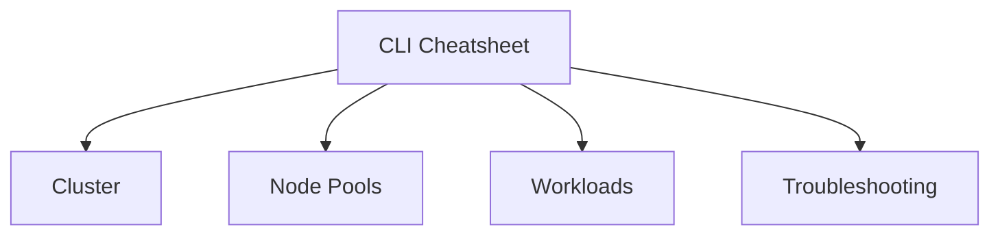

---
hide:
  - toc
---

# CLI Cheatsheet

Keep these commands nearby for common AKS tasks. Use long flags for readability and auditability.

## Topic/Command Groups




### Cluster lifecycle

```bash
az aks list --output table
az aks show --resource-group $RG --name $CLUSTER_NAME --output yaml
az aks get-credentials --resource-group $RG --name $CLUSTER_NAME --overwrite-existing
az aks get-upgrades --resource-group $RG --name $CLUSTER_NAME --output table
```

### Node pools

```bash
az aks nodepool list --resource-group $RG --cluster-name $CLUSTER_NAME --output table
az aks nodepool show --resource-group $RG --cluster-name $CLUSTER_NAME --name <pool-name> --output yaml
az aks nodepool scale --resource-group $RG --cluster-name $CLUSTER_NAME --name <pool-name> --node-count 5
```

### Kubernetes objects

```bash
kubectl get nodes -o wide
kubectl get pods -A -o wide
kubectl get svc -A
kubectl get ingress -A
kubectl get events -A --sort-by=.lastTimestamp
```

## Usage Notes

- Keep environment variables like `$RG` and `$CLUSTER_NAME` consistent across scripts.
- Prefer `--output yaml` or `--output json` when you need evidence for incident notes.
- Use namespace-qualified `kubectl` commands during incidents to reduce ambiguity.

## See Also

- [Diagnostic Commands](diagnostic-commands.md)
- [Cluster Creation](../operations/cluster-creation.md)
- [Node Pool Operations](../operations/node-pool-operations.md)

## Sources

- [Azure CLI az aks reference](https://learn.microsoft.com/cli/azure/aks)
- [kubectl Quick Reference](https://kubernetes.io/docs/reference/kubectl/quick-reference/)
