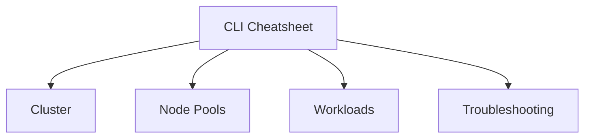

---
content_sources:
  diagrams:
  - id: reference-cli-cheatsheet
    type: flowchart
    source: self-generated
    justification: Reference visualization synthesized from the Microsoft Learn sources
      linked in this page or the repository validation data for this guide.
    based_on:
    - https://learn.microsoft.com/cli/azure/aks
---


# CLI Cheatsheet

Keep these commands nearby for common AKS tasks. Use long flags for readability and auditability.

## Topic/Command Groups
<!-- diagram-id: reference-cli-cheatsheet -->



### Cluster lifecycle

```bash
az aks list --output table
az aks show --resource-group $RG --name $CLUSTER_NAME --output yaml
az aks get-credentials --resource-group $RG --name $CLUSTER_NAME --overwrite-existing
az aks get-upgrades --resource-group $RG --name $CLUSTER_NAME --output table
```

| Command | Purpose |
| --- | --- |
| `az aks list` | List AKS clusters in the subscription. |
| `--output` | Output format for the result. |
| `az aks show` | Show a single cluster's full properties. |
| `--resource-group` | Resource group that contains the AKS cluster. |
| `--name` | Name of the AKS cluster. |
| `--output` | Output format for the result. |
| `az aks get-credentials` | Merge cluster credentials into the local kubeconfig. |
| `--resource-group` | Resource group that contains the AKS cluster. |
| `--name` | Name of the AKS cluster. |
| `--overwrite-existing` | Overwrite any existing kubeconfig entry for the cluster. |
| `az aks get-upgrades` | List available Kubernetes upgrade versions. |
| `--resource-group` | Resource group that contains the AKS cluster. |
| `--name` | Name of the AKS cluster. |
| `--output` | Output format for the result. |

### Node pools

```bash
az aks nodepool list --resource-group $RG --cluster-name $CLUSTER_NAME --output table
az aks nodepool show --resource-group $RG --cluster-name $CLUSTER_NAME --name <pool-name> --output yaml
az aks nodepool scale --resource-group $RG --cluster-name $CLUSTER_NAME --name <pool-name> --node-count 5
```

| Command | Purpose |
| --- | --- |
| `az aks nodepool list` | List the node pools in the cluster. |
| `--resource-group` | Resource group that contains the AKS cluster. |
| `--cluster-name` | Name of the AKS cluster. |
| `--output` | Output format for the result. |
| `az aks nodepool show` | Show a single node pool's properties. |
| `--resource-group` | Resource group that contains the AKS cluster. |
| `--cluster-name` | Name of the AKS cluster. |
| `--name` | Name of the node pool to show. |
| `--output` | Output format for the result. |
| `az aks nodepool scale` | Scale a node pool to a fixed node count. |
| `--resource-group` | Resource group that contains the AKS cluster. |
| `--cluster-name` | Name of the AKS cluster. |
| `--name` | Name of the node pool to scale. |
| `--node-count` | Target number of nodes. |

### Kubernetes objects

```bash
kubectl get nodes -o wide
kubectl get pods -A -o wide
kubectl get svc -A
kubectl get ingress -A
kubectl get events -A --sort-by=.lastTimestamp
```

## Usage Notes

- Keep environment variables like `$RG` and `$CLUSTER_NAME` consistent across scripts.
- Prefer `--output yaml` or `--output json` when you need evidence for incident notes.
- Use namespace-qualified `kubectl` commands during incidents to reduce ambiguity.

## See Also

- [Diagnostic Commands](diagnostic-commands.md)
- [Cluster Creation](../operations/cluster-creation.md)
- [Node Pool Operations](../operations/node-pool-operations.md)

## Sources

- [Azure CLI az aks reference](https://learn.microsoft.com/cli/azure/aks)
- [kubectl Quick Reference](https://kubernetes.io/docs/reference/kubectl/quick-reference/)
