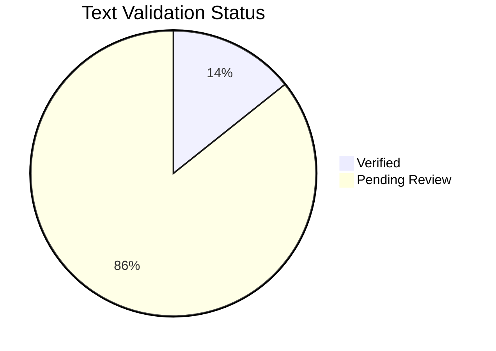

---
content_sources:
  diagrams:
    - id: reference-content-validation-status
      type: pie
      source: self-generated
      justification: Text and diagram validation status chart generated from repository frontmatter metadata.
      based_on:
        - docs/
content_validation:
  status: pending_review
  last_reviewed: null
  reviewer: agent
  core_claims: []
---

# Content Source Validation Status

This page tracks non-tutorial text validation metadata and Mermaid diagram source metadata declared in document frontmatter.

## Summary

*Generated from repository frontmatter metadata.*

| Text Validation Status | Count |
|---|---:|
| Total non-tutorial documents | 63 |
| Verified | 9 |
| Pending review | 54 |
| Unverified | 0 |
| Missing metadata | 0 |
| Core claims listed | 24 |
| Core claims verified | 24 |

| Diagram Source Type | Count |
|---|---:|
| Mermaid diagrams | 65 |
| MSLearn sourced | 27 |
| Self-generated | 38 |
| Missing source metadata | 0 |

!!! warning "Validation state"
    `pending_review` means the document participates in the tracking workflow, but its individual factual claims still need claim-level source review. Do not treat pending documents as verified.

<!-- diagram-id: reference-content-validation-status -->


## Document Matrix

| Document | Status | Core Claims | Verified Claims |
|---|---|---:|---:|
| [best-practices/common-anti-patterns.md](../best-practices/common-anti-patterns.md) | `verified` | 3 | 3 |
| [best-practices/cost-optimization.md](../best-practices/cost-optimization.md) | `verified` | 3 | 3 |
| [best-practices/index.md](../best-practices/index.md) | `verified` | 2 | 2 |
| [best-practices/networking.md](../best-practices/networking.md) | `verified` | 3 | 3 |
| [best-practices/production-baseline.md](../best-practices/production-baseline.md) | `verified` | 3 | 3 |
| [best-practices/reliability.md](../best-practices/reliability.md) | `verified` | 3 | 3 |
| [best-practices/resource-governance.md](../best-practices/resource-governance.md) | `verified` | 3 | 3 |
| [best-practices/security.md](../best-practices/security.md) | `verified` | 3 | 3 |
| [contributing/index.md](../contributing/index.md) | `pending_review` | 0 | 0 |
| [index.md](../index.md) | `pending_review` | 0 | 0 |
| [operations/cluster-creation.md](../operations/cluster-creation.md) | `pending_review` | 0 | 0 |
| [operations/credential-rotation.md](../operations/credential-rotation.md) | `pending_review` | 0 | 0 |
| [operations/index.md](../operations/index.md) | `pending_review` | 0 | 0 |
| [operations/maintenance-windows.md](../operations/maintenance-windows.md) | `pending_review` | 0 | 0 |
| [operations/monitoring-logging.md](../operations/monitoring-logging.md) | `pending_review` | 0 | 0 |
| [operations/node-pool-operations.md](../operations/node-pool-operations.md) | `pending_review` | 0 | 0 |
| [operations/scaling-operations.md](../operations/scaling-operations.md) | `pending_review` | 0 | 0 |
| [operations/upgrades.md](../operations/upgrades.md) | `pending_review` | 0 | 0 |
| [platform/cluster-architecture.md](../platform/cluster-architecture.md) | `pending_review` | 0 | 0 |
| [platform/identity-and-secrets.md](../platform/identity-and-secrets.md) | `pending_review` | 0 | 0 |
| [platform/index.md](../platform/index.md) | `pending_review` | 0 | 0 |
| [platform/ingress-load-balancing.md](../platform/ingress-load-balancing.md) | `pending_review` | 0 | 0 |
| [platform/networking-models.md](../platform/networking-models.md) | `pending_review` | 0 | 0 |
| [platform/node-pools.md](../platform/node-pools.md) | `pending_review` | 0 | 0 |
| [platform/scaling.md](../platform/scaling.md) | `pending_review` | 0 | 0 |
| [platform/storage-options.md](../platform/storage-options.md) | `pending_review` | 0 | 0 |
| [reference/cli-cheatsheet.md](../reference/cli-cheatsheet.md) | `pending_review` | 0 | 0 |
| [reference/content-validation-status.md](../reference/content-validation-status.md) | `pending_review` | 0 | 0 |
| [reference/diagnostic-commands.md](../reference/diagnostic-commands.md) | `pending_review` | 0 | 0 |
| [reference/glossary.md](../reference/glossary.md) | `pending_review` | 0 | 0 |
| [reference/index.md](../reference/index.md) | `pending_review` | 0 | 0 |
| [reference/limits-and-quotas.md](../reference/limits-and-quotas.md) | `pending_review` | 0 | 0 |
| [reference/validation-status.md](../reference/validation-status.md) | `verified` | 1 | 1 |
| [reference/version-support.md](../reference/version-support.md) | `pending_review` | 0 | 0 |
| [start-here/aks-vs-other-compute.md](../start-here/aks-vs-other-compute.md) | `pending_review` | 0 | 0 |
| [start-here/index.md](../start-here/index.md) | `pending_review` | 0 | 0 |
| [start-here/learning-path.md](../start-here/learning-path.md) | `pending_review` | 0 | 0 |
| [start-here/overview.md](../start-here/overview.md) | `pending_review` | 0 | 0 |
| [start-here/prerequisites.md](../start-here/prerequisites.md) | `pending_review` | 0 | 0 |
| [troubleshooting/architecture-overview.md](../troubleshooting/architecture-overview.md) | `pending_review` | 0 | 0 |
| [troubleshooting/decision-tree.md](../troubleshooting/decision-tree.md) | `pending_review` | 0 | 0 |
| [troubleshooting/evidence-map.md](../troubleshooting/evidence-map.md) | `pending_review` | 0 | 0 |
| [troubleshooting/first-10-minutes/connectivity.md](../troubleshooting/first-10-minutes/connectivity.md) | `pending_review` | 0 | 0 |
| [troubleshooting/first-10-minutes/index.md](../troubleshooting/first-10-minutes/index.md) | `pending_review` | 0 | 0 |
| [troubleshooting/first-10-minutes/performance.md](../troubleshooting/first-10-minutes/performance.md) | `pending_review` | 0 | 0 |
| [troubleshooting/first-10-minutes/pod-failures.md](../troubleshooting/first-10-minutes/pod-failures.md) | `pending_review` | 0 | 0 |
| [troubleshooting/index.md](../troubleshooting/index.md) | `pending_review` | 0 | 0 |
| [troubleshooting/mental-model.md](../troubleshooting/mental-model.md) | `pending_review` | 0 | 0 |
| [troubleshooting/playbooks/cluster-autoscaler-issues.md](../troubleshooting/playbooks/cluster-autoscaler-issues.md) | `pending_review` | 0 | 0 |
| [troubleshooting/playbooks/connectivity/ingress-failure.md](../troubleshooting/playbooks/connectivity/ingress-failure.md) | `pending_review` | 0 | 0 |
| [troubleshooting/playbooks/connectivity/service-unreachable.md](../troubleshooting/playbooks/connectivity/service-unreachable.md) | `pending_review` | 0 | 0 |
| [troubleshooting/playbooks/index.md](../troubleshooting/playbooks/index.md) | `pending_review` | 0 | 0 |
| [troubleshooting/playbooks/ingress-not-working.md](../troubleshooting/playbooks/ingress-not-working.md) | `pending_review` | 0 | 0 |
| [troubleshooting/playbooks/node-issues/cni-ip-exhaustion.md](../troubleshooting/playbooks/node-issues/cni-ip-exhaustion.md) | `pending_review` | 0 | 0 |
| [troubleshooting/playbooks/node-issues/node-not-ready.md](../troubleshooting/playbooks/node-issues/node-not-ready.md) | `pending_review` | 0 | 0 |
| [troubleshooting/playbooks/node-not-ready.md](../troubleshooting/playbooks/node-not-ready.md) | `pending_review` | 0 | 0 |
| [troubleshooting/playbooks/operations/scaling-failure.md](../troubleshooting/playbooks/operations/scaling-failure.md) | `pending_review` | 0 | 0 |
| [troubleshooting/playbooks/operations/upgrade-failure.md](../troubleshooting/playbooks/operations/upgrade-failure.md) | `pending_review` | 0 | 0 |
| [troubleshooting/playbooks/pod-crashloopbackoff.md](../troubleshooting/playbooks/pod-crashloopbackoff.md) | `pending_review` | 0 | 0 |
| [troubleshooting/playbooks/pod-issues/crashloop.md](../troubleshooting/playbooks/pod-issues/crashloop.md) | `pending_review` | 0 | 0 |
| [troubleshooting/playbooks/pod-issues/image-pull-failure.md](../troubleshooting/playbooks/pod-issues/image-pull-failure.md) | `pending_review` | 0 | 0 |
| [troubleshooting/playbooks/pod-issues/pending-pods.md](../troubleshooting/playbooks/pod-issues/pending-pods.md) | `pending_review` | 0 | 0 |
| [troubleshooting/quick-diagnosis-cards.md](../troubleshooting/quick-diagnosis-cards.md) | `pending_review` | 0 | 0 |

## How to Update

Add a `content_validation` block to every non-tutorial Markdown file:

```yaml
content_validation:
  status: pending_review
  last_reviewed: null
  reviewer: agent
  core_claims: []
```

When claims have been reviewed against Microsoft Learn, replace the empty claim list with 2-5 sourced claims and set `status: verified` only if every listed claim is verified.

Then regenerate this page:

```bash
python3 scripts/generate_content_validation_status.py
```

## See Also

- [Tutorial Validation Status](validation-status.md)
- [CLI Cheatsheet](cli-cheatsheet.md)
- [Limits and Quotas](limits-and-quotas.md)

## Sources

- [Azure Kubernetes Service documentation](https://learn.microsoft.com/en-us/azure/aks/)
- [AKS cluster architecture](https://learn.microsoft.com/en-us/azure/aks/concepts-clusters-workloads)
