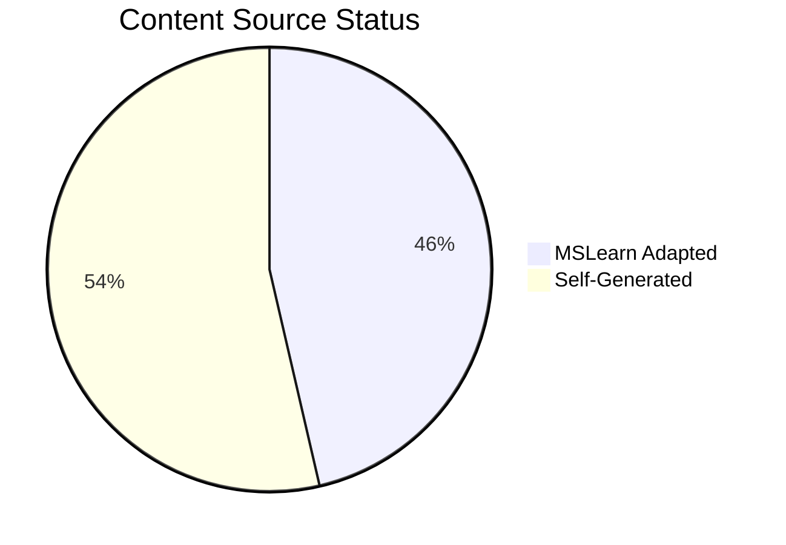
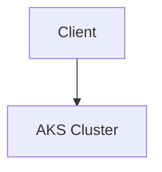

# Content Source Validation Status

This page describes how diagram and content sources are declared in this repository, and what tooling is available today to validate those declarations.

!!! note "Current state"
    Diagram-level source metadata (`content_sources.diagrams`) is used across the repository, and the tooling below runs in CI to keep that metadata honest. **Document-level `content_validation` metadata is not yet adopted in this repository** — the schema is documented in [AGENTS.md](https://github.com/yeongseon/azure-kubernetes-service-practical-guide/blob/main/AGENTS.md) as an aspirational policy and is tracked as future work. Do not read the absence of `content_validation` blocks as a validation failure; read it as "not yet implemented."

## Diagram Inventory Snapshot

*Snapshot date: 2026-04-10. Manually authored — this table does not update automatically when diagrams are added or reclassified.*

| Content Type | Total | MSLearn Adapted | Self-Generated | No Source |
|---|---:|---:|---:|---:|
| Mermaid Diagrams | 69 | 32 | 37 | 0 |

<!-- diagram-id: reference-content-validation-status -->


A text-sections row was previously shown on this page with placeholder dashes. It has been removed because no text-level `content_validation` metadata is currently enforced or inventoried.

## Source Type Policy

The `content_sources.diagrams[].source` field must be one of the three values below. These are the exact set accepted by `scripts/validate_content_sources.py` today; any other value causes CI to fail.

| Type | Description | Additional requirement |
|---|---|---|
| `mslearn` | Content directly from Microsoft Learn | `mslearn_url` OR a non-empty `based_on` list |
| `mslearn-adapted` | Content adapted or synthesized from Microsoft Learn | `mslearn_url` OR a non-empty `based_on` list |
| `self-generated` | Original content created for this guide | `justification` field |

!!! note "Broader source vocabulary in AGENTS.md"
    [AGENTS.md](https://github.com/yeongseon/azure-kubernetes-service-practical-guide/blob/main/AGENTS.md) also references `community` and `unknown` source categories as part of the aspirational content-validation policy. Those values are **not** currently accepted by the validator on any Mermaid page in this repository; they belong to the same "not yet implemented" bucket as document-level `content_validation` metadata.

## How Diagram Sources Are Declared

### Step 1: Add `content_sources` to the document frontmatter

```yaml
---
content_sources:
  diagrams:
    - id: cluster-architecture
      type: flowchart
      source: mslearn-adapted
      based_on:
        - https://learn.microsoft.com/en-us/azure/aks/concepts-clusters-workloads
---
```

### Step 2: Mark each Mermaid block with its `diagram-id`

~~~markdown
<!-- diagram-id: cluster-architecture -->

~~~

### Step 3: Run the diagram source validator

```bash
python3 scripts/validate_content_sources.py
```

This is the same validator that runs in the `Validate Content Sources` CI workflow.

## Tooling Available in This Repository

The following scripts run against the repository today. There is no dashboard-generator script in this repository, so this page is maintained manually rather than being regenerated.

| Script | Purpose | Where it runs |
|---|---|---|
| `scripts/validate_content_sources.py` | Enforces that every Mermaid block has a `diagram-id` HTML comment and a matching `content_sources.diagrams[]` entry with a valid `source` value. | **Blocking** PR check (`Validate Content Sources`) |
| `scripts/validate_mermaid_format.py` | Enforces Mermaid orientation rules and formatting conventions. | **Blocking** PR check (same workflow) |
| `scripts/validate_mermaid_syntax.py` | Parses each Mermaid block to catch syntax errors before build. | **Blocking** PR check (same workflow) |
| `scripts/validate_mslearn_urls.py` | Checks that Microsoft Learn URLs cited in `content_sources` are reachable. | **Reporting only:** runs on push to `main` with `continue-on-error`, not a blocking PR gate |
| `scripts/generate_validation_status.py` | Regenerates `docs/reference/validation-status.md` — the **tutorial** validation dashboard, not this page. | Manual invocation by contributors |

There is intentionally no `scripts/generate_content_validation_status.py` in this repository. Earlier revisions of this page referenced one, which was misleading; this page is authored by hand.

## Validation Rules Enforced Today

!!! danger "Enforced in CI"
    1. Every Mermaid block must have a `diagram-id` HTML comment.
    2. Every declared `diagram-id` must have a matching `content_sources.diagrams[]` entry.
    3. `mslearn-adapted` and `mslearn` diagrams must have either an `mslearn_url` field or a **non-empty** `based_on` list. The validator does **not** currently verify that every `based_on` URL points to `learn.microsoft.com`; that is a repository convention, not an enforced rule.
    4. `self-generated` diagrams must include a `justification` field.
    5. Mermaid syntax must parse successfully.

## Official Microsoft Learn References

Use these official sources when declaring diagram provenance:

| Topic | Microsoft Learn URL |
|---|---|
| AKS Overview | <https://learn.microsoft.com/en-us/azure/aks/> |
| AKS Cluster Architecture | <https://learn.microsoft.com/en-us/azure/aks/concepts-clusters-workloads> |
| AKS Networking | <https://learn.microsoft.com/en-us/azure/aks/concepts-network> |
| AKS Identity and Access | <https://learn.microsoft.com/en-us/azure/aks/concepts-identity> |
| AKS Security | <https://learn.microsoft.com/en-us/azure/aks/concepts-security> |
| AKS Storage | <https://learn.microsoft.com/en-us/azure/aks/concepts-storage> |
| AKS Scaling | <https://learn.microsoft.com/en-us/azure/aks/concepts-scale> |
| AKS Monitoring | <https://learn.microsoft.com/en-us/azure/aks/monitor-aks> |

## See Also

- [Tutorial Validation Status](validation-status.md)
- [CLI Cheatsheet](cli-cheatsheet.md)

## Sources

- <https://learn.microsoft.com/en-us/azure/aks/>
